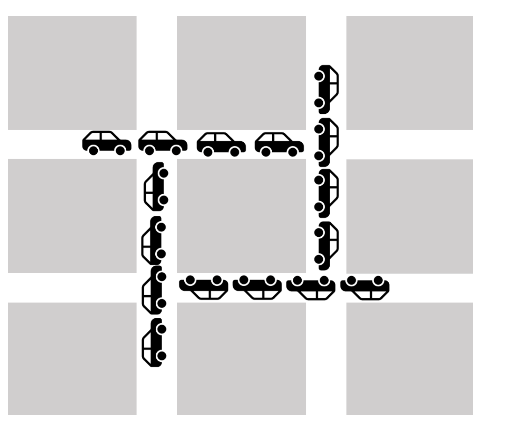
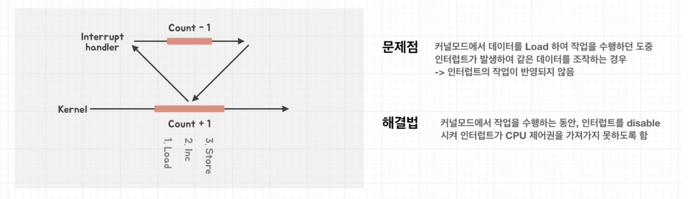
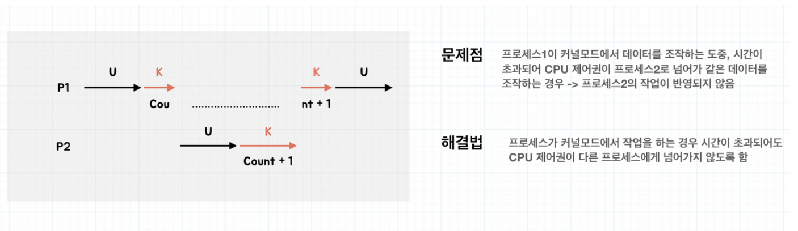
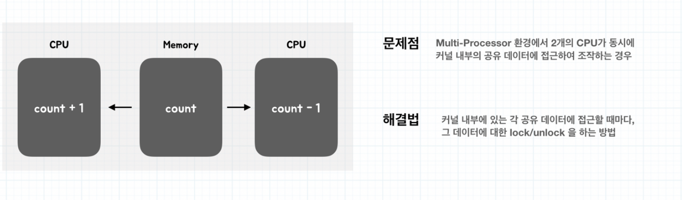

# [10주차] 교착과 경쟁

날짜: 2022년 10월 2일
진행상황: Done
태그: OS

---

# 교착 상태( Dead Lock )

---

<aside>
💡 두 개 이상의 프로세스가 **자원을 점유한 상태**에서 서로 다른 프로세스가 점유중인 자원을 요구하며, **서로의 작업을 끝나기만을 기다려 둘 다 영원히 끝나지 않는 상황**을 뜻한다.

</aside>

## 교착 상태의 발생 조건

---

- 교착상태는 아래의 4가지 조건이 모두 만족되는 경우( 필요충분조건)에 발생할 가능성이 있다.
    
    → 즉, 4가지 조건 중 하나라도 만족하지 않는 경우가 있다면 교착 상태는 발생하지 않는다.
    

### [1]. 상호 배제( Mutual Exclusion )

---

한 번에 한 개의 프로세스만이 공유자원을 사용할 수 있다.

### [2]. 점유 대기( Hold and Wait )

---

프로세스가 할당된 자원을 가진 상태에서 다른 자원을 기다린다

### [3]. 비선점( No Preemption )

---

프로세스가 작업을 마친 후 자원을 자발적으로 반환할 때까지 기다린다.

→ 이미 할당된 자원을 강제적으로 빼앗을 수 없다.

### [4]. 순환 대기( Circular Wait )

---

프로세스의 자원 점유 및 점유된 자원의 요구 관계가 원형을 이루면서 대기하는 조건.

각 프로세스는 순환적으로 다음 프로세스가 요구하는 자원을 가지고 있다.

## 교착 상태 해결 방법

---

### [1]. 예방( Prevention )

---

<aside>
💡 예방 방법은 교착 상태의 발생조건 **4가지 중 하나를 부정함으로써 교착을 예방**하는 방법

</aside>

- 상호 배제 부정
- 점유 대기 부정
- 비선점 부정
- 순환 대기 부정

**단점 : 시스템 처리량이나 자원 사용의 효율성을 떨어트린다.**

### [2]. 회피( Avoidance )

---

<aside>
💡 교착상태가 발생할 수 있는 자원 할당을 하지 않고 안전한 상태에서만 자원 요청을 허용

</aside>

→ 교착상태 회피를 하기 위해서는 아래와 같은 가정이 필요하다.

- `**프로세스 수 고정**`
- `**자원의 종류와 수 고정**`
- 프로세스가 요구하는 `**최대 자원의 수**`를 알아야 한다
- 프로세스는 자원 사용 후 `**반드시 반납**`

**Safe State**

---

`**safe sequence**`( 교착 상태를 발생시키지 않고 자원을 할당하는 순서 )가 존재하며, **모든 프로세스가 정상적으로 종료될 수 있는 상태**를 의미한다. 

**Unsafe State**

---

교착 상태가 **발생할 가능성이 있는 상태**

### [3]. 탐지( Detection )

---

### [4]. 회복( Recovery )

---

# 경쟁 상태 ( Race Condition )

---

<aside>
💡 공유 자원에 대해 여러 프로세스가 동시에 접근을 시도할 때, 타이밍이나 순서 등이 결과값에 영향을 줄 수 있는 상태

</aside>

→ 동시에 접근할 때 자료의 `**일관성**` 을 해치는 결과가 나타날 수 있다.

## 경쟁 상태 발생 조건

---

### [1]. 커널 작업 수행 중 인터럽트가 발생할 때

---

### [2]. 프로세스가 시스템 콜을 하여 커널 모드로 진입 후 작업 수행 도중 Context Change( 문맥 교환 )이 발생할 때

---

### [3]. 멀티 프로세서에서 공유 메모리 내의 커널 데이터에 접근할 때

---

