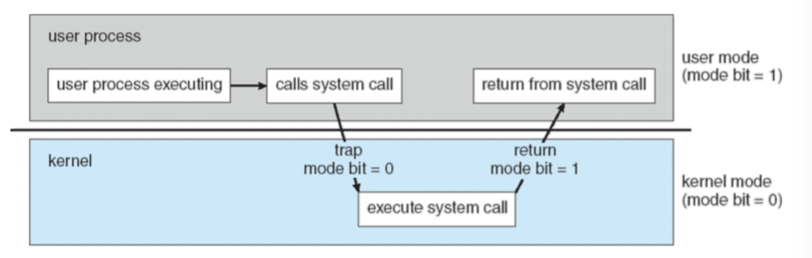
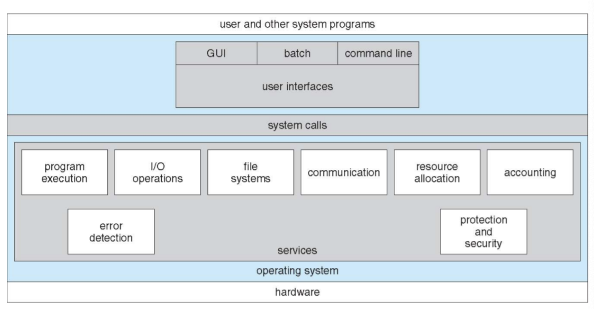
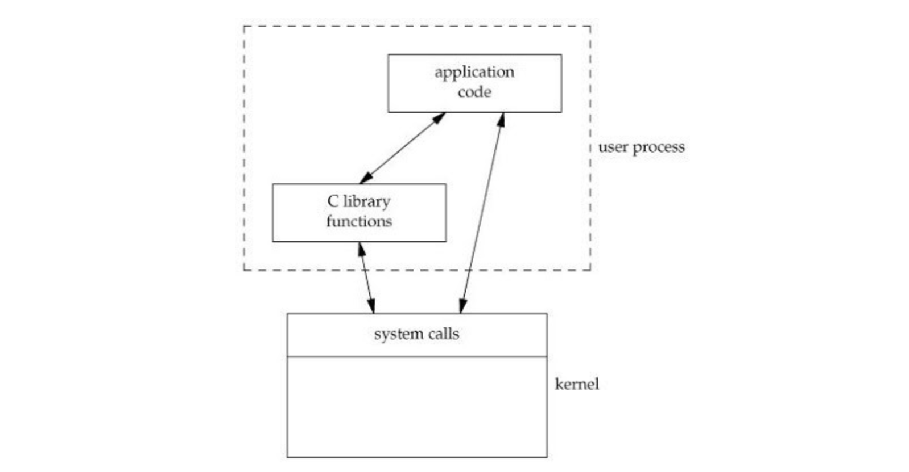

# [10주차] 시스템 콜

날짜: 2022년 10월 2일
진행상황: Done
태그: OS

---

# CPU 모드

---

- CPU는 User Application이 시스템을 손상시키는 것을 방지하기 위해 2가지 모드를 제공한다.
- CPU에 있는 Mode Bit로 구분하며 `**0 : Kernel mode**` , `**1 : User mode**` 를 나타낸다.

## 사용자 모드( User Mode )

---

<aside>
💡 User Application 코드가 실행되는 모드

</aside>

- 사용자가 접근할 수 있는 영역에 제한이 있기 때문에 해당 모드에서는 **하드웨어에 직접적으로 접근 X**
- **하드웨어에 접근하기 위해서는** 시스템 콜을 사용해서 **커널모드로의 전환이 필요하다.**
- User Application의 **각 Thread들은 고유의 사용자 모드 스택**을 가진다.

## 커널 모드( Kernel Mode )

---

<aside>
💡 운영체제가 CPU를 사용하는 모드

</aside>

- 커널 자원에 접근하기 위해서는 시스템 콜을 사용하거나 라이브러리 함수를 사용해야 한다.
- 커널모드로 전환이 되면 운영체제는 하드웨어를 제어하는 명령어 ( Privileged Instructions )를 실행
- `**Privileged Instructions**`는 **사용자 모드에서** 실행되면 `**Exception**`이 발생

- 사용자 모드에서 시스템 콜 발생 → 커널 모드 전환 → 작업 수행 후 다시 사용자 모드 전환

# 시스템 콜 ( System Call )

---

<aside>
💡 프로세스가 하드웨어( 로컬 )에 직접 접근해서 필요한 기능을 사용할 수 있게 해주는 것

</aside>

- 시스템 호출이라고도 부른다.
- 커널 모드의 기능을 사용자 모드가 사용할 수 있게 만들어주는 `**프로그래밍 인터페이스**`
- 직접적으로 시스템 콜을 사용하기보다 **API를 통해** 사용하게 된다.

## 시스템 콜 종류

---

<aside>
💡 프로세스 제어, 파일 조작, 디바이스 조작, 정보 유지보수, 통신의 5가지로 분류

</aside>

### [1]. 프로세스 제어( Process Control )

---

- 프로세스 생성 및 제거
- 프로세서 종료 및 중지
- 프로세스 적재 및 실행
- 대기
- 메모리 할당 및 해제

### [2]. 파일 조작( File Manipulation )

---

- 파일 생성 및 삭제
- 파일 CRUD

### [3]. 디바이스 관리( Device Management )

---

- 장치 요청 및 해제
- 장치 읽기/쓰기/위치 변경
- 속성 설정
- 장치의 논리적 부착( Attach ) 및 분리( Detach )

### [4]. 정보 유지( Information Maintenance )

---

- 시간과 날짜의 설정과 획득
- 시스템 데이터의 설정과 획득
- 프로세스 파일, 장치 속성의 획득 및 설정

### [5]. 통신 ( Communication )

---

- 통신 연결의 생성 및 제거
- 메시지의 송수신
- 상태 정보 전달
- 원격 장치의 부착 및 분리
- 메시지 전달 - 두 프로세스 통신에 정보 교환을 위한 메시지
- 공유 메모리 - 다른 프로세스가 소유한 메모리에 접근을 위해 특정 시스템 콜 호출

# 시스템 콜 VS 라이브러리 함수

---

## 시스템 콜

- 커널 자원을 사용자가 사용할 수 있도록 만들어 놓은 함수
- 호출 시 `**커널 모드**`로 전환이 되어 실행
- 파일 입출력 시 read(), write()와 같은 시스템 콜들은 호출할 때마다 커널 모드로 전환되어 바로 파일에 기록된다.
- 리턴 타입은 대부분 int
    
    `오류` : -1
    
    `정상` : 0 이상의 값
    
- read(), write()

## 라이브러리 함수

- 사용자가 많이 사용하는 기능들을 미리 함수로 만들어 놓은 것
- 내부적으로 시스템 콜을 사용하지만 호출 시에는 `**사용자 모드에서 실행**`된다.
- 버퍼를 사용해 내부적으로 한 번만 read(), write()를 실행하기 때문에 시스템 자원을 효율적으로 사용하게 된다.
- 내부적으로 시스템 콜을 호출하기 때문에 `**wrapper 함수**`라고도 부른다.
- fread(), fwrite()

# 예상 질문

---

1. 커널 자원에 접근하는 방법 두 가지
2. 시스템 콜과 라이브리 함수의 실행 모드