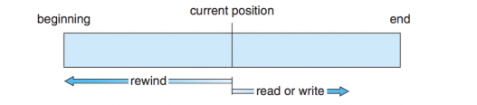
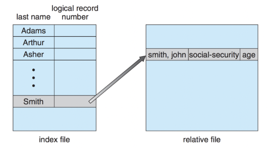
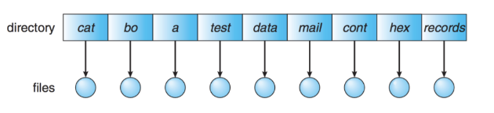
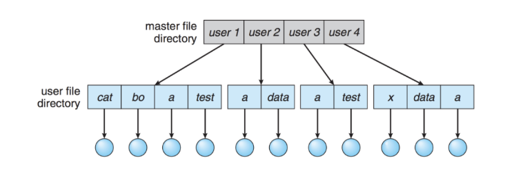
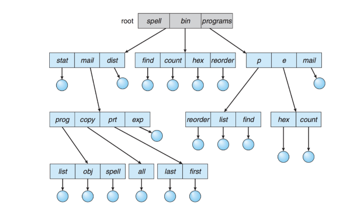
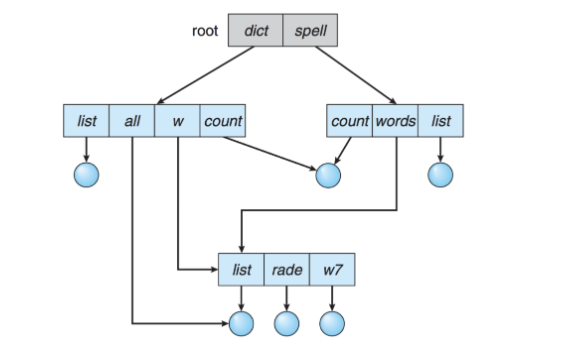
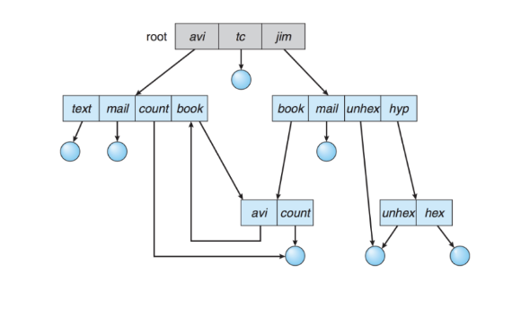

# [11주차] 파일 시스템

날짜: 2022년 10월 10일
진행상황: Done
태그: OS

---

# 파일 시스템

---

## 파일

---

<aside>
💡 논리적인 저장 단위로, 관련된 정보 자료들의 집합에 이름을 붙인 것

</aside>

- 컴퓨터 시스템의 편리한 사용을 위해 정보 저장의 일괄된 논리적 관점을 제공한다.
- 일반적으로 레코드 혹은 블록 단위로 비휘발성 보조기억장치에 저장된다.

## 파일 속성( File Attribute )

---

<aside>
💡 파일을 관리하기 위한 각종 정보

</aside>

- 파일 메타데이터라고도 한다.
- 파일 자체의 내용은 아니다.
    
    — 파일의 이름, 유형, 위치, 사이즈, 접근 권한, 소유자, 시간 등 전반적인 정보를 말한다.
    

## 파일 시스템

---

<aside>
💡 OS와 모든 데이터, 프로그램의 저장과 접근을 위한 기법을 제공한다.

</aside>

- 시스템 내의 모든 파일에 관한 정보를 제공하는 계측정 디렉터리 구조이고, 파일 및 파일 메타데이터, 디렉터리 정보 등을 관리한다.

## 파티션

---

<aside>
💡 연속된 저장 공간을 하나 이상의 연속되고 독립적인 영역으로 나누어 사용할 수 있도록 정의한 규약이다.

</aside>

- 하나의 디스크 안에 여러 파티션을 두는 게 일반적이지만, 여러 물리적 디스크를 하나의 파티션으로 구성하기도 한다.

# 접근 방식 ( Access Method )

---

## [1]. 순차 접근

---

- 가장 단순한 방법으로 파일의 정보가 레코드 순서대로 처리된다. (= 카세트 테이프 )
- 현재 위치에서 읽거나 쓰면 offset이 자동으로 증가하고, 뒤로 돌아가기 위해선 되감기가 필요하다.

## [2]. 직접 접근

---

- 파일의 레코드를 임의의 순서로 접근할 수 있다. (= LP판 )
- 읽기나 쓰기의 순서에 제약이 없으며, 현재 위치를 유지할 수 있다면 이를 통해 순차 접근 기능도 구현 가능

## [3]. 색인 접근

---

- 파일에서 레코드를 찾기 위해 인덱스를 먼저 찾고 대응되는 포인터를 찾는다.
    
    → 인덱스를 통해 원하는 파일에 접근하여 데이터를 얻을 수 있다
    
- 크기가 큰 파일에서 유리하다.

# 디렉터리

---

<aside>
💡 파일의 메타데이터 중 일부를 보관하고 있는 일종의 특별한 파일이다

</aside>

- 해당 디렉터리에 속한 파일 이름과 속성들을 포함하고 있으며, 다음과 같은 기능들을 제공한다.
    - 파일 찾기( Search )
    - 파일 생성( Create )
    - 파일 삭제( Delete )
    - 디렉터리 나열( List )
    - 파일 재명명( Rename )
    - 파일 시스템 순회( Traverse )

## [1]. 1단계 디렉터리

---

<aside>
💡 모든 파일들이 디렉터리 밑에 존재하는 형태

</aside>

- 파일들은 서로 유일한 이름을 가지고 서로 다른 사용자라도 같은 이름을 사용할 수 없다.
- 지원하기도 쉽고 이해하기도 쉽지만, 파일이 많아지거나 다수의 사요자가 사용하는 시스템에서는 심각한 제약을 갖는다.

## [2]. 2단계 디렉터리

---

<aside>
💡 각 사용자별로 별도의 디렉터리를 갖는 형태

</aside>

- 서로 다른 사용자가 같은 이름의 파일을 가질 수 있고, 효율적인 탐색이 가능하다.
- 그룹화가 불가능하고, 다른 사용자의 파일에 접근해야 하는 경우에는 단점이 된다.

`**UFD**` : 자신만의 사용자 파일 디렉터리

`**MFD**` : 사용자의 이름과 계정번호로 인덱싱된 디렉터리. 각 엔트리는 사용자의 UFD를 가리킨다.

## [3]. 트리 구조 디렉터리

---

<aside>
💡 사용자들이 자신의 서브 디렉터리를 만들어서 파일을 구성할 수 있다.

</aside>

- 하나의 루트 디렉터리를 가지며 모든 파일은 고유한 경로( 상대/절대 )를 가진다.
- 효율적인 탐색이 가능하고, 그룹화가 가능하다.
- 디렉터리는 일종의 파일이므로 일반 파일인지 디렉터리인지 구분할 필요가 있다.
    
    → 이를 bit를 통해 0 : 일반 파일, 1 : 디렉터리로 구분한다.
    

## [4]. 비순환 그래프 디렉터리

---

<aside>
💡 디렉터리들이 서브 디렉터리들과 파일을 공유할 수 있도록 한다.

</aside>

- 트리 구조의 디렉터리를 일반화한 형태이다.
- 단순한 트리 구조보다는 더 복잡한 구조이기 때문에 몇몇 문제가 발생할 수 있다.
    - 파일을 무작정 삭제하게 되면 현재 파일을 가리키는 포인터는 대상이 사라지게 된다
        
        따라서, 파일에 참조 계수를 두어, 참조 계수가 0이 되면 링크가 존재하지 않는다는 뜻이므로 그 때 삭제할 수 있도록 제어한다.
        

## [5]. 일반 그래프 디렉터리

---

<aside>
💡 순환을 허용하는 그래프 구조

</aside>

- 순환이 허용된다면 무한 루프에 빠질 수 있다.
- 따라서, 하위 디렉터리가 아닌 파일에 대한 링크만 허용하거난 Garbage Collection을 통해 파일 시스템을 순회하고, 접근 가능한 모든 것을 표시한다.

# 🔗   참조 링크

---