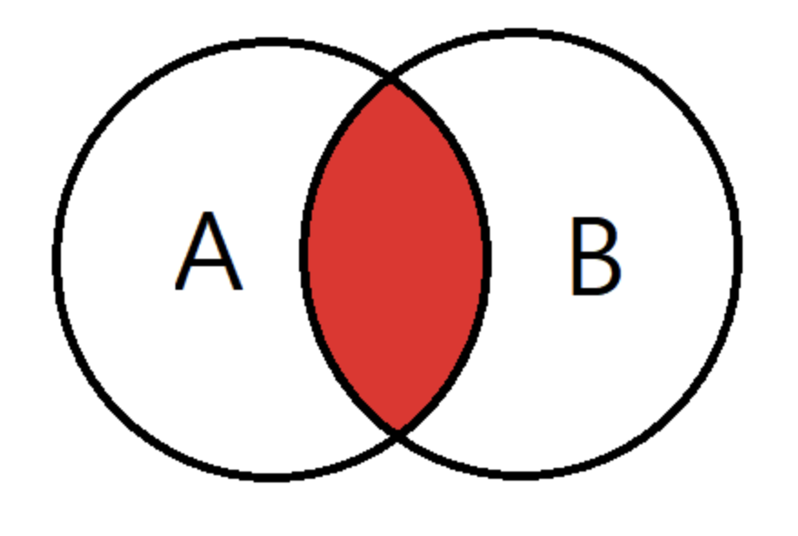
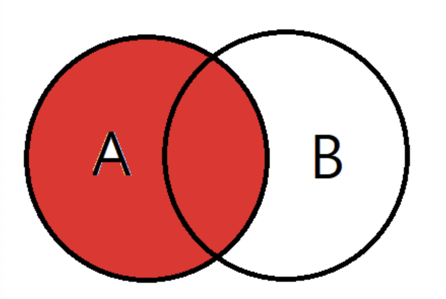
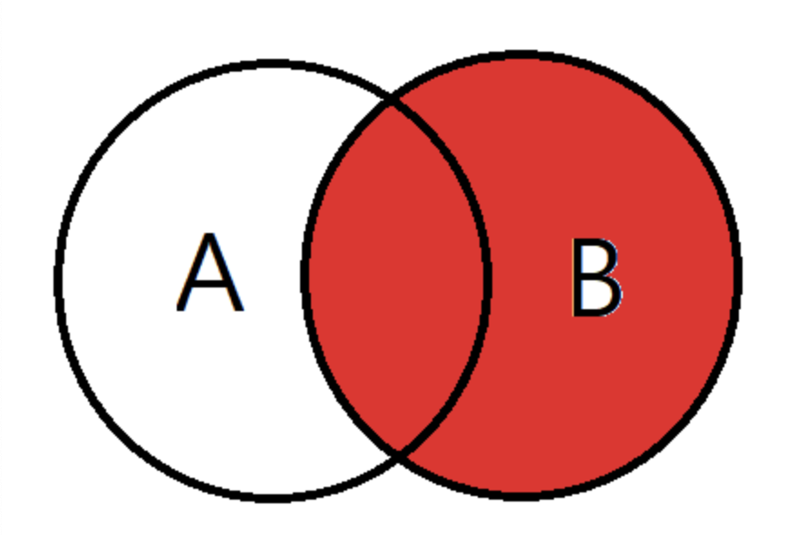
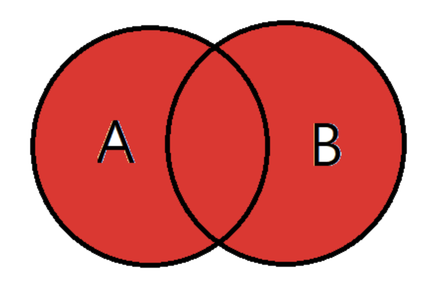
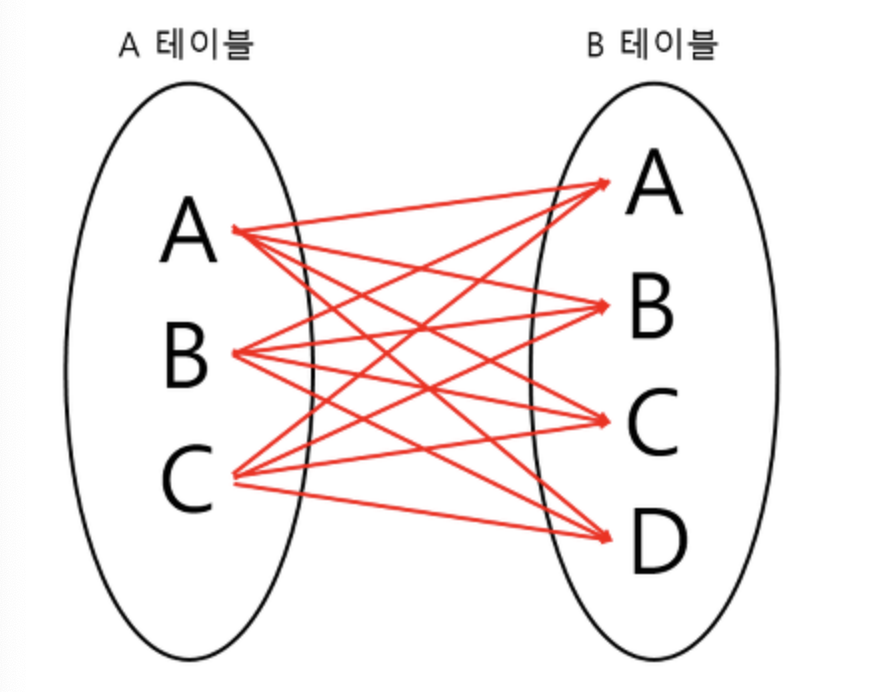
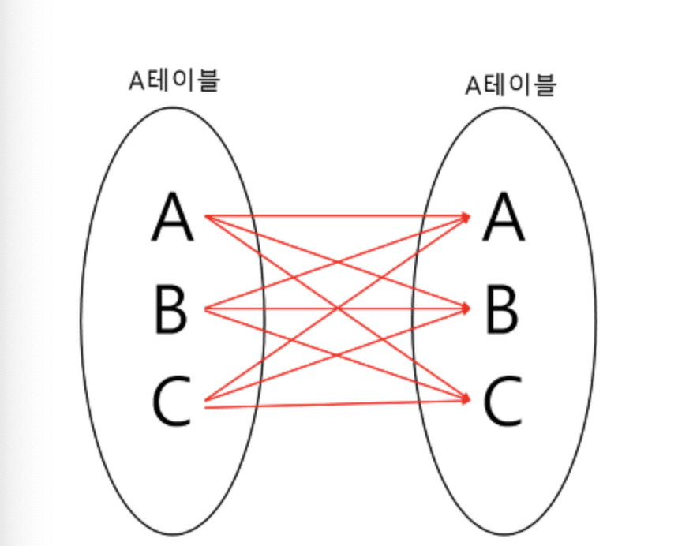
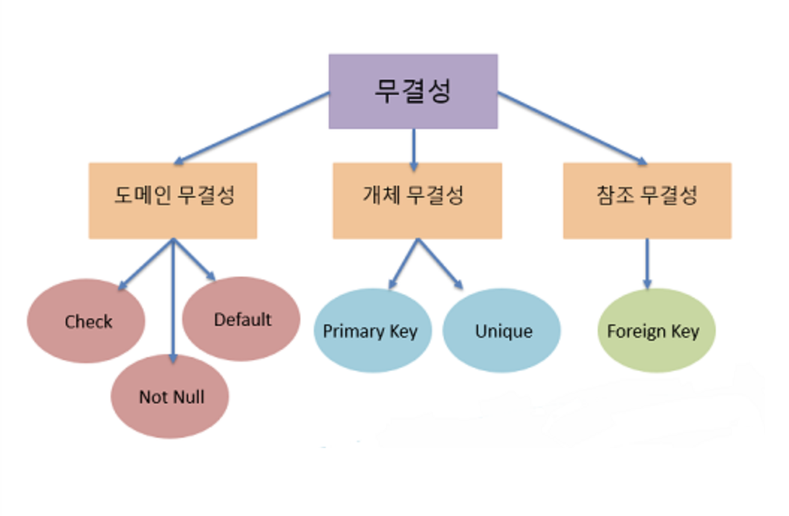

# [12주차] JOIN, 데이터 무결성과 제약조건

날짜: 2022년 10월 22일
진행상황: Done
태그: DB

---

# SQL 기본 쿼리문

---

## 조인( Join )

---

<aside>
💡 두 개 이상의 테이블이나 데이터베이스를 연결하여 데이터를 검색하는 방법

</aside>

- 여러 개의 테이블을 마치 하나의 테이블인 것처럼 활용한다.
    
    보통 PK나 FK로 두 테이블을 연결한다.
    

### [1]. INNER JOIN

---

<aside>
💡 교집합으로, 기준 테이블과 JOIN테이블의 중복된 값을 보여준다.

</aside>



```sql
SELECT
테이블별칭.조회할칼럼,
테이블별칭.조회할칼럼
FROM 기준테이블 별칭
INNER JOIN 조인테이블 별칭 ON 기준테이블별칭.기준키 = 조인테이블별칭.기준키....

SELECT
A.NAME, --A테이블의 NAME조회
B.AGE   --B테이블의 AGE조회
FROM EX_TABLE A
INNER JOIN JOIN_TABLE B ON A.NO_EMP = B.NO_EMP AND A.DEPT = B.DEPT
```

### [2]. LEFT OUTER JOIN

---

<aside>
💡 기준 테이블값 + ( 기존 테이블 값과 조인된 테이블의 중복된 값 )

</aside>



- A테이블의 모든 데이터와 A와 B의 중복되는 값을 검색한다.

```sql
SELECT
테이블별칭.조회할칼럼,
테이블별칭.조회할칼럼
FROM 기준테이블 별칭
LEFT OUTER JOIN 조인테이블 별칭 ON 기준테이블별칭.기준키 = 조인테이블별칭.기준키

SELECT
A.NAME, --A테이블의 NAME조회
B.AGE   --B테이블의 AGE조회
FROM EX_TABLE A
LEFT OUTER JOIN JOIN_TABLE B ON A.NO_EMP = B.NO_EMP AND A.DEPT = B.DEPT
```

### [3]. RIGHT OUTER JOIN

---

<aside>
💡 LEFT OUTER JOIN과 다르게 오른쪽 테이블 기준으로 JOIN하는 것이다.

</aside>



- B테이블의 모든 데이터와 A와 B의 중복되는 값이 검색된다

```sql
SELECT
테이블별칭.조회할칼럼,
테이블별칭.조회할칼럼
FROM 기준테이블 별칭
RIGHT OUTER JOIN 조인테이블 별칭 ON 기준테이블별칭.기준키 = 조인테이블별칭.기준키 .....

SELECT
A.NAME, --A테이블의 NAME조회
B.AGE   --B테이블의 AGE조회
FROM EX_TABLE A
RIGHT OUTER JOIN JOIN_TABLE B ON A.NO_EMP = B.NO_EMP AND A.DEPT = B.DEPT
```

### [4]. FULL OUTER JOIN

---

<aside>
💡 합집합을 의미하며, 조인되는 테이블의 모든 데이터가 검색된다.

</aside>



- 기준 테이블의 의미가 없다.

```sql
SELECT
테이블별칭.조회할칼럼,
테이블별칭.조회할칼럼
FROM 기준테이블 별칭
FULL OUTER JOIN 조인테이블 별칭 ON 기준테이블별칭.기준키 = 조인테이블별칭.기준키 .....

SELECT
A.NAME, --A테이블의 NAME조회
B.AGE   --B테이블의 AGE조회
FROM EX_TABLE A
FULL OUTER JOIN JOIN_TABLE B ON A.NO_EMP = B.NO_EMP AND A.DEPT = B.DEPT
```

### [5]. CROSS JOIN

---

<aside>
💡 모든 경우의 수를 전부 표현해주는 방식이다.

</aside>



- 기준 테이블이 A일 경우, A의 한 Row를 B테이블 전체와 JOIN하는 방식이다.
- A의 레코드 수가 3개, B의 레코드 수가 4개라면 총 12개의 데이터가 검색된다

```sql
SELECT
테이블별칭.조회할칼럼,
테이블별칭.조회할칼럼
FROM 기준테이블 별칭
CROSS JOIN 조인테이블 별칭

SELECT
A.NAME, --A테이블의 NAME조회
B.AGE   --B테이블의 AGE조회
FROM EX_TABLE A
CROSS JOIN JOIN_TABLE B

-- 일반 INNER JOIN에서 WHERE절 생략 시 CROSS JOIN의 형태를 가진다.
SELECT
테이블별칭.조회할칼럼,
테이블별칭.조회할칼럼
FROM 기준테이블 별칭,조인테이블 별칭

SELECT
A.NAME, --A테이블의 NAME조회
B.AGE   --B테이블의 AGE조회
FROM EX_TABLE A,JOIN_TABLE B
```

### [6]. SELF JOIN

---

<aside>
💡 자기 자신과 조인하는 방식

</aside>



- 자신이 갖고 있는 칼럼을 다양하게 변형시켜 활용할 때 자주 사용한다.

```sql
SELECT
테이블별칭.조회할칼럼,
테이블별칭.조회할칼럼
FROM 테이블 별칭,테이블 별칭2

SELECT
A.NAME, --A테이블의 NAME조회
B.AGE   --B테이블의 AGE조회
FROM EX_TABLE A,EX_TABLE B
```

# 데이터 무결성 ( Data Integrity )

---

<aside>
💡 데이터의 정확성, 일관성, 유효성이 유지되는 것을 의미한다.

</aside>

- `**정확성**` : 중복이나 누락이 없는 상태
- `**일관성**` : 원인과 결과의 의미가 **연속적으로 보장되어 변하지 않는 상태**



## 개체 무결성 제약조건

---

### 개체 무결성( Entity Integrity )

---

<aside>
💡 기본 키 제약이라고도 하며, 테이블은 기본키를 지정하고 그에 따른 무결성 원칙을 지켜야 한다.

</aside>

- `**기본 키( Primary Key )**`는 Null을 가질 수 없다.
- PK는 테이블 내에 오직 하나의 값만 존재해야 한다.
    
    → 하나의 테이블 내에 동일한 PK를 갖는 레코드는 존재할 수 없다.
    

`**기본 키( PK )**` : 테이블에서 특정 레코드를 구별하기 위해 후보 키 중에서 선택된 고유한 식별자 키

### [1]. PK 제약조건 ( PRIMARY KEY )

---

```sql
CREATE TABLE `테이블 명` {
		user_id CHAR(30) PRIMARY KEY,
		,,,
);
```

### [2]. Unique 제약조건 ( UNIQUE )

---

- 중복을 허용하지 않는 유일한 값을 갖는 제약조건이다.

```sql
CREATE TABLE `테이블 명`{
		[컬럼 명] [데이터 타입] CONSTRAINT [제약조건 명] UNIQUE(컬럼 명)
);

CREATE TABLE `테이블 명`{
		user_id VARCHAR(30) CONSTRAINT id_unq UNIQUE(user_id)
);
```

## 참조 무결성 제약조건

---

### [1]. FK 제약조건 ( FOREIGN KEY REFERENCES )

---

<aside>
💡 외래 키 제약이라고도 하며, 테이블 간의 참조 관계를 선언하는 제약조건

</aside>

- `**외래 키(Foreign Key)**`의 값은 Null이거나, 참조 Relation의 PK 값과 동일해야 한다.
- 외래 키 속성은 참조할 수 없는 값으 지닐 수 없다.
    
    → 즉, 외래 키 속성 값이 상위 테이블의 인스턴스( 레코드 )에 반드시 존재하거나 Null이어야 한다.
    

`**외래 키( Foreign Key )**` : 한 테이블의 키 중에서 다른 테이블의 레코드를 유일하게 식별할 수 있는 키

```sql
CREATE TABLE `테이블 명`{
		-- 제약 조건명 정의
		[컬럼 명] [데이터 타입] CONSTRAINT [제약조건 명] REFERENCES [참조테이블(컬럼명)]

		-- 간편 정의 방법
		[컬럼 명] [데이터 타입] FOREIGN KEY REFERENCES [참조테이블(컬럼명)]

		-- example.
		order_user_id VARCHAR(30) FOREIGN KEY REFERENCES user_info(user_id)
);
```

## 도메인 제약조건

---

### [1]. 도메인 무결성( Domain Integrity )

---

<aside>
💡 테이블의 존재하는 필드의 무결성을 보장하기 위한 것으로 필드의 타입, Null 값 허용 등에 대한 사항을 정의하고 올바른 데이터가 입력되었는지 확인하는 제약조건

</aside>

- 예를 들어 주민등록번호 필드에 문자가 입력되는 경우에 도메인의 무결성이 깨졌다고 볼 수 있다.

### [2]. CHECK 제약조건 ( CHECK )

---

- 입력되는 값을 체크하여, 설정된 값 이외의 값이 들어오면 오류 메시지를 띄우게 한다.

```sql
CREATE TABLE `테이블 명`{
		user_age NUMBER(4) CHECK(user_age >= 0)
);
```

### [3]. DEFAULT 제약조건 ( DEFAULT )

---

- 아무런 값을 입력하지 않고 행만 추가되었을 때, Null 대신 들어갈 기본 값을 지정해준다.

```sql
CREATE TABLE `테이블 명`{
		user_company VARCHAR(30) DEFAULT 'SSAFY'
);
```

### [4]. NOT NULL 제약조건 ( NOT NULL )

---

- 해당 칼럼에 NULL 값이 저장되지 않도록 하는 제약조건

```sql
CREATE TABLE `테이블 명`{
		-- 제약 조건명 정의
		user_name VARCHAR(10) CONSTRAINT INFO_NAME_NN NOT NULL
		
		-- 간편 정의방법
		user_name VARCHAR(10) NOT NULL
);
```

## 무결성 제약조건의 장단점

---

### 장점

- 스키마를 정의할 때 일관성 조건을 오직 한 번만 명시하고, DB가 갱신될 때 DBMS가 자동적으로 일관성 조건을 검사하므로 응용 프로그램들은 일관성 조건을 검사할 필요가 없어진다.

### 단점

- 프로그래밍 작업이 훨씬 복잡해진다.
- 무결성 제약조건을 반복해서 구현해야 하고, 제약조건들 간 충돌이 발생할 수 있다.

# 🔗   참조 링크

---

[[CS-study] SQL :: JOIN](https://velog.io/@hellojihyoung/CS-study-SQL-JOIN)

[[MSSQL] JOIN의 종류설명 및 사용법 & 예제](https://coding-factory.tistory.com/87)

[두 테이블 값 비교 후 없는 데이터 찾기](https://velog.io/@devkhun/%EB%91%90-%ED%85%8C%EC%9D%B4%EB%B8%94-%EA%B0%92-%EB%B9%84%EA%B5%90-%ED%9B%84-%EC%97%86%EB%8A%94-%EB%8D%B0%EC%9D%B4%ED%84%B0-%EC%B0%BE%EA%B8%B0)

[[DB] 📚 무결성 제약 조건 🕵️ 정리](https://inpa.tistory.com/entry/DB-%F0%9F%93%9A-%EB%AC%B4%EA%B2%B0%EC%84%B1-%EC%A0%9C%EC%95%BD-%EC%A1%B0%EA%B1%B4-%F0%9F%95%B5%EF%B8%8F-%EC%A0%95%EB%A6%AC)

[[SQL] PRIMARY KEY, FOREIGN KEY 데이터 무결성을 위한 제약 조건](https://lifejusik1004.tistory.com/entry/SQL-PRIMARY-KEY-FOREIGN-KEY-%EB%8D%B0%EC%9D%B4%ED%84%B0-%EB%AC%B4%EA%B2%B0%EC%84%B1%EC%9D%84-%EC%9C%84%ED%95%9C-%EC%A0%9C%EC%95%BD-%EC%A1%B0%EA%B1%B4)