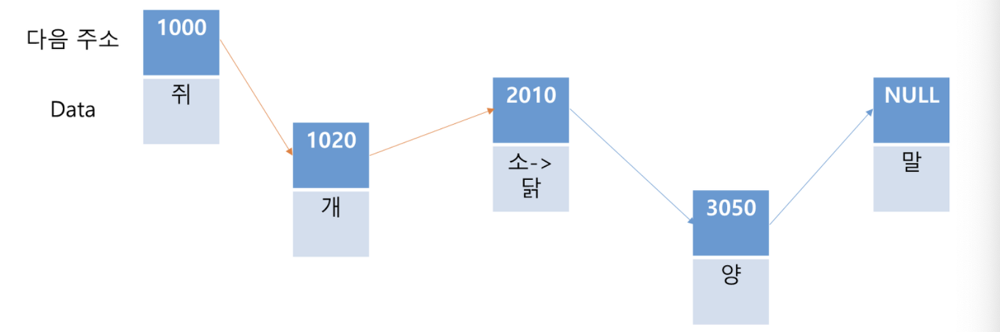
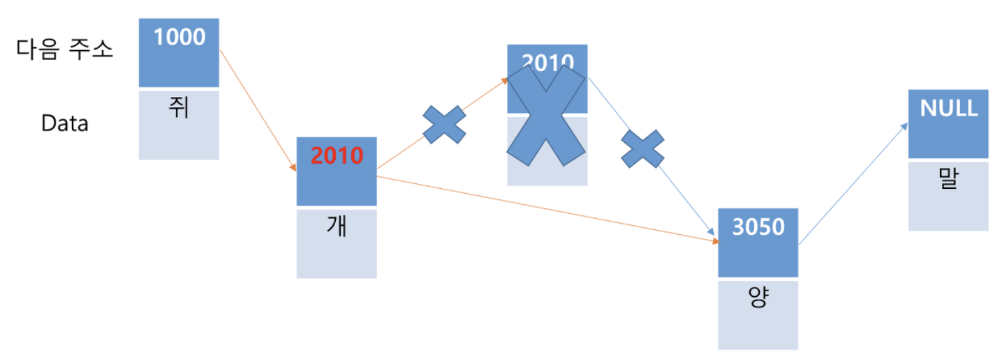

# [1주차] Array, Linked List

진행상황: Done
태그: 자료구조

# Array

<aside>
💡 **연속된 메모리 공간에** 순차적으로 저장된 동일한 타입의 데이터 모음

</aside>

### 구성요소

- 요소 ( Element )
- 인덱스 ( Index )

: 배열을 구성하는 **각각의 값**

: 배열에서의 **위치를 가리키는 숫자**

  범위 : 0 ~ (배열의 길이 - 1)

### 특징

1)  배열의 주소는 **배열명으로 접근이 가능**하다 !

⇒ 즉, 배열 이름은 **배열에 할당된 메모리 공간의 시작 주소**이다.

2) 고정된 크기를 갖는다.

3) 논리적 저장 순서와 물리적 저장 순서가 일치하다.

4) **Cache Hit Rate**가 높다

⇒ CPU가 참조하고자 하는 메모리가 **캐시에 존재하고 있는지**를 의미하며, 성능과 비례

### 지역성

| 종류 | 특성 |
| --- | --- |
| 공간 지역성 ( Spacial Locality ) | 참조된 주소와 인접한 주소의 내용이 다시 참조되는 특성 |
| 시간 지역성 ( Tempoal Locality ) | 최근에 참조된 주소는 빠른 시간내에 다시 참조되는 특성 |
| 순차 지역성 ( Sequential locality ) | ❗️데이터가 순차적으로 엑세스되는 특성으로 공간지역성에 편입되어 설명되기도 한다. |

☑️ 배열은 메모리 상 연속적으로 데이터가 저장되어있다.

→ 즉, 배열은 공간 지역성이 좋아 높은 Cache Hit Rate를 가진다!

### 배열의 연산

1) Select와 Update

| index | 0 | 1 | 2 | 3 |
| --- | --- | --- | --- | --- |
| data | 10 | 2 | 4 | 7 → 8 |

**𝙌. 위 배열에서 array[3]에 있는 값을 8로 변경하고자 할 때의 시간 복잡도?**

🅰 시작주소 + 1 → **O(1)**

2) Insert와 Delete

| index | 0 | 1 | 2 | 3 |
| --- | --- | --- | --- | --- |
| data | 10 |  | 4 | 8 |

𝙌**. 위 배열에서 array[1]에 있는 값을 삭제하고자 할 때의 시간 복잡도?**

🅰 array[1]을 삭제한 후 array[2]와 array[3]의 데이터를 왼쪽으로 땡겨야 한다.

   평균적으로 어떤 원소를 삭제할 때, **array.length / 2**만큼 땡기게 되므로

   시간 복잡도는 O(N)이 된다.

     원소 삽입의 경우에도, 삽입 후 데이터를 밀어내므로 같은 연산을 수행한다.

---

# List

— 자료 구조의 관점으로 보면 배열 또한 리스트에 포함되지만,

— 프로그래밍 언어의 관점에서

<aside>
💡 리스트란 배열이 가지고 있는 인덱스라는 장점을 버리고, 빈틈없는 데이터의 적재라는 장점을 취한 인터페이스다

</aside>

— Linked List, ArrayList 등의 선형 자료 구조를 구현할 때 사용되는 추상 자료형이다.

### 특징

1) 메모리의 낭비가 발생할 수 있는 배열과 달리, 리스트는 빈 공간을 허용하지 않기 때문에,

    **메모리의 낭비가 없다.**

2) 데이터들이 **순차적으로 구성된 집합**이지만, **메모리상에 연속적으로 존재하진 않는다**.

   → 따라서 Cache Hit Rate가 낮다.

3) 크기가 가변적이다.

### List의 연산

1) Select와 Update

**𝙌. 위 리스트에서 ‘소'를 ‘닭’으로 변경하고자 할 때의 시간 복잡도?**

🅰 리스트에서 ‘소’가 있는 위치를 찾는 데에 평균적으로 **O(N)**의 시간 복잡도를 가진다.

     변경하는 동작 자체는 O(1)의 시간복잡도

2) Insert와 Delete

**𝙌. 위 리스트에서 ‘소'를 삭제하고자 할 때의 시간 복잡도?**

🅰 소를 찾는데 우선 O(N)이 소요되고, ‘소'를 삭제하면 기존 소를 참조하던 ‘개'의 포인터 값을 ‘양'의 주소로만 바꿔주면 되기 때문에 해당 동작은 O(1)이다. 따라서, O(N)의 시간 복잡도를 갖는다. 데이터 삽입시에도 똑같이 O(N)의 시간복잡도를 갖는다.

# 

# Linked List

— Linked List( 연결 리스트 )는 각 **노드**가 데이터와 포인터를 가지고 한 줄로 연결되어 있는 방식으로 데이터를 저장하는 자료 구조이다.

- 여러 개의 노드로 이루어져 있다.
- 노드는 다음 노드의 주솟값과, 데이터를 가진다.
    
    → 마지막 노드라면, 포인터가 Null을 가리킴.
    

### 연결 리스트 메서드

→ 여기서의 인덱스는 연결 리스트를 배열로 생각했을 때의 각 위치를 의미한다.

- addToTail(Value)
- remove(Value)
- getNodeAt(index)

- contains(Value)
- indexOf(Value)
- size()
- printList()

: 주어진 Value를 연결 리스트 맨 끝에 추가

: 주어진 Value를 찾아서 연결 해제

: 주어진 인덱스의 노드를 찾아서 반환한다.

 → 없다면 undefined를 반환

: 연결 리스트에 value를 가지는 노드의 존재여부 반환

: 주어진 Value의 인덱스를 반환

: 리스트 개수 반환

: 현재 연결 리스트를 1 → 2 → 3 → 4의 형태로 출력

- 

### Doub