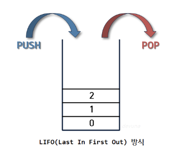
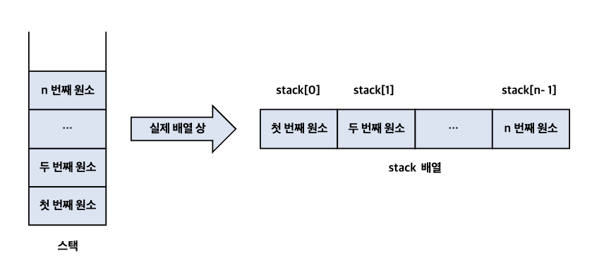
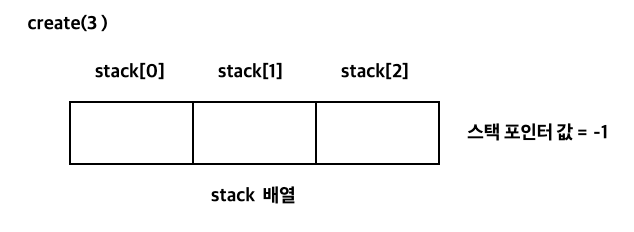
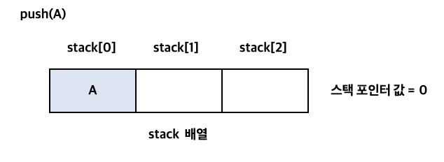
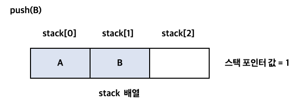
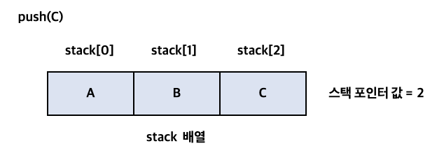
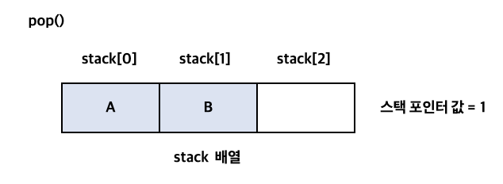
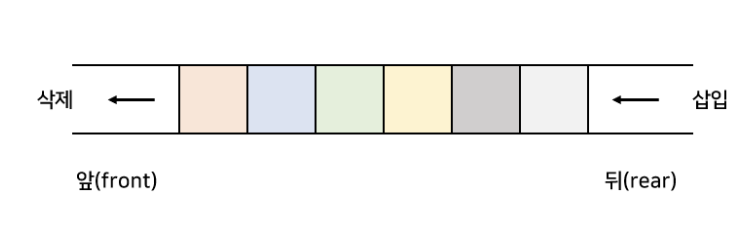

# [2주차] Stack, Queue

진행상황: Done
태그: 자료구조

# Stack

---

<aside>
💡 Stack이란 **쌓아 올린다는 것을 의미** 즉 자료를 차곡차곡 쌓아 올려나가는 형태의 자료구조이다.

</aside>

## 특징

1. 스택은 같은 구조와 크기의 자료를 **정해진 방향으로만 쌓을 수 있다.**
    
    → 쌓여진 자료는 **top 좌표를 통해서만 접근**할 수 있다.
    
    → top은 가장 위에 있는 자료 즉, **가장 최근에 들어온 자료**를 가리킨다.
    
2. 스택은 **가장 마지막에 삽입된 자료(Last-In)**가 **가장 먼저 삭제(First-Out)**되는 구조적 특징을 가진다.

## 연산

- 스택은 일반적으로 배열이나 연결 리스트를 이용해 구현한다.
- 스택의 연산은 top(스택 포인터)를 이용하여 이루어지며,
    
    → 빈 스택에서의 top값은 -1이다 : top은 가장 최근에 들어온 원소를 가리키므로, 원소가 없다면 -1
    
       ∵ top의 범위는 -1 ≤ top < 스택의 길이
    

### Stack의 삽입 ( Push )

1. 스택에 원소가 삽입되면, top을 +1 이동시켜준다.

### Stack의 삭제 ( Pop )

1. 스택의 원소가 삭제되면, top을 -1 이동시켜준다.

### 예제

> 크기가 3인 스택을 생성해 원소 A, B, C를 삽입한 후 한 개의 원소를 삭제하는 과정을 생각해보자
> 
1. 크기가 3인 스택을 생성한다. ( top : -1 )
2. 해당 스택에 원소 A를 삽입한다. ( top += 1 → top = 0)
3. 해당 스택에 원소 B를 삽입한다. ( top += 1 → top = 1)
4. 해당 스택에 원소 C를 삽입한다. ( top += 1 → top = 2)
5. 해당 스택의 가장 위에 있는 원소 즉, top이 가리키는 원소를 삭제한다. ( top -= 1 → top = 1 )

---

1. 크기가 3인 스택을 생성

1. 원소 A 삽입

1. 원소 B 삽입

1. 원소 C 삽입

1. top 원소 삭제

## Stack의 활용

- 웹 브라우저 방문기록 (뒤로 가기) : 가장 최근에 방문한 페이지부터 다시 보여준다.
- 역순 문자열 만들기
- 실행 취소 (undo) : 가장 나중에 실행된 것부터 실행을 취소한다.
- 후위 표기법 계산
- 수식의 괄호 검사 (연산자 우선순위 표현을 위한 괄호 검사)
- DFS 구현

# Queue

---

<aside>
💡 Queue의 사전적 의미는 [ (무엇을 기다리는 사람) 줄, 혹은 **줄을 서서 기다리는 것**]을 의미한다.

</aside>

→ 일상생활에서 먼저 **온 사람의 업무( First-In )**를 **먼저 처리( First-Out )하는 것**과 같은 자료구조이다.

→ 이러한 구조를 **선입선출(FIFO, First-In First-Out)방식**의 자료구조라고 표현한다.

## 특징

1. Queue는 한쪽 끝에서 삽입 작업, 다른 쪽 끝에선 삭제 작업이 이루어진다.
2. **삭제연산만 수행되는 곳을 프론트(front)**라고 하며, **삽입연산만 수행되는 곳을 리어(rear)**라고 한다.
    
    → Queue의 리어에서 이루어지는 **삽입연산을 인큐(enQueue) : rear += 1**
    
    → Queue의 프론트에서 이루어지는 **삭제연산을 디큐(deQueue) : front += 1**
    
    
    

## 종류

→ 큐는 일반적으로 배열이나 연결 리스트를 이용하며, 구현 형태에 따라 **선형 큐**와 **원형 큐** 등으로 나뉜다.

### [1] 선형 큐

- 선형 큐는 **배열을 선형으로 나타낸 형태**이다.
- 자료의 **삽입과 삭제가 용이**하나 큐에 빈 자리가 있어도 포화상태로 인식하는 경우가 있어
    
    **빈 자리를 따로 정리하는 과정을 거쳐야 한다는 단점**이 있다.
    

### [2] 원형 큐

- 배열을 원형의 형태로 표현한 것으로 **논리적으로 배열의 처음과 끝을 연결한 형태**이다.
- 초기 공백 상태에서 front와 rear의 값을 0으로 하고
    
    

## Queue의 활용

→ Queue는 주로 데이터가 입력된 시간 순서대로 처리해야 할 필요가 있는 상황에 이용한다.

1. 우선순위가 같은 작업 처리 : 프린터의 인쇄 대기열
2. 은행 업무
3. 프로세스 관리
4. BFS 구현
5. 캐시 (Cache) 구현

# 🔗   참조 링크

---

[[자료구조] 스택 (STACK), 큐(QUEUE) 개념/비교 /활용 예시](https://devuna.tistory.com/22)

[스택의 개념과 연산](https://velog.io/@suitepotato/00002)

[큐의 개념과 연산](https://velog.io/@suitepotato/00004)