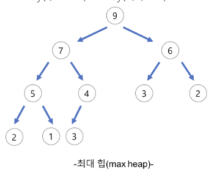
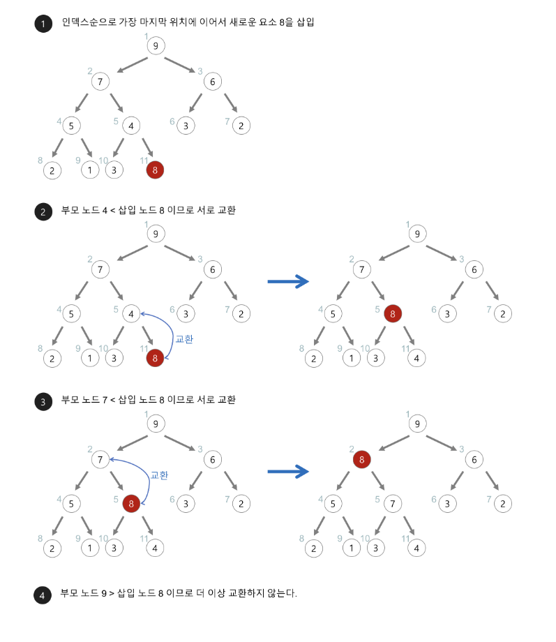
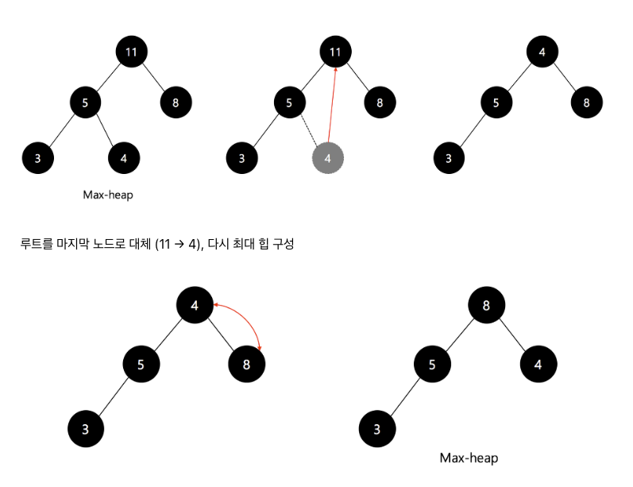

# [2주차] heap

진행상황: Done
태그: 자료구조

---

# Heap

---

<aside>
💡 **완전 이진 트리**의 일종으로 **우선순위 큐를 위하여 만들어진 자료구조**이다

</aside>

- 여러 원소 중 최댓값이나 최솟값을 빠르게 찾아내도록 만들어진 자료구조
- 힙은 일종의 **반정렬 상태( 느슨한 정렬 상태 )**를 유지한다
    
    ☑️  반정렬 상태 : 부모 노드와 자식노드간의 정렬은 진행됐지만, 형제 노드 끼리는 정렬하지 않으므로
    
- 힙 트리에서는 중복된 값을 허용한다 ( ❗️ 이진 탐색 트리에서는 중복된 값을 허용하지 않는다 )

## 종류

---

### [1] 최대힙 ( max heap )

→ 부모 노드의 키 값이 자식 노드의 키 값보다 크거나 같은 완전 이진트리

### [2] 최소힙 (  min heap )

→ 부모 노드의 키 값이 자식 노드의 키 값보다 작거나 같은 완전 이진트리

## 힙의 구현

---

- 힙을 저장하는 표준적인 자료구조는 **배열**이다.
- 배열의 편의성을 위해 첫 인덱스인 0 은 사용하지 않는다.
- 특정 위치의 노드 번호는 새로운 노드가 추가되어도 변하지 않는다.
    
    → 루트 노드의 오른쪽 노드는 항상 3이다
    
- 힙에서의 부모 노드와 자식 노드의 관계
    
    
    [1] 왼쪽 자식의 인덱스 
    
    [2] 오른쪽 자식의 인덱스
    
    [3] 부모의 인덱스
    
    = (부모의 인덱스) * 2       → 짝수
    
    = (부모의 인덱스) * 2 + 1 → 홀수
    
    = (자식의 인덱스) / 2
    

## 힙의 연산

---

### 힙 구조화 ( heapify )

  힙에서 원소의 삽입이나 삭제 등 **힙의 조건이 깨질 경우**, **힙의 조건을 만족하도록** 노드의 위치를 바꾸는 것

→ 삽입과 삭제의 경우 **연산 자체는 O(1)**의 시간 복잡도로 작동하지만,

    재구조화의 과정이 O(logN)이 소요 →  **최종적으로 O(logN)의 시간 복잡도**를 가지게 된다.

### 힙 만들기 ( build heap )

  배열을 힙으로 만드는 과정 → 이 때, **heapify를 N번 진행**하므로 **시간 복잡도는 O(NlogN)**이 소요된다.

→ 가장 말단의 오른쪽에 있는 노드의 부모 노드부터 위에서 아래로 heapify 진행

### 힙의 삽입

1. 힙에 새로운 요소가 들어오면, 새로운 요소를 힙의 마지막 노드에 이어서 삽입한다.
2. 새로운 노드를 부모 노드들과 비교 후 힙의 성질을 이어간다.

### 힙의 삭제

1. 최대 힙에서 최댓값을 삭제할 때,  최댓값은 루트 노드이므로 → 루트 노드 삭제
2. 삭제된 로트 노드에는 힙의 마지막 노드를 가져온다.
3. 힙을 재구성한다.
    
    
    

### 힙 정렬

  정렬은 **추가적인 배열을 사용하지 않고**, **시간 복잡도 O(NlogN)**에 수행 가능하다.

[1] 내림차순 정렬 → 최대 힙 사용

[2] 오름차순 정렬 → 최소 힙 사용

   ❗️ 힙 정렬은 전체 자료를 정렬하는 것이 아닌, **가장 큰 값 몇 개만 필요할 때 가장 유용**하다.

### 진행 과정

---

1. 정렬할 N개의 원소로 최대 힙 구성
2. 최대 힙의 루트 노드와 마지막 원소 위치 교환
3. 새로운 루트 노드에 대해 최대 힙 구성
4. 원소 개수만큼 단계 2, 단계 3을 반복 수행

build heap 과정 → **O(NlogN)**

최대 힙에서 원소를 하나 삭제

heapify진행       → **O(NlogN)**

⇒  따라서, 힙 정렬의 O(NlogN) + O(NlogN) = **O(NlogN)**의 시간 복잡도를 가진다 .

# 🔗  참조 링크

---

[[자료구조] 힙(heap)이란 - Heee's Development Blog](https://gmlwjd9405.github.io/2018/05/10/data-structure-heap.html)

[힙 정렬(Heap Sort)](https://ratsgo.github.io/data%20structure&algorithm/2017/09/27/heapsort/)