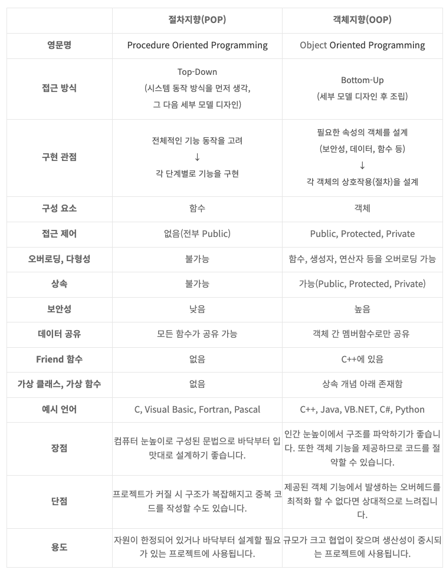

# [3주차] 절차지향 프로그래밍

진행상황: Done
태그: CS

---

# 절차지향 프로그래밍 ( Procedural Programming )

---

<aside>
💡 **일이 진행되는 순서대로 프로그래밍**하는 방법

</aside>

- 절차지향 프로그래밍은 객체지향 프로그래밍에 대조되는 단어가 아니다
- 절자적 프로그래밍이라고도 하며, **Procedure**를 이용하여 작성하는 **프로그래밍 스타일**이다.

⇒     ❗️절차적 프로그래밍은 **순차적인 처리를 중요**시 여기며, 

   **프로그램 전체가 유기적으로 연결되도록** 만드는 프로그래밍 기법이다.

## Procedure 목록

---

- 루틴

: **Main문**

- 서브루틴

: Main문 밖에서 정의한 코드 블럭 중 **반환 값이 없는 것**

- 함수

      : Main문 밖에서 정의한 코드 블럭 중 **반환 값이 있는 것**

## 장점

---

1. 모듈 구성이 용이하며 구조적인 프로그래밍이 가능하다.
2. 컴퓨터의 처리구조와 유사해 실행 속도가 빠르다.

## 단점

---

1. 유지보수가 어렵다.
2. 정해진 순서대로 입력이 이뤄져야 하므로, 순서를 바꾸면 결과값의 보장이 어렵다.
3. 코드가 길어질수록 가독성이 떨어지며 이해하기가 어렵다.
4. 대형 프로젝트에 부적합하다

## 절차적 프로그래밍의 종류

---

**[1]. C언어**

- 고급 프로그래밍 언어와 저급 프로그래밍 언어의 특징을 모두 갖췄다.
- 컴파일러 방식의 언어이다.
- 이식성이 좋아 컴퓨터 기종에 관계없이 프로그램 작성이 가능하다.

**[2]. ALGOL**

- 수치 계산이나 논리 연산을 위한 과학 기술 계산용 언어이다.
- PASCAL과 C언어의 모체가 되었다.

**[3]. COBOL**

- 사무 처리용 언어이다.
- 영어 문장 형식으로 구성되어 이해와 사용이 쉽다.

**[4]. FORTRAN**

- 과학 기술 계산용 언어이다.
- 수학과 공학 분야의 공식이나 수식과 같은 형태로 프로그래밍 가능.

## 소프트웨어의 위기

---

- 소프트웨어의 급격한 발전이 이루어지며, 그로 인해 소프트웨어의 규모가 커져갔다.
- 복잡해졌으며 커져버린 프로젝트를 더 이상 절차 지향적 프로그래밍을 통해 소화할 수 없었다
    
    ⇒ 품질이 하락
    
- 그에 대한 대안으로 객체지향 프로그래밍을 개발하여 발전하게 되었다.

# PP vs OOP

---

## 목적

---

**절차지향**

- 절차가 중점이 된다

**객제지향**

- 객체 종류 ﹒속성 등이 중점이 된다

## 설계방식

---

**절차지향**

- 프로그램의 **순서와 흐름을 먼저** 세우고,
    
    필요한 자료구조와 함수들을 설계
    
- **하향식 설계**

**객체지향**

- **자료 구조와 이를 중심으로 한 모듈 들을 먼저** 설계한 다음, 이들의 실행 순서와 흐름을 조합하는 방식
- **상향식 설계**

## 더 나은 설계는?

---

<aside>
💡 더 나은 설계란 없으며, **비즈니스 모델의 성격에 따라 다를 뿐**이다.

</aside>

→ 객체는 변수와 함수를 추상화 과정을 통해 좀 더 모듈화한 도구에 불과하다.

- 모듈화 함으로써 객체지향이 지닐 수 있는 강점인 `**[ 정보 은닉화, 상속 및 다형성을 통한 확장성과 재사용성, 생산성과 유지보수의 용이성 ]**` 이 OOP의 진정한 특징이자 정체성일지도 모른다.

## 정리

---

# 🔗  참조 링크

[[프로그래밍 언어] 절차적 프로그래밍 vs 객체지향 프로그래밍](https://kevinkim95-dev.tistory.com/2)

[객체지향과 절차지향](https://incheol-jung.gitbook.io/docs/q-and-a/architecture/undefined)

[절차지향과 객체지향 언어의 차이, 장단점, 코드 비교, 용도 총정리](https://blog.naver.com/PostView.nhn?isHttpsRedirect=true&blogId=hirit808&logNo=221457311265&categoryNo=35&parentCategoryNo=0&viewDate=&currentPage=1&postListTopCurrentPage=1&from=search)

[절차지향(Procedural Programming), 객체지향(Object Oriented Programming) 장단점 및 차이점](https://usefultoknow.tistory.com/entry/%EC%A0%88%EC%B0%A8%EC%A7%80%ED%96%A5Procedural-Programming-%EA%B0%9D%EC%B2%B4%EC%A7%80%ED%96%A5Object-Oriented-Programming-%EC%9E%A5%EB%8B%A8%EC%A0%90-%EB%B0%8F-%EC%B0%A8%EC%9D%B4%EC%A0%90)