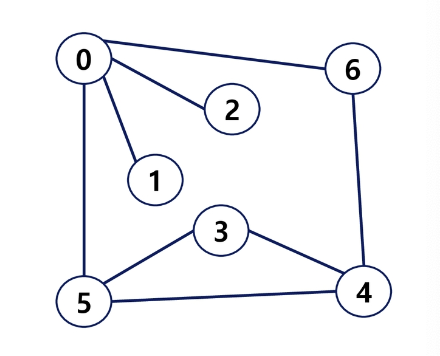

# [4주차] 그래프

진행상황: Done
태그: 자료구조

---

# 그래프

---

<aside>
💡 그래프는 **아이템( 사물 또는 추상적 개념 )들과 이들 사이의 연결 관계**를 표현한다.

</aside>

- 그래프는 **정점들의 집합**과 이들을 연결하는 **간선들의 집합**으로 **구성된 자료구조**이다.
- 선형 자료구조나 트리 자료구조로 표현하기 어려운 **N : N 관계를 표현하기에 용이한 자료구조**이다.

## 구성요소

---

**정점 ( Vertex )**

- 그래프의 구성요소로 하나의 연결 점 ( 트리에서의 노드와 비슷 )

**간선 ( Edge )**

- 두 정점을 연결하는 선

**차수 ( Degree )**

- 정점에 연결된 간선의 수

## 그래프의 간선 개수

---

✅ **V개의 정점**을 가지는 그래프의 최대 간선 수는 `V * (V - 1) / 2`개이다.

# 그래프 유형

---

- **무향 그래프 ( Undirected Graph )**

: **방향이 없는** 그래프

- **유향 그래프 ( Directed Graph )**

: **방향을 가진** 그래프

- **가중치 그래프 ( Weighted Graph )**

: 간선별 **가중치가 부과**된 그래프

- **사이클 없는 방향 그래프 ( DAG, Directed Acyclic Graph )**

- **완전 그래프**

- **부분 그래프**

: 정점들에 대해 가능한 모든 간선을 가진 그래프

  → **간선의 수 : V * (V - 1) / 2**

: 일부의 정점이나 간선을 제외한 그래프

### ❗️트리도 그래프이다

1. 각 노드는 **최대 하나의 부모 노드가 존재**할 수 있다.
2. 각 노드는 **자식 노드가 없거나 하나 이상이 존재**할 수 있다.
3. 두 노드 사이에는 **유일한 경로가 존재**한다.

# 용어 정리

---

## 인접 ( Adjacency )

---

<aside>
💡 두 개의 정점에 **간선이 존재**하면 **서로 인접**해 있다고 한다.

</aside>

→ 완전 그래프에 속한 임의의 두 정점들은 서로 인접해 있다.

## 그래프 경로

<aside>
💡 **경로(Path)란** 어떤 정점에서 시작하여 다른 정점으로 끝나는 순회로 **두 정점 사이를 잇는 간선들을 순서대로 나열한 것**

</aside>

- 같은 정점을 거치지 않는 간선들의 Sequence
- 어떤 정점에서 다른 정점으로 가는 경로는 여러가지일 수 있다.

𝙌. 0에서 6까지의 경로를 나타내시오

🅰 **정점들** : 0 - 2 - 4- 6  **간선들** :(0, 2) - (2, 4) - (4, 6)

### 사이클 ( Cycle )

---

- 경로의 시작 정점과 끝 정점이 같은 것
- 시작한 정점에서 끝나는 경로
- ex ) 1 - 3 - 5 - 1

## 그래프 표현

---

<aside>
💡 간선의 정보를 저장하는 방식, 메모리나 성능을 고려해서 결정

</aside>

### [1]. 인접 행렬 ( Adjacent matrix )

---

<aside>
💡 두 정점을 연결하는 간선의 유무를 행렬로 표현

</aside>

- V x V 정방 행렬
- 행 번호와 열 변호는 그래프의 정점에 대응
- 두 정점이 인접하다면 1, 그렇지 않다면 0으로 표현

### 무향 그래프

---

- i 번째 행의 합 = i 번째 열의 합 = Vi의 차수

### 유향 그래프

---

- 행 i의 합 = Vi의 진출 차수
- 열 i의 합 = Vi의 진입 차수

### 인접 행렬의 단점은 ?

---

- 간선의 수와 무관하게 항상 **n² 크기의 2차원 배열이 필요**하므로 **메모리 공간이 낭비**된다.
- 모든 간선의 수를 알아내려면 **인접행렬 전체를 확인**해야 하므로 `O(n²)`의 시간이 소요된다.

### 희소 그래프 ( Sparse Graph ) VS 밀집 그래프 ( Dense Graph )

---

### [2]. 인접 리스트 ( Adjacent List )

---

<aside>
💡 각 정점에 대한 인접 정점들을 순차적으로 표현

</aside>

- 하나의 정점에 대한 인접 정점들을 각각 노드로 하는 연결 리스트로 저장

### [3]. 간선 리스트 ( Edge List )

---

<aside>
💡 두 정점에 대한 간선 그 자체를 객체로 표현하여 리스트로 저장

</aside>

- 간선을 표현하는 두 정점의 정보를 나타냄 [ 시작 정점, 끝 정점 ]

# 🔗  참조 링크

[삼성 청년 SW 아카데미](https://edu.ssafy.com/edu/lectureroom/openlearning/openLearningList.do)