# [4주차] 트리

진행상황: Done
태그: 자료구조

---

# 트리

---

<aside>
💡 트리란 스택이나 큐와 같은 선형 구조가 아닌 비선형 구조이고 **계층적 관계 ( Hierachical Relationship )** 을 표현하는 자료구조이다.

</aside>

- 한 개 이상의 노드로 이루어진 유한 집합이며 다음 조건을 만족한다.
    
    — 노드 중 최상위 노드를 루트( Root )라 한다.
    
- 트리는 각각의 부분트리로 나눌 수 있으며, 이를 부 트리 ﹒**서브트리**라고 한다.

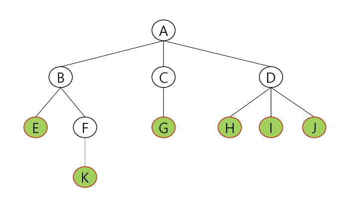

## 트리 용어정리

---

### [1]. 노드

---

- **형제 노드 ( Sibling node )**
    
    → 같은 부모 노드의 자식 노드들 ( B, C, D 등 )
    
- **조상 노드**
    
    → 간선을 따라 루트 노드까지 이르는 경로에 있는 모든 노드들
    
    → K의 조상 노드 : F, B, A
    
- **서브트리 ( Sub Tree )**
    
    → 부모 노드와 연결된 간선을 끊었을 때 생성되는 트리
    
- **자손 노드**
    
    → 서브 트리에 있는 하위 레벨의 노드들
    
    → B의 자손 노드 : E, F, K
    

### [2]. 차수 ( Degree )

---

- **노드의 차수** : 노드에 연결된 자식 노드의 수
    
    → B의 차수 = 2, C의 차수 = 1
    
- **트리의 차수** : 트리에 있는 노드의 차수 중에서 가장 큰 값
    
    → 트리 T의 차수 = 3
    
- **단말 노드 ( Leap Node )** : 차수가 0인 노드, 자식 노드가 없는 노드

### [3]. 높이

---

- **노드의 높이** : 루트에서 노드에 이르는 간선의 수, 노드의 레벨
    
    → B의 높이 = 1, F의 높이 = 2
    
- **트리의 높이** : 트리에 있는 노드의 높이 중에서 가장 큰 값, 최대 레벨
    
    → 트리 T의 높이 = 3
    
    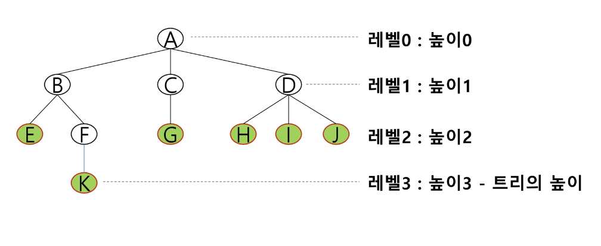
    

# 이진트리

---

<aside>
💡 모든 노드들이 2개의 서브트리를 갖는 특별한 형태의 트리

</aside>

❗️각 노드가 자식 노드를 최대한 2개 까지만 가질 수 있는 트리이다.

- 왼쪽 자식 노드 ( Left Child Node )
- 오른쪽 자식 노드 ( Right Child Node )

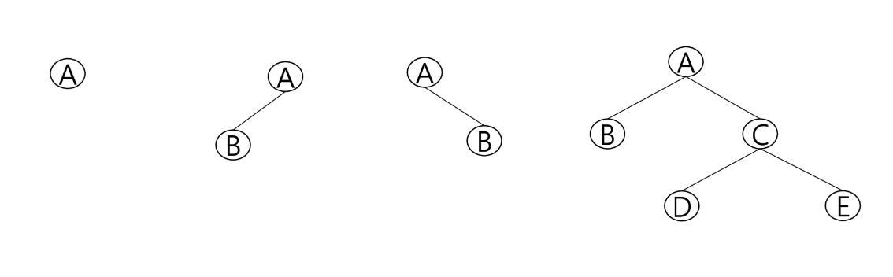

## 이진트리의 특성

---

- 레벨 i에서의 노드의 최대 개수는 2개
- 높이가 h인 이진 트리가 가질수 있는 노드 개수
    
    — 최대 개수 : (2의 h + 1승 - 1)개
    
    — 최소 개수 : (h + 1) 개
    

## 이진트리의 종류

---

### [1]. 포화 이진 트리 ( Full Binary Tree )

---

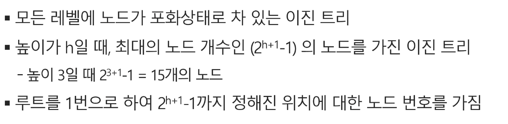

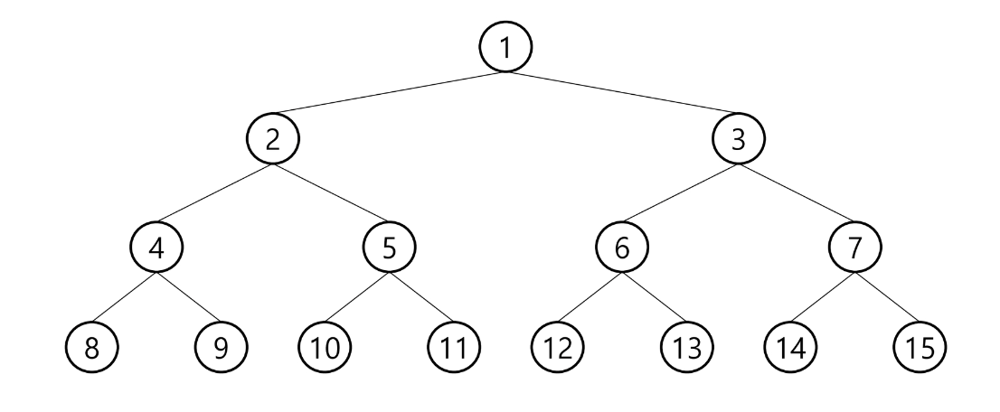

### [2]. 완전 이진 트리 ( Complete Binary Tree )

---

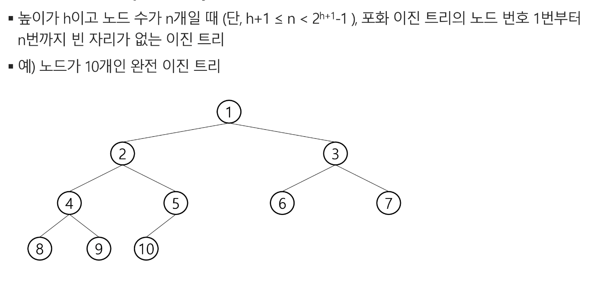

### [3]. 편향 이진 트리 ( Skewed Binary Tree )

---

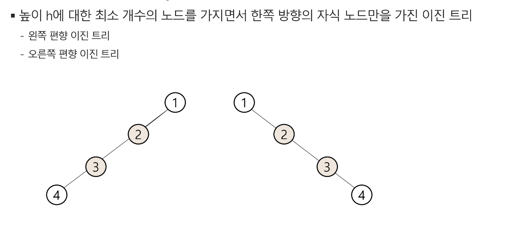

## 이진트리의 순회 ( Traversal )

---

<aside>
💡 트리의 각 노드를 **중복되지 않게 전부 방문**하는 것

</aside>

❗️트리는 **비 선형 구조**이기 때문에 선형구조에서와 같이 **선후 연결관계를 알 수 없다.**

## 3가지 기본적인 순회방법

---

### [1]. 전위순회 ( Preorder Traversal ) : VLR

---

- 부모노드 방문 후, 자식 노드를 좌, 우 순서로 방문한다.

### 수행 방법

---

1. 현재 노드 N을 방문하여 처리한다 → V
2. 현재 노드 N의 왼쪽 서브트리로 이동한다 - > L
3. 현재 노드 N의 오른쪽 서브트리로 이동한다 → R

```python
def preorder_traversal(T):
		if T : # T is not None
				visit(T)
				preorder_traversal(T.left)
				preorder_traversal(T.right)
```

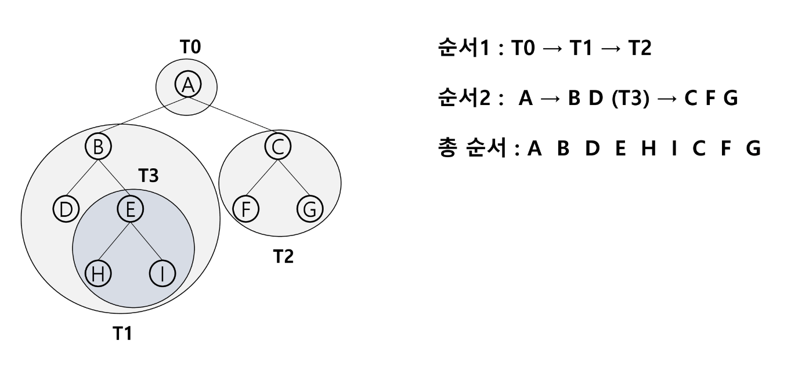

### [2]. 중위순회 ( Inorder Traversal ) : LVR

---

- 왼쪽 자식노드, 부모노드, 오른쪽 자식노드 순으로 방문한다.

### 수행 방법

---

1. 현재 노드 N의 왼쪽 서브트리로 이동한다 : L
2. 현재 노드 N을 방문하여 처리한다 : V
3. 현재 노드 N의 오른쪽 서브트리로 이동한다 : R

```python
def inorder_traversal(T):
		if T:
				inorder_traversal(T.left)
				visit(T)
				inorder_traversal(T.right)
```


### [3]. 후위순회 ( PostOrder Traversal ) : LRV

---

- 자식노드를 좌우 순서로 방문한 후, 부모노드로 방문한다.

### 수행 방법

---

1. 현재 노드 N의 왼쪽 서브트리로 이동한다 : L
2. 현재 노드 N의 오른쪽 서브트리로 이동한다 : R
3. 현재 노드 N을 방문하여 처리한다 : V

```python
def postorder_traversal(T):
		if T:
				postorder_traversal(T.left)
				postorder_traversal(T.right)
				visit(T)
```

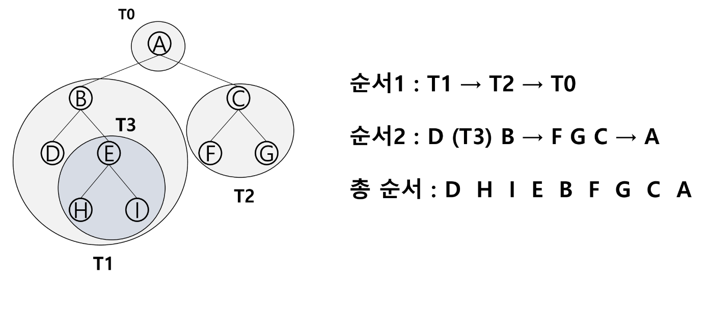

## 이진트리의 표현

---

### [1]. 배열을 통한 이진 트리의 표현

- 노드 번호를 **배열의 인덱스로 사용**
- 높이가 h인 이진 트리를 위한 배열의 크기 : **2의 h + 1승 - 1**

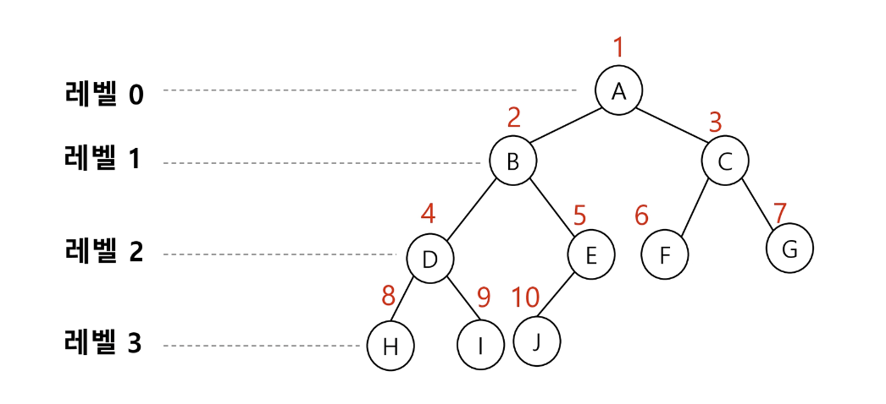

### 노드의 성질

---

- 노드 번호가 i 인 노드의 부모 노드 번호 : **i / 2**
- 노드 번호가 i 인 노드의 왼쪽 자식 노드 번호 : **2 * i**
- 노드 번호가 i 인 노드의 오른쪽 자식 노드 번호 : **2 * i + 1**
- 레벨 N의 노드 시작 번호 : **2^N**

### 배열을 이용한 이진 트리 표현의 단점

---

- 편향 이진 트리의 경우, **사용하지 않는 배열 원소에 대한 메모리 공간 낭비** 발생

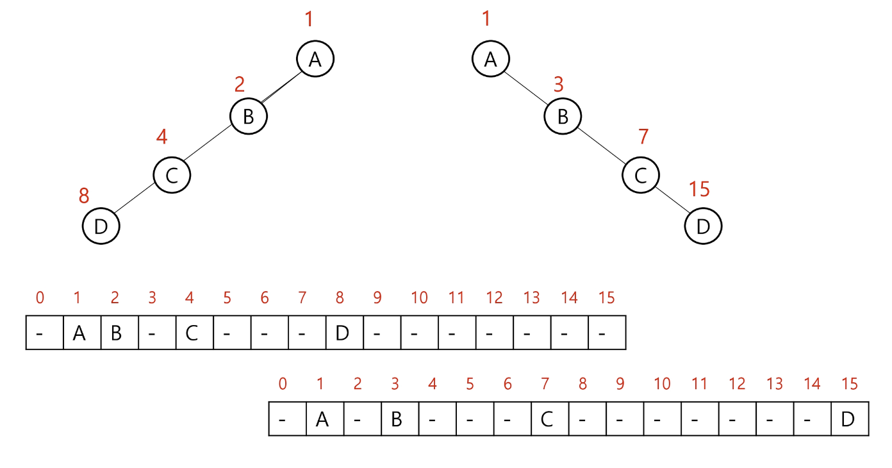

- 트리의 중간에 구조적 변경이 일어날 경우 ( 노드의 삽입, 삭제 ) **배열의 크기 변경**이 어렵다

### [2]. 연결리스트를 통한 이진 트리의 표현

---

<aside>
💡 배열의 단점을 보완하기 위해 **`( 메모리 낭비, 구조 변경의 비효율성 )`** 연결리스트를 이용하여 트리를 표현할 수 있다.

</aside>

- 이진 트리의 모든 노드는 **최대 2개의 자식 노드**를 가지므로.
    
    → 일정한 구조의 **단순 연결 리스트 노드를 사용**하여 구현
    
    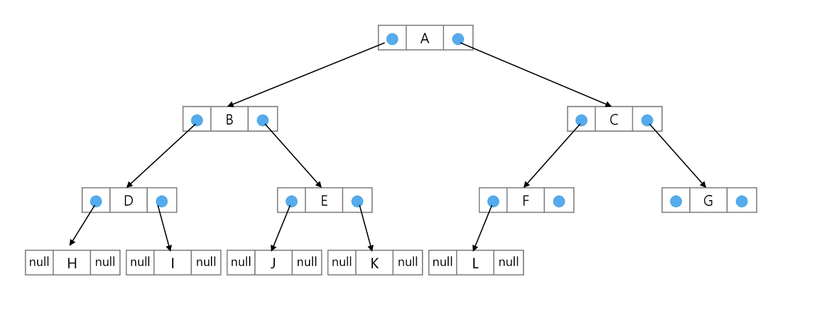
    

# 수식 트리

---

<aside>
💡 수식을 표현하는 이진 트리

</aside>

- **수식 이진 트리 ( Expression Binary Tree )** 라고 부르기도 한다.
- 연산자는 루트 노드이거나 가지 노드
- 피 연산자는 모두 잎(Leap) 노드

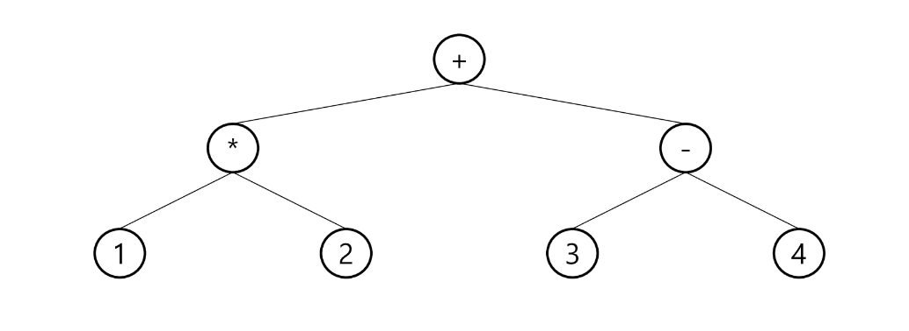

## 수식 트리의 순회

---

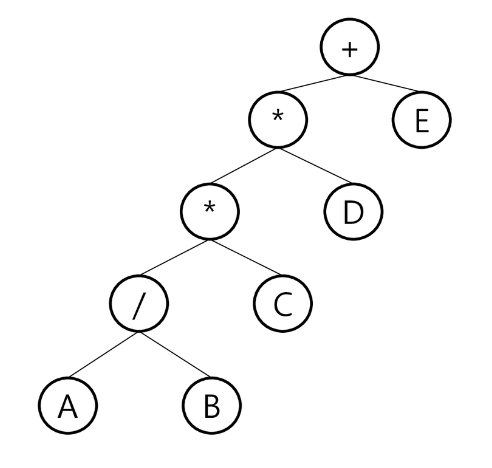

- 중위 순회 : **A / B * C * D + E**
- 후위 순회 : **A B / C * D * E +**
- 전위 순회 : **+ * * / A B C D E**

# 이진 탐색 트리

---

<aside>
💡 탐색작업을 효울적으로 하기 위한 자료구조

</aside>


## 이진 탐색 트리의 특징

---

- **모든 원소는 서로 다른 유일한 키**를 갖는다.
- left < root < right
- 왼쪽 서브트리와 오른쪽 서브트리도 이진 탐색 트리 구조를 갖는다.
- **중위 순회하면 오름차순으로 정렬된 값**을 얻을 수 있다.

 

## 이진 탐색 트리의 연산

---

### [1]. 탐색연산

---

1. **루트에서 시작**한다.
2. 탐색할 키 값 X를 루트 노드의 키 값과 비교한다.
    - **(키 값 X = 루트노드의 키 값 )**인 경우 : 원하는 원소를 찾았으므로 탐색연산 성공
    - **(키 값 X < 루트노드의 키 값 )**인 경우 : 루트노드의 왼쪽 서브트리에 대해서 탐색 수행
    - **(키 값 X > 루트노드의 키 값 )**인 경우 : 루트노드의 오른쪽 서브트리에 대해서 탐색 수행
3. 서브트리에 대해서 순환적으로 탐색 연산을 반복한다.

### [2]. 삽입연산

---

1. 먼저 탐색 연산을 수행
    - **삽입할 원소와 같은 원소가 트리에 있다면 삽입할 수 없으므로**, 같은 원소가 트리에 있는지 탐색하여 확인한다.
2. 탐색 실패한 위치에 원소를 삽입한다.

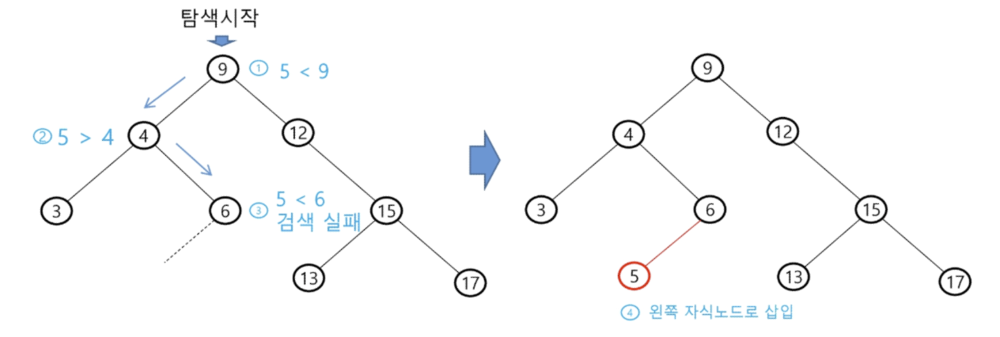

### [3]. 삭제연산

---

- **삭제하려는 노드가 단말 노드일 경우**
    1.  삭제하고자 하는 노드를 삭제해주면 된다.
    
    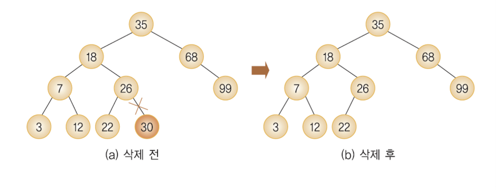
    
- **삭제하려는 노드가 하나의 서브트리만 갖는 경우**
    1. 삭제하고자 하는 노드를 삭제한다.
    2. 해당 노드의 자식 노드를 해당 노드의 위치로 옮겨준다.
    
    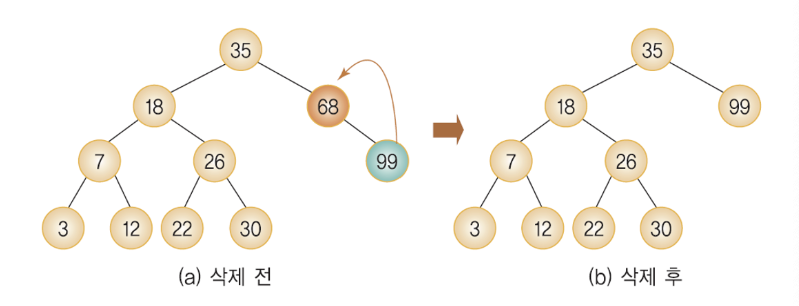
    
- **삭제하려는 노드가 두 개의 서브트리를 갖는 경우**
    1. 삭제하고자 하는 노드와 가장 비슷한 값을 갖는 노드를 해당 노드의 위치로 가져온다.
    
    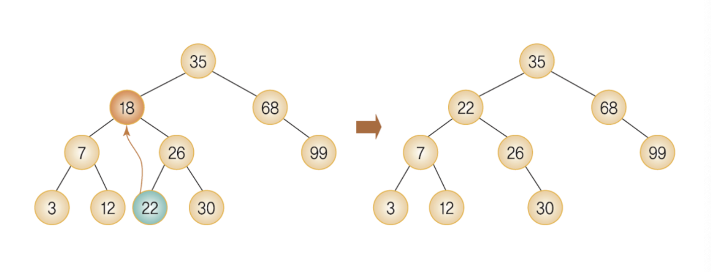
    

## 이진 탐색 트리의 성능

---

- **탐색, 삽입, 삭제시간** : **O(h)** - 트리의 높이만큼의 시간 소요
- **평균의 경우** : 이진 트리가 균형적으로 생성되어 있을 때 - **O(logN)**
- **최악의 경우** : 한쪽으로 치우친 경사 이진트리의 경우 - **O(N)**

# 🔗  참조 링크

[이진탐색트리 삭제 연산](https://velog.io/@abda/%EC%9D%B4%EC%A7%84%ED%83%90%EC%83%89%ED%8A%B8%EB%A6%AC-%EC%82%AD%EC%A0%9C-%EC%97%B0%EC%82%B0-lc9wll6k)

[삼성 청년 SW 아카데미](https://edu.ssafy.com/edu/lectureroom/openlearning/openLearningList.do)