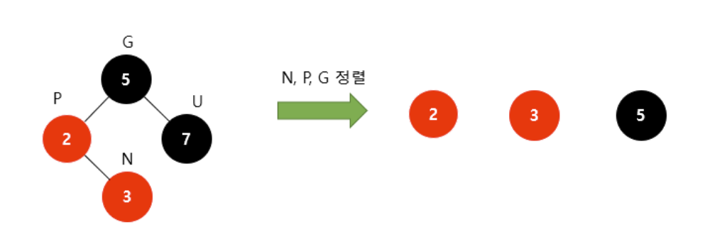

# [5주차] 트리2

진행상황: Done
태그: 자료구조

---

avl 트리, 레드블랙 트리, B + 트리, 트라이

# AVL 트리 ( Adelson-Velski & Landis )

---

<aside>
💡 트리를 구성하는 왼쪽 및 오른쪽 서브트리의 높이가 1 이하인 균형트리

</aside>

- 스스로 균형을 잡는 이진 탐색 트리이다.
    - 두 자식 서브트리의 높이는 항상 최대 1만큼 차이난다.
    - 만약 어떤 시점에서 높이 차이가 1보다 커지면 이 속성을 유지하기 위해 스스로 균형을 잡는다.

❗️ **트리 내의 검색 시간을 줄이는 것**이 목적 

## AVL 트리의 필요성

---

- 편향 이진트리의 경우 O(N)의 시간복잡도를 가지는데,
    
    → 이러한 경우에 비효율적으로 구성되는 것을 막기 위해 균형을 잡아준다. → **O(logN)**
    

## Balance Factor

---

- 이진트리의 균형을 잡을 때 핵심되는 것으로, **왼쪽과 오른쪽 서브트리의 높이차이**를 뜻한다.
- 각각의 노드의 BF는 자식 노드간 높이의 차이 값 ( 해당 트리에서 -2 ~ 2의 범위 )
    
    → 이를 **-1 ~ 1의 범위로 좁혀주는 것**을 균형을 잡는다라고 표현한다.
    

## 회전( 균형 잡기 )

---

### 종류

- 왼쪽 으로 돌리는 회전 ( L )
- 오른쪽으로 돌리는 회전 ( R )
- 왼쪽에서 오른쪽으로 돌리는 회전 ( LR )
- 오른쪽에서 왼쪽으로 돌리는 회전 ( RL )

### 회전 과정

[[Data Structure] AVL(Adelson-Velsky and Landis) 트리란?](https://fomaios.tistory.com/entry/Data-Structure-AVLAdelson-Velsky-and-Landis-%ED%8A%B8%EB%A6%AC%EB%9E%80)

# 레드-블랙 트리 ( Red-Black Tree )

---

<aside>
💡 자가 균형 이진 탐색 트리이다

</aside>

## 조건

---

1. 모든 노드는 **빨간색** 혹은 **검은색**이다.
2. 루트 노드는 **검은색**이다.
3. 모든 리프노드( NIL )들은 **검은색**이다.
    
    ✅ **NIL ( Null Leap )** : 자료를 갖지 않으며 트리의 끝을 나타내는 노드
    
4. **빨간색** 노드의 자식은 **검은색**이다.
    
    → No Double Red( 빨간색 노드가 연속으로 나올 수 없다. )
    
5. 모든 리프 노드에서 Black Depth는 같다.
    
    → 리프노드에서 루트 노드까지 가는 경로에서 만나는 **검은색 노드의 개수가 같다.**
    

## 삽입 과정

---

- 레드-블랙 트리에 새로운 노드를 삽입할 때, **새로운 노드**는 항상 **빨간색으로 삽입**한다.
    
    → 이렇게 되면 4번 조건이 위배되어 **Double Red 발생**
    
- 레드-블랙 트리는 이러한 Double Red 문제를 해결하기 위해 2가지 전략을 사용한다.

## Double Red 해결 전략

---

- 새로 삽입할 노드를 N( New ), 부모 노드를 P( Parent ), 조상 노드를 G( Grand Parent ), 삼촌 노드를 U( Uncle )이라고 할 때, ❗️ **Double Red가 발생했다면 !**
    1. 삼촌 노드 ( U )가 **검은색**이라면 → **Restrucuring을 수행**
    2. 삼촌 노드 ( U )가 **빨간색**이라면 → **Recoloring을 수행**

### [1]. Restructuring

---

1. 새로운 노드 (N), 부모 노드(P), 조상 노드(G)를 오름차순으로 정렬한다.

1. 셋 중 중간값을 부모로 만들고, 나머지 둘을 자식으로 만든다.

1. 새로 부모가 된 노드를 검은색으로 만들고 나머지 자식들을 빨간색으로 만든다.

### [2]. Recoloring

---

1. 새 노드 ( N )의 부모( P )와 삼촌( U )를 검은색으로 바꾸고 조상( G )을 빨간색으로 바꾼다.
    
    1-1. 조상( G )이 루트노드라면 → 검은색으로 바꾼다.
    
    1-2. 조상( G )을 빨간색으로 바꿨을 때, 또 다시 Double Red가 발생한다면
    
      → Double Red가 발생하지 않을 때 까지, Restructuring이나 Recoloring을 반복
    

- **상세 과정**
    
    [https://code-lab1.tistory.com/62](https://code-lab1.tistory.com/62)
    

# 트라이

---

- 문자열을 트리구조로 저장해 빠르게 찾는 알고리즘 기법
- 검색어 자동완성, 사전 검색, 문자열 검사 등에 사용된다.
- 하나의 노드는
    - 알파벳일 경우 26개의 자식노드
    - 숫자일 경우 10개의 자식노드가 생길 수 있다.
- 한 노드당 그 만큼의 포인터 배열을 설정해야 하므로, 공간복잡도를 많이 소모한다.

## 트라이 시간 복잡도

---

- 제일 긴 문자열의 길이를 L, 총 문자열의 수를 M이라 할 때,
    
    생성 : O(M * L) → 모든 문자열을 넣어야 하며 ( M )개에 대해 가장 긴 문자열인 ( L )만큼 걸리므로 L * M만큼의 시간 복잡도
    
    삽입 : O(L)