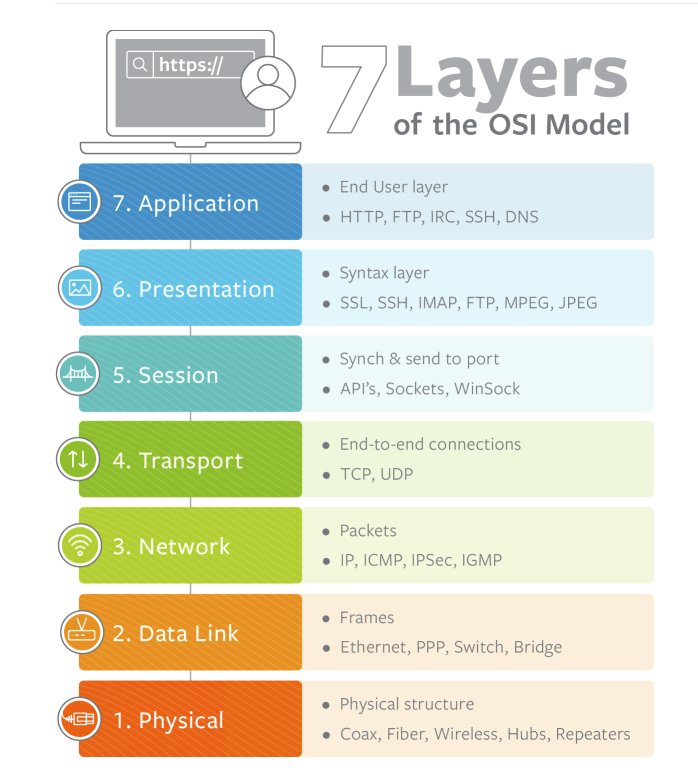
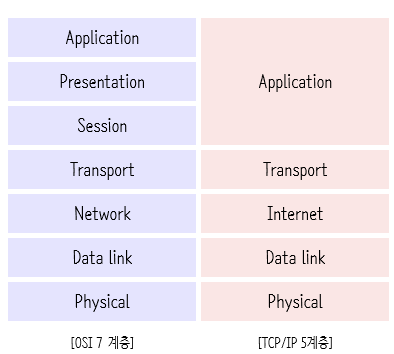

# [6주차] OSI 7 Layers

진행상황: Done
태그: CS

---

# OSI 7 Layers

---

<aside>
💡 OSI 7계층은 네트워크를 구성하는 표준 계층 중 하나로, 네트워크 통신에서 일어나는 7단계의 과정

</aside>

## 7 계층으로 나누게 된 이유

---

<aside>
💡 통신이 일어나는 과정을 단계별로 알 수 있고, 특정한 곳에 이상이 생기면 그 단계만 수정할 수 있기 때문

</aside>

- 계층을 분리함으로써 각 계층은 독립적인 역할 수행이 가능하다.
    
    → 역할이 분리되면 문제 발생 시, 문제의 현상을 보았을 때 어떤 계층에 문제가 생겼는지 파악이 가능해진다.
    
- 각 계층은 하위 계층을 사용하고 현 계층의 기능을 포함하여 상위 계층에 제공한다.
    
    → 그래서 계층구조는 위에서 바라보았을 때, 아래층이 안보이는 구조라 볼 수 있다.
    
    → **따라서, 최상위 계층만 보면 그 아래계층을 모두 포함하고 있다.**
    

## [1]. 물리 계층 ( Physical Layer )

---

<aside>
💡 물리계층은 단지 데이터를 전기적인 신호로 변환해서 주고받는 기능을 진행하는 역할을 한다.

</aside>

- 데이터를 **전송하는 역할만 진행**하며, 데이터의 **종류나 오류를 제어하지 않는다.**
- 전기적인, 기계적인 신호를 주고받는 역할을 하는 계층
- 대표적인 장치로는 통신 케이블, 허브, 리피터 등이 있으며, 전송단위는 **비트이다**.

## [2]. 데이터 링크 계층 ( Data-Link Layer )

---

<aside>
💡 물리 계층으로 송수신되는 정보를 관리하여 안전하게 전달되도록 도와주는 역할

</aside>

- Point to Point간의 **신뢰성 있는 전송을 보장하기 위한 계층**
    
    → 전송 데이터에 대한 CRC 오류제어가 필요하다.
    
- MAC 주소를 통해 통신한다.
- 대표적인 장비로는 스위치와 브릿지가 있으며, 전송 단위는 프레임이다.
- 프레임에 MAC주소를 부여하고 **에러검출, 재전송, 흐름제어**를 진행한다.

## [3]. 네트워크 계층 ( Network Layer )

---

<aside>
💡 데이터를 목적지까지 가장 안전하고 빠르게 전달하는 기능을 담당한다.

</aside>

- 네트워크 계층에서는 노드들을 거칠때마다 라우팅을 해주는 역할을 담당한다.
- 대표적인 장비로는 라우터, L3 스위치, IP 공유기가 있으며, 전송 단위는 패킷이다.
- 라우터를 통해 이동할 경로를 선택하여 IP주소를 지정하고, 해당 경로에 따라 패킷을 전달한다.
- 라우팅, 흐름 제어, 오류 제어, 세그먼테이션 등을 수행한다.

## [4]. 전송 계층 ( Transport Layer )

---

<aside>
💡 양 끝단 (End to End)의 사용자들이 데이터를 주고 받을 수 있게 하는 계층이다.

</aside>

- TCP와 UDP 프로토콜을 통해 통신을 활성화 한다.
    
    → 포트를 열어두고, 프로그램이 전송을 할 수 있도록 제공해준다.
    
- 전송 단위는 세그먼트( Segment )이다.

## [5]. 세션 계층 ( Session Layer )

---

<aside>
💡 데이터가 통신하기 위한 논리적 연결을 담당하는 계층이다.

</aside>

- 세션 계층부터 데이터를 만들어내는 계층이다.
- 양 끝단의 응용 프로세스가 통신을 관리하기 위한 방법을 제공한다.
- 동시 송수신 방식 ( duplex ), 반이중 방식 ( half-duplex ), 전이중 방식 ( full-duplex )의 통신과 함께,
    
    체크 포인팅과 유휴, 종료, 다시 시작 과정등을 수행한다.
    
- 세션 계층은 **TCP/IP 세션을 만들고 없애는 책임**을 지니고 있다.
- 대표적으로 RPC, Socket등이 있다.

## [6]. 표현 계층 ( Presentation Layer )

---

<aside>
💡 데이터 표현에 대한 독립성을 제공하고 암호화하는 역할을 담당한다.

</aside>

- 파일 인코딩 및 명령어 포장, 압축, 암호화를 진행한다.
- JPEG, MPEG등이 대표적

## [7]. 응용 계층 ( Application Layer )

---

<aside>
💡 최종 목적지로, 응용 프로세스와 직접 관계하여 일반적인 응용 서비스를 수행한다.

</aside>

- UI ( User Interface ), e-mail, DB 관리 등의 서비스를 제공한다.
- HTTP, FTP등의 프로토콜이 대표적이다.

# TCP/IP 5 Layers

---

<aside>
💡 TCP/IP 5계층은 네트워크를 구성하는 표준 계층 중 하나로, 산업계의 표준이 되는 모델이다

</aside>

## OSI 7 계층 VS TCP/IP 계층

---

### 공통점

- 두 모델 모두 계층형이다.

### 차이점

- TCP/IP 모델은 OSI 모델보다 먼저 개발되었다.
- 세션(Session)과 표현(Presentation) 2개의 계층은 TCP/IP 모델의 응용(Application)계층에 속한다.
- TCP/IP 모델은 인터넷 개발 이후 **계속 표준화되어 신뢰성이 우수**하다.
- OSI 모델은 표준이 되기는 하지만 ~~실질적으로 구현되는 예가 거의 없어~~ **신뢰성이 저하**되었다.
- OSI 모델은 Reference의 가치가 있다
- 실질적인 통신 자체는 **TCP/IP 모델을 사용**한다.

# 🔗  참조 링크

---

[OSI 7 계층 | 👨🏻‍💻 Tech Interview](https://gyoogle.dev/blog/computer-science/network/OSI%207%EA%B3%84%EC%B8%B5.html)

[OSI 7 Layer vs TCP/IP 5 Layer](https://velog.io/@osk3856/TCP-Updated-Model#OSI)