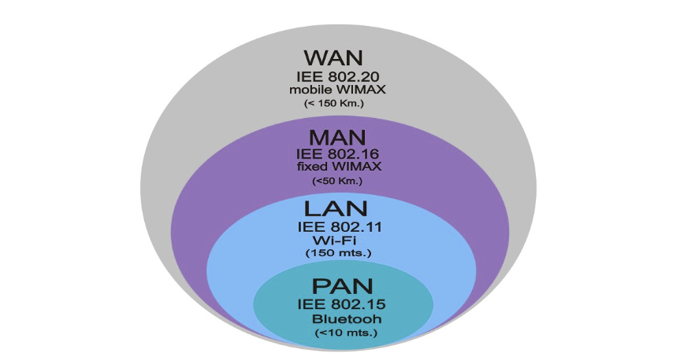
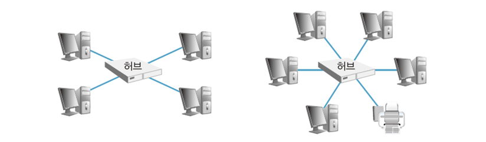
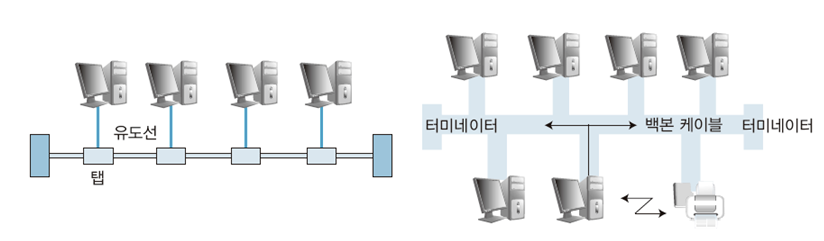
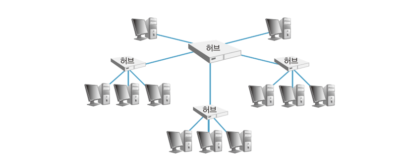
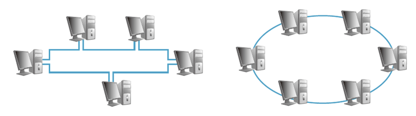
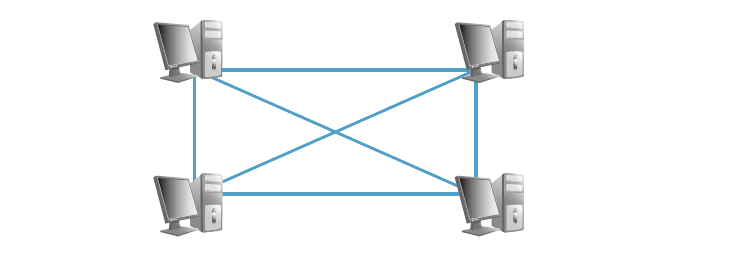
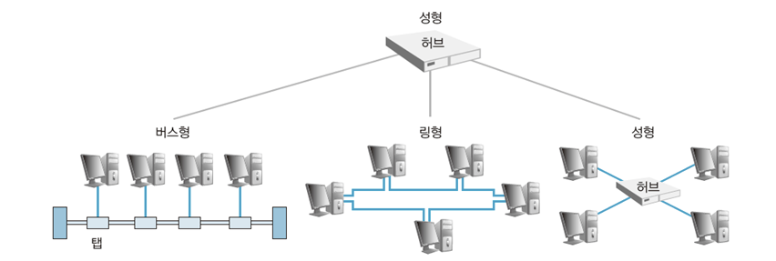
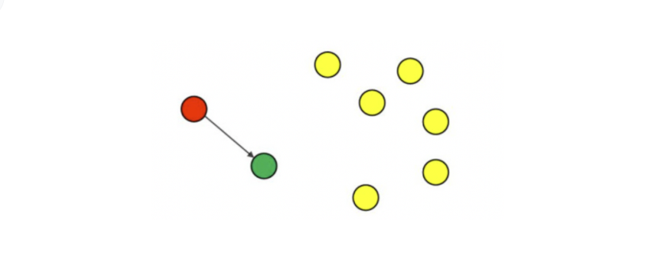

# [6주차] 네트워크

진행상황: Done
태그: CS

---

# 네트워크

---

<aside>
💡 통신설비들로 두 대 이상의 컴퓨터를 서로 연결한 것

</aside>

- LAN, 케이블, 무선매체 등 통신설비를 갖춘 컴퓨터로 서로 연결하는 조직, 체계, 통신망

## 용어 정리

---

- 패킷 : 헤더, 페이로드, 제어 요소등을 포함하는 데이터 세그먼트
- 헤더 : 데이터 형태, 데어트의 송수신지, 일련번호 등으로 구성
- 페이로드 : 실제 전송 데이터를 포함하는 부분
- 비트 : 0과 1의 정보를 나타내는 최소 단위
- 바이트 : 1 바이트 = 8 비트

## 장점

---

- 데이터 공유
    - 서버( 공유 장치 - 네트워크 사용자 접근 가능 )
    - 컴퓨터들( 접근 권한 읽기 전용 혹은 읽기/쓰기 가능 등의 권한을 가짐 )
- 주변장치 공유
    - 장치 간 혹은 서버 - 클라이언트 간 통신 등 장치들끼리의 공유
- 능률적인 통신
    - 송신자 → 메일 서버 → 수신자
- 손쉬운 백업
    - 하드에 있는 데이터를 백업
    

## 데이터 전송 규칙

---

❗️ 네트워크에서 데이터를 주고 받으려면 규칙이 필요하다

### 패킷

---

<aside>
💡 컴퓨터 간 데이터를 주고받을 때, 네트워크를 통해 전송되는 데이터 전송단위 ( 작은 조각 )

</aside>

- 용량이 큰 데이터를 보낼 때 작게 나눠서 보내는 것이 규칙
    
    → 너무 큰 데이터를 그대로 보내면 `* 대역폭`을 너무 많이 점유하여 다른 패킷의 흐름을 방해하기 때문
    
    `대역폭` : 네트워크에서 이용 간으한 신호의 최고 주파수/최저 주파수의 차이 ( = bps 단위 사용 )
    
- 분할된 패킷을 전송할 때 전송 순서대로 도착하지 않을 수 있다 → 재결합 하는 작업 필요
- 재결합 하는 방법
    1. 데이터 전송 시 패킷에 번호를 붙여서 전송
    2. 수신 측이 해당 데이터를 받아서 번호를 맞춰 재결합

### 패킷 전송 과정

---

💡 패**킷 데이터 전송 시 오류 검출 방식으로 `홀수 패리티 방식`을 적용한다**

`홀수 패리티 방식`  : 

데이터의 오류 검출용 패리티 비트를 하나씩 붙이는데, 전체 비트에서 1의 개수가 홀수가 되도록 붙이는 방식

**패킷 전송 과정 예시**

---

‘JIN’이라는 문자열을 메신저로 전송하는 과정

1. 각 문자에 해당하는 이진값을 생성
    
    J : 1001010
    
    I  : 1101001
    
    N : 1101110
    
2. 패킷으로 분해하고 헤더를 붙인다. [ 홀수 패리티 방식 적용 ]
    
    1/1001010/0
    
    2/1101001/1
    
    3/1101110/0
    
3. 전송된 데이터는 네트워크 상황에 따라 랜덤으로 도착한다.
    
    3/1101110/0
    
    1/1001010/0
    
    2/1101001/1
    
4. 재조립하여 원래의 데이터 JIN으로 바꾼다.
    
    1/1001010/0
    
    2/1101001/1
    
    3/1101110/0
    

## 네트워크 설정

---

### 네트워크 설정 단계

---

1. 필요한 하드웨어 및 케이블 확인. LAN 카드 또는 무선 LAN카드를 컴퓨터에 연결
2. 이더넷 네트워크나 무선 네트워크를 사용하려 컴퓨터를 연결한다. ( 라우터, 스위치 등 전송매체 필요 )
3. 유선 네트워크는 LAN케이블을 꽂는 즉시 연결된다.
    
    무선 네트워크는 라우터가 연결된 컴퓨터에서 네트워크 설정을 확인해야 한다.
    
4. 네트워크 테스트를 통해 컴퓨터와 주변 장치가 제대로 연결되었는지 확인한다.

### 이더넷 상태에서 확인할 수 있는 요소들

---

1. 시간 : 인터넷에 연결된 시간
2. 속도 : 컴퓨터의 최고 인터넷 속도
3. 작업 : 데이터 전송 단위인 패킷의 송수신을 바이트 단위로 보여줌( 통신이 원활하면 빠르게 바뀜 )

### 유선 네트워크를 설정하고 사용하는 단계

---

1. 필요한 하드웨어 확인 후 컴퓨터에 LAN카드 설치
2. 이더넷 네트워크를 사용하여 컴퓨터를 연결, 전송매체인 라우터, 스위치 등이 필요하다.
3. 이더넷 네트워크 뿐만 아니라 이더넷 잭을 직접 연결할 수도 있다.
4. 네트워크 테스트를 통해 장치들이 제대로 연결되었는지 확인한다.

# 네트워크 구성

---

## 네트워크 구성

---

LAN의 구성 : 인터넷 공유기를 중심으로 사설망을 유/무선으로 구성. 기기들을 연결해서 사용

## 네트워크 구성 요소

---

<aside>
💡 컴퓨터 ↔  접속장치 ↔  전송 매체 (케이블)

</aside>

- PC( 컴퓨터나 서버 ) : 네트워크로 다양한 데이터 송수신
- 접속장치 : 애플리케이션의 데이터를 전송하기 위한 장치
    - 스위치 : 네트워크 내부에서 데이터 전송을 수행하는 장치
    - 라우터 : 서로 다른 네트워크를 구분 짓고 연결하는 장치
- 전송 매체 : 컴퓨터와 네트워크 접속 장치가 전송 매체에 의해 서로 연결된다
    - 유선 전송 매체 : 케이블
    - 무선 전송 매체 : 전파 ( 규격에 따라 전파 파장이나 주파수에 맞춰 사용 )

# 네트워크 형태

---

## [1]. 근거리 네트워크 ( LAN : Local Area Network )

---

<aside>
💡 건물 안이나 특정 지역의 네트워크

</aside>

- 가까운 거리에 위치한 컴퓨터의 네트워크를 말하며, 유선 케이블, 적외선 링크, 무선 송수신기 등을 이용하여 통신한다. 가정이나 학교에서 볼 수 있는 형태의 네트워크
- 10km의 범위를 가진다.

## [2]. 광역 네트워크 ( WAN : Wide Area Network )

---

<aside>
💡 두 개 이상의 근거리 네트워크를 넓은 지역에 걸쳐 연결하는 것

</aside>

- 근거리 네트워크에 포함되지 않은 멀리 떨어진 컴퓨터 사이에서 통신하기 위한 네트워크
    
    → 통신사들의 `ISP` 서비스를 이용한다.
    
    `ISP( Internet Service Provider )` : 
    
    개인이나 기업에게 인터넷 접속 서비스, 웹 사이트 구축 등을 제공하는 회사
    

## [3]. 개인 영역 네트워크 ( PAN : Personal Area Network )

---

<aside>
💡 블루투스나 UWB 등의 기술을 이용한 개인 휴대기기 사이 구성된 무선 연결망

</aside>

## [4]. 대도시 영역 네트워크 ( MAN : Metropolitan Area Network )

---

<aside>
💡 LAN보다 넓고 50km 거리 내에서 이용할 수 있는 네트워크

</aside>

## [5]. 인트라넷 ( Intranet )

---

<aside>
💡 사설 네트워크

</aside>

- 멀리 떨어져 있어도 사설 네트워크를 연결할 수 있다. 대학교의 다른 캠퍼스 같은 경우

# 네트워크 접속 장치

---

## [1]. LAN 카드

---

<aside>
💡 컴퓨터 내에 설치하는 확장카드

</aside>

- 두 대 이상의 컴퓨터에 네트워크를 구성하려는 목적으로 외부 네트워크와 빠른 속도로 데이터 송수신할 수 있게 한다.
- **전송매체에 접속, 데이터 입출력 및 송수신, 프로토콜 처리 기능**을 담당한다.
- 각 LAN 카드는 고유 식별 코드를 가지고 있다 : **`MAC주소`**
    
    
    `MAC주소` : 
    
    Media Access Control의 약자로, 네트워크에 사용되는 모든 기기의 고유번호
    
    앞 24비트는 제조사, 뒤 24비트는 제품 일련번호로 구성
    

## [2]. 허브

---

<aside>
💡 여러 개의 입력 및 출력 포트가 있는 특수한 형태의 네트워크 장치

</aside>

- 컴퓨터가 세 대 이상일 경우 사용
- 이더넷 케이블( UTP )을 사용하여 허브 포트에 연결하는 방식으로 데이터를 수신하면 연결된 모든 컴퓨터에 뿌려주는 방식
- 모든 입력과 출력이 서로 연결되어 있어 여러 개의 노드가 똑같은 중계기를 공유할 수 있다.

### 더미 허브

---

- 대상 식별을 못하기 때문에 연결된 **모든 컴퓨터에 데이터를 브로드캐스팅**한다.
- 데이터를 주고받을 수는 있지만 동시에 할 수는 없어서 **스위치보다 느리다**.
- 단순한 만큼 **저렴하다**는 장점이 있다.

### 스위칭 허브

---

더미 허브의 문제를 해결한 접속장치 ( 전체 대역폭을 컴퓨터 노드 수로 나눠서 사용하는 문제 )

- 전송 기능 말고 수신지 주소로 스위칭하는 기능이 있다.
- 노드들을 점대점으로 접속시키기 때문에 네트워크 효율이 좋다.
- 100Mbps 대역폭 이더넷에 5포트 허브로 컴퓨터 5대를 연결하면 각 컴퓨터는 100Mbps씩 받는다.

### 스태커블 허브

---

스택 접속 포트가 갖춰진 허브

- 허브와 허브 사이를 연결하여 용량 확장
- 중규모 이상의 네트워크를 구성할 때, 스태커블 허브를 여러 층으로 쌓아서 구성
- 일반 포트로 더미 허브를 연결한 것보다 빠르다. ( 각 허브 사이 전송속도 균일 )
    
    
    `스태킹` :
    
    허브에서 제공하는 포트 수를 촉화할 때는 두 대 이상의 장치가 필요한데, 이런 여러 장치를 하나의 시스템으로 관리하기 위해 여러 층으로 쌓아서 연결하는 기능
    

### 인텔리전트 허브

---

- 신호 조절, 변경 등 지능형 기능을 포함한 허브

## [3]. 스위치

---

<aside>
💡 컴퓨터에 할당되는 대역폭을 극대화하는 장치

</aside>

- 허브와 달리 근거리 통신망이 제공하는 대역폭을 컴퓨터로 모두 전송한다.
- 컴퓨터 수에 상관없이 보편적으로 100Mbps/ 1Gbps/ 10Gbps등 대역폭을 제공할 수 있다.
- 수신 정보를 식별하여 원하는 곳에만 전송할 수 있다.

## [4]. 브릿지

---

<aside>
💡 두 개 이상의 근거리 통신망을 연결하여 하나의 네트워크로 만들어주는 장치

</aside>

- 수신지 주소에 따라 특정 네트워크 트래픽만 통과시킬 수 있도록 설계된 특수 형태의 네트워크 스위치
- 근거리 통신망에서는 한 장치가 송신 중에 다른 장치도 송신하면 충돌이 나는데, 브릿지로 그 문제를 해결

**✅  스위치와의 차이점**

- 브릿지는 데이터 송수신 중 충돌을 방지하기 위해서 네트워크를 `세그먼트` 단위로 분할한다.
    
    ( 스위치는 프레임 단위 )
    
    `세그먼트` : 스위치로 구성된 가장 작은 규모의 네트워크
    

## [5]. Gateway

---

<aside>
💡 종류가 다른 두 개 이상의 네트워크를 상호 접속하여 정보를 주고받는 방식

</aside>

- 접속할 수 있는 통신망 : LAN, PDN( 공중 데이터망 ), PSDN ( 공중전화 교환망 )

**✅  브릿지와의 차이점**

- 서로 다른 프로토콜 통신망 간에도 프로토콜 변환하여 정보 주고받기 가능

## [6]. 중계기

---

<aside>
💡 접속 시스템의 수를 증가시키거나 네트워크 전송 거리를 연장하려고 사용하는 장치

</aside>

- 네트워크에서 신호를 수신하여 증폭하고 다음 구간으로 재전송
- 보통 100m 이상일 때 사용해야 한다
    
    → UTP케이블 사용할 때, 광섬유 케이블 일 때도 제한적이라 중계기를 사용한다.
    

## [7]. 라우터

---

<aside>
💡 서로 다른 네트워크 간 통신하는 데 사용하는 장치

</aside>

- 둘 이상의 네트워크를 연결하는 데 사용
- 구조가 다른 망을 연결할 수 있다 ( LAN, MAN, WAN 단위를 연결하는 데 사용 )
- IP주소를 바탕으로 경로 검사하여 효율적인 경로를 선택하는 라우팅 기능 수행
- 라우팅 테이블이 있어 인터넷 상에서 수신지의 주소를 토대로 경로상의 다음 주소를 결정한다
- 라우터 간의 정보를 동적으로 변경 가능
- 오류 패킷 폐기/혼잡 제어 기능이 있다.
- 논리 주소에 따라 네트워크 트래핑 방향 지정
- 가정용 라우터 : 공유기

**✅  스위치나 허브는 무선 신호를 전송하는 역할인 `AP`가 필요한데, 라우터는 이미 있어 AP가 필요 없다.**

`AP` : 무선 LAN카드로 서로 간의 네트워크를 연결하는 장치

# 네트워크 접속 형태

---

<aside>
💡 네트워크에 연결되어 있는 `노드`와 링크가 물리적/논리적으로 배치되어 있는 방식

</aside>

- 네트워크 구성 또는 네트워크 토폴로지라고 한다.
    
    `노드` : 네트워크에 연결된 주소가 있는 통신 장치. 컴퓨터, 프린터, 복합기 등
    
- 네트워크 접속 형태는 상호 연결 방법 ( 물리적인 배열 X : 성형 접속 형태라고 진짜 별모양이 아니다 )
- 점대점 관계, 주종 관계 등으로 나뉜다.

## [1]. 성형

---

<aside>
💡 가장 일반적인 네트워크 구성 형태로 허브가 노드 중앙에 위치한 구조이다

</aside>

- 주종 관계의 네트워크
- 장점
    - 설치비용 저렴
    - 유지보수 및 확장이 용이
    - 링크 하나가 고장나더라도 다른 링크에 영향을 주지 않는다.
- 단점
    - 중앙 전송제어장치에 장애가 발생하면 전체 네트워크가 다운된다.
    - 통신량이 많으면 지연이 발생하며, 케이블이 많이 필요해진다.

## [2]. 버스형

---

<aside>
💡 네트워크 노드와 주변 장치가 파이프 같은 일자형 케이블( 버스 )에 연결되어 있는 구조

</aside>

- 점대점 관계, 주종 관계 모두에 포함될 수 있다.
- 케이블이 중추 네트워크 역할을 하며, 케이블 양 끝에 터미네이터 장치가 있어 신호가 다시 되돌아오는 걸 막는다.
- 장점
    - 설치가 간단하다
    - 케이블 비용이 적게 들어간다
    - 중추 케이블을 가장 효과적으로 설치가 가능하다
- 단점
    - 장비수가 많아지면 네트워크 성능이 저하된다
    - 중앙 케이블이 고장나면 전체가 다운된다
    - 네트워크 제구성이나 결합/분리가 어렵다
    - 중계기를 사용해야 한다
    - 노드 케이블을 사용하고 있다면 다른 노드가 기다려야 한다
    - `베이스밴드 전송 방식`에서는 케이블 거리가 멀어지면 신호가 약해져서 중계기를 사용해야 한다
        
        `베이스밴드 전송 방식` : 데이터를 전송할 때 신호를 변조하지 않고 그대로 보내는 전송 방식
        

## [3]. 트리형

---

<aside>
💡 성형을 변형시켜서 트리 형태로 구성한 네트워크. 중앙 허브에 N차 허브가 붙어나가는 방식

</aside>

- 주종 관계의 네트워크 구성 방식
- 장점
    - 제어가 간단하며 네트워크 확장이 쉽다
    - 중앙 허브에 더 많은 장비를 연결할 수 있어서 데이터 전송 거리를 늘릴 수 있다
    - 컴퓨터 분리/우선순위 부여가 가능
- 단점
    - 중앙이 다운되면 전체 네트워크가 다운되며 부하 가능성이 있다
    

## [4]. 링형

---

<aside>
💡 노드가 링에 순차적으로 연결된 형태로, 모든 컴퓨터를 하나의 링으로 연결한다

</aside>

- 점대점 관계의 네트워크 구성 방식
- 단순 링형 ( 한 방향으로만 전송 ), 이중 링형( 양방향 전송 )이 있다
- 장점
    - 구조가 단순하다
    - 설치 재구성이 쉬우며 장애 복구 시간이 빠르다
    - 케이블 비용이 줄어든다
    - 한 장치에 이상이 발생하면 경보를 발생할 수 있다
- 단점
    - 새로운 장비를 추가하려면 링을 절단하고 넣어야 한다
        
        → 하나가 다운되면 전체 네트워크가 다운된다
        

## [5]. 그물형

---

<aside>
💡 중앙 제어 노드가 없이 모든 노드가 점대점 형태로 연결된 네트워크 구성 방식

</aside>

- 점대점 관계의 네트워크 구성 방식
- N(N - 1)/2개의 물리적 채널이 필요하지만 신뢰성이 높아서 **중요한 네트워크에서 사용된다**
- 장점
    - 통신량 문제 해결
    - 한 링크가 고장나더라도 전체에 영향을 끼치지 않는다
    - 전용선으로 모든 메시지가 전송해서 비밀 유지와 보안에 좋다
- 단점
    - 설치와 재구성이 어렵다
    - 비용이 많이 든다
    

## [6]. 혼합형

---

<aside>
💡 실제 네트워크에서 주로 쓰이는 방식

</aside>

- 네트워크 `서브넷`이 서로 연결되어 규모가 큰 접속 형태가 되도록 여러 접속 형태를 결합한다.
    
    `서브넷` : 대규모 네트워크를 구성하는 개별 네트워크
    

# 네트워크 통신 방식

---

<aside>
💡 네트워크 통신 방식에서 **각각의 대상**에 따라 구분된다.

</aside>

## [1]. 유니캐스트

---

- 네트워크에서 가장 많이 사용하는 방식으로, **1 : 1 통신 방식**이다. ( E-mail )
- 통신할 때 데이터를 송신하는 PC와 수신하는 PC는 각각 MAC주소를 가지고 있으며,
    
    통신을 위한 데이터 전송 프레임에 송신측 MAC주소와 하나의 수신측 MAC주소가 들어있다.
    

<aside>
💡 따라서, 어떤 PC에서 유니캐스트 프레임을 전송하면, 로컬 네트워크상의 모든 PC들은 프레임을 받아 **자신의 MAC주소와 비교**해서, 다르면 버리고 같으면 프레임을 받아들여 CPU로 전송한다.

</aside>

## [2]. 브로드캐스트

---

- 특정한 대상을 향한 방식이 아닌, 내가 속한 **네트워크 내의 모든 장비들과 통신을 위한 방식**이다.
- 이러한 방식은 내가 받기 싫어도 **무조건 수신**을 하게 되어있다. ( 아파트 안내 방송 )
- 정해진 브로드캐스트 주소로 통신을 하면, 각각의 MAC주소와 별개로 패킷이 CPU로 전송된다.
    
    → 따라서, 개별 PC의 성능에도 영향을 미치고, 네트워크 전체적인 트래픽에도 영향을 끼친다.
    

<aside>
💡 상대의 MAC주소를 알아내기 위한 `ARP`를 시도하거나, 라우터들끼리의 정보교환 및 다른 라우터를 찾을 때, 서버들이 자신의 서비스를 제공한다는 것을 클라이언트에 알릴 때 사용된다.

</aside>

`ARP` : **Address Resolution Protocol**, **MAC주소와 IP주소를 서로 연결하는 용도**로 사용되는 프로토콜

## [3]. 멀티캐스트

---

- 전체 사용자중 **특정 일부에게 정보를 동시에 보내야 하는 경우**에 사용된다.
- 멀티캐스트 방식은 특정 대상에게만 데이터를 전송하여 불필요한 트래픽이나 성능저하를 막는다.
- 라우터나 스위치에서 멀티캐스트를 지원해주어야 사용이 가능하다.

## [4]. 애니캐스트

---

- **가장 가까운 노드와 통신**하는 방식이다.
- 유니캐스트와의 차이점은 **송신 노드가 네트워크에 연결된 수신 가능한 노드 중 한 노드에만 데이터를 전송한다**는 점이 다르다.
- 주로 트래픽 분산, 네트워크 이중화, D-Dos공격 발생 시 서버가 받는 피해를 최소화 하는 데에 사용된다.

# 면접 질문

---

> 네트워크를 왜 OSI 7계층으로 나눴는지에 대해서 말해주세요
> 

---

<aside>
💡 통신이 일어나는 과정을 단계별로 알 수 있고, 특정한 곳에 이상이 생기면 그 단계만 수정할 수 있기 때문

</aside>

> 스위치와 허브의 차이점에 대해서 말해주세요
> 

---

스위치는 패킷의 목적지 주소로 지정된 기기로 이어지는 포트로만 패킷이 전달

허브는 연결된 기기 중 하나에서 전송된 패킷이 허브에 연결된 모든 기기로 브로드캐스팅된다는 점이다.

> port번호에 대해서 간략하게 말해주시고 사용하는 이유에 대해서 이야기 해주세요
> 

---

포트번호란 0 ~ 65535 범위의 숫자로 **컴퓨터 안에서 작동하는 애플리케이션을 식별하기 위해 사용합니다.**

> OSI 7계층 중, 데이터 링크 계층에선 주로 어떤 작업을 수행하는지 말해주세요
> 

---

물리 계층으로 송수신되는 정보를 관리하여 안전하게 전달되도록 도와주는 역할

MAC주소를 통해 통신하며, 에러 검출, 재전송, 흐름제어를 진행한다.

> 네트워크 종류 4가지에 대해서 간단히 설명해 주세요.
> 

---

wan, man, lan, pan

> 네트워크 통신 방식 3가지에 대해서 간략하게 설명해 주세요.
> 

---

유니 캐스트

멀티캐스트

브로드캐스트

> TCP/IP 4(5)계층에 대해 간략히 설명해 주세요.
> 

---

> 세션 계층에서의 3가지 통신(방향성) 방식을 간략하게 설명해 주세요
> 

---

- 단방향 : 한쪽만 전달이 가능
- 반이중(half-duplex) : 상대방이 연락을 할 수 없음
- 전이중(Full Duplex) : 전화와 같이 동시에 전달 가능

> TCP UDP 같은 프로토콜이 위치한 계층에 대해 설명해주세요
> 

---

전송계층

> WAN과 LAN의 차이에 대해 설명해 주세요.
> 

---

- **WAN (Wide Ares Network)** : 광대역 네트워크
    
    지역 간 또는 대륙간의 넓은 지역의 컴퓨터를 연결. 인터넷은 전 세계 수십억 대의 컴퓨터를 연결하는 가장 큰 WAN.
    
- **LAN ( Local Area Network )** : 근거리 영역 네트워크
    
    상대적으로 짧은 거리에 있는 컴퓨터를 연결. 예를 들어 사무실 , 학원, 병원의 모든 컴퓨터 연결 가능
    

# 🔗  참조 링크

---

[1. 네트워크의 개념](https://foxtrotin.tistory.com/153?category=754276)

[유니캐스트, 멀티캐스트, 브로드캐스트, 애니캐스트](https://velog.io/@dongvelop/%EC%9C%A0%EB%8B%88%EC%BA%90%EC%8A%A4%ED%8A%B8-%EB%A9%80%ED%8B%B0%EC%BA%90%EC%8A%A4%ED%8A%B8-%EB%B8%8C%EB%A1%9C%EB%93%9C%EC%BA%90%EC%8A%A4%ED%8A%B8-%EC%95%A0%EB%8B%88%EC%BA%90%EC%8A%A4%ED%8A%B8)

[ISP](https://terms.naver.com/entry.naver?docId=1198309&cid=40942&categoryId=32854)