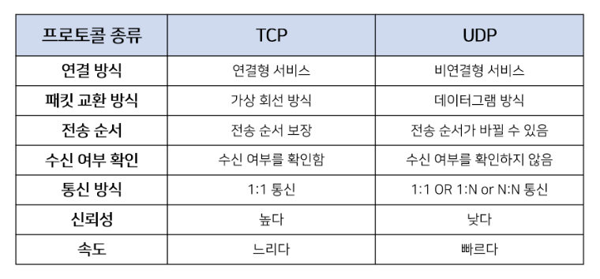
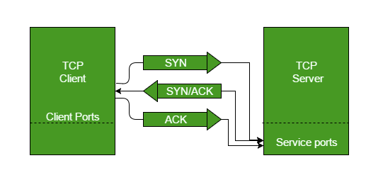
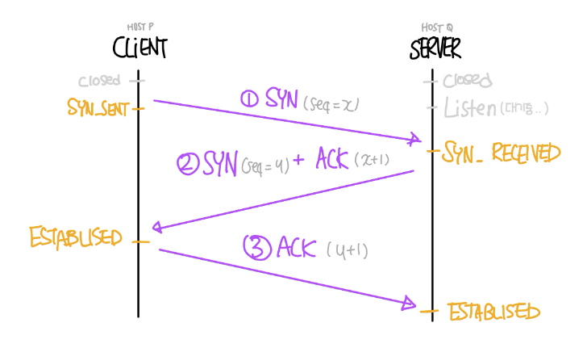
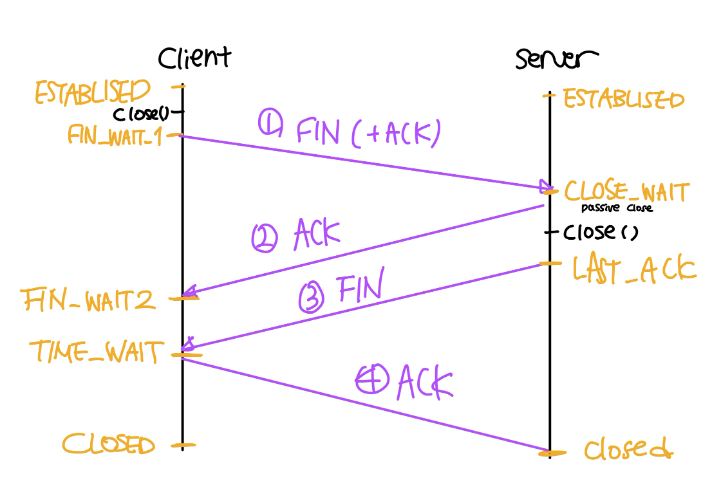

# [7주차] 3, 4way handshake

날짜: 2022년 9월 12일 → 2022년 9월 12일
진행상황: Done
태그: network

---

# 전송 계층 ( Transport Layer )

---

<aside>
💡 전송계층에서는 양 끝단( End-to-End )의 사용자들이 신뢰성있는 데이터를 주고 받을 수 있도록 해주어 상위 계층에서 데이터 전달의 유효성이나 효율성을 생각하지 않도록 해준다.

</aside>

- 전송 계층은 인터넷의 기반인 TCP/IP 참조 모델과 일반적인 네트워크 모델인 개방 시스템 간 상호 접속
    
    → (Open Systems Interconnection, OSI) 모두 포함하고 있다.
    
    - **애플리케이션 프로세스들 간**의 **논리적인 통신을 제공**
- 네트워크 계층에서는 **HOST간**의 **논리적인 통신을 제공**
    
    → 데이터의 **전달 경로를 설정**하는 역할
    

# TCP ( Transmission Control Protocol )

---

<aside>
💡 인터넷상에서 데이터를 메시지의 형태로 보내기 위해 IP와 함께 사용하는 프로토콜

</aside>

- **신뢰적이고 연결지향성 서비스를 제공**한다.
- 일반적으로 TCP는 IP와 함께 사용되며 **IP는 배달**을, **TCP는 패킷의 추적 및 관리**를 하게 된다.
- 연결형 서비스로 신뢰적인 전송을 보장하기에 `handshaking`하며, 데이터의 흐름제어와 혼잡제어를 수행한다. → 상대적으로 속도가 느림

## TCP 특징

---

- `3-way handshaking`과정을 통해 연결을 설정하고 `4way-handshaking`을 통해 해제한다.
- 흐름 제어 및 혼잡 제어
- 높은 신뢰성을 보장한다.
- UDP보다 속도가 느리다.
- 전이중( Full-Duplex ), 점대점( Point-to-Point ) 방식

# UDP ( User Datagram Protocol )

---

<aside>
💡 데이터를 `Datagram`단위로 처리하는 프로토콜

</aside>

`Datagram` : 독립적인 관계를 지니는 패킷

- UDP는 비연결형 프로토콜이다.
    - 할당되는 **논리적인 경로**가 없고
    - 각각의 패킷이 **다른 경로로 전송**되며
    - 이 각각의 패킷은 **독립적인 관계**를 지니게 되는데
    
    → 이렇게 데이터를 `서로 다른 경로로 독립 처리하는 프로토콜`을 UDP라고 한다.
    

## UDP 특징

---

- 비연결형 서비스로 데이터그램 방식을 제공한다.
- 정보를 주고 받을 때 정보를 보내거나 받는다는 신호절차를 거치지 않는다.
- UDP헤더의 CheckSum 필드를 통해 최소한의 오류만 검출한다.
- 신뢰성이 낮다.
- TCP보다 속도가 빠르다.

# TCP vs UDP

---

- TCP와 UDP는 각각 별도의 포트 주소 공간을 관리하므로 같은 포트 번호를 사용해도 무방하다.
    
    ❗️ 즉, **두 프로토콜에서 동일한 포트 번호를 할당해도 서로 다른 포트로 간주**한다.
    
- 같은 모듈 내에서도 클라이언트 프로그램에서 동시에 여러 Connection을 확립한 경우에는
    
    서로 다른 포트 번호를 동적으로 할당한다. ( 동적할당에 사용되는 포트 번호 : 49,152 ~ 65,535 )
    
    
    

# TCP의 3-way Handshake

---

<aside>
💡 TCP 통신을 이용하여 데이터를 전송하기 위해 **네트워크 연결( Connection Establish )을 설정하는 과정**

</aside>

- 양쪽 모두 데이터를 전송할 준비가 되었다는 것을 보장
    
    → 실제로 데이터 전달이 시작하기 전에 다른 쪽이 준비된 상태임을 알 수 있도록 한다.
    
- TCP/IP 프로토콜을 이용해서 통신을 하는 응용 프로그램이 데이터를 전송하기 전에,
    
    먼저, **정확한 전송을 보장하기 위해** 상대방 컴퓨터와 **사전에 세션을 수립하는 과정**을 의미한다.
    

## 포트 상세 정보

---

`CLOSED` : 포트가 닫힌 상태

`LISTEN` : 포트가 열린 상태로 요청 대기 중

`SYN_RCV` : SYNC 요청을 받고 상대방의 응답을 기다리는 중

`ESTABLISHED` : 포트 연결 상태

## 플래그 정보

---

- TCP 헤더에는 CONTROL BIT( 플래그 비트, 6bit )가 존재한다.
    
    각각의 비트는 [ URG, ACK, PSH, RST, SYN, FIN ] 의 의미를 가진다.
    
    → 즉, 해당 위치의 bit가 1이면 해당 패킷이 어떤 내용을 담는 패킷인지를 나타낸다.
    
        ex. 100000 : URG
    

### [1]. **SYN( Synchronize Sequence Number )** / `000010`

---

- 연결 설정
- Sequence Number를 랜덤으로 설정하여 **세션을 연결하는 데 사용**된다.
    
    초기에 Sequence Number를 전송한다.
    

### [2]. ACK( Acknowledgement ) / `010000`

---

- 패킷을 받았다는 것을 의미한다. ( 응답 확인 )
- Acknowledgement Number 필드가 유효한지를 나타낸다.
- 양단 프로세스가 쉬지 않고 데이터를 전송한다고 가정할 때,

 →  최초 연결 설정 과정에서 전송되는 첫 번째 세그먼트를 제외한 모든 세그먼트의 ACK 비트는 1로 지정

### [3]. FIN( Finish ) / `000001`

---

- 세션 연결을 종료시킬 때 사용되며, 더 이상 전송할 데이터가 없음을 의미한다. ( 연결 해제 )

## 3-way Handshake의 기본 매커니즘

---

- TCP 통신은 `PAR`( Positive Acknowledgement with Re-transmission ) 을 통해 신뢰적인 통신 제공

### PAR을 사용하는 기기는 ack를 받을 때까지 데이터 유닛을 재전송한다

---

1. 수신자가 데이터 유닛( 세그먼트 )이 손상된 것을 확인하면 해당 세그먼트를 없앤다.
2. 발신자( sender )는 Positive ack가 오지 않은 데이터 유닛을 다시 보낸다.

→ 위 그림을 통해 해당 과정에서 클라이언트와 서버 사이에서 3개의 세그먼트가 교환되는 것을 확인

    이것이 3-way handshake의 기본 매커니즘이다.

### 작동 방식

---

- 클라이언트는 서버와 연결하기 위해 3-way handshake를 통해 연결 요청을 한다.

      ( 아래 그림에선 연결 요청한 쪽을 클라이언트로, 수신자를 서버로 생각한다. )

- `SYN( Synchronization )` : **연결요청**, 세션을 설정하는 데 사용되며 초기에 시퀀스 번호를 전송
- `ACK( Acknowledgement )` : 전송한 시퀀스 번호에 TCP계층에서의 **길이 혹은 양을 더한 것과 같은 값 ( Y )**을 ACK에 포함하여 전송
- **동기화 요청에 대한 답변** : 클라이언트의 시퀀스 번호 + 1을 하여 ACK로 돌려준다.

### [1]. STEP 1 ( SYN : 연결 요청 )

<aside>
💡 클라이언트는 서버와 커넥션을 연결하기 위해 SYN을 보낸다. ( SYN = X )

</aside>

- 발신자가 최초로 데이터를 전송할 때 Sequence Number를 임의의 랜덤 숫자( X )로 지정하고,
    
    SYN 플래그 비트를 1로 설정한 세그먼트를 전송한다.
    
- PORT 상태
    - 클라이언트 : `CLOSED` → `SYN_SENT`
    - 서버           : `LISTEN`

### [2]. STEP 2 ( SYN + ACK )

<aside>
💡 서버가 SYN(X)를 받고, 클라이언트에게 ACK와 SYN 패킷을 전송( SYN = Y, ACK = X + 1 )

</aside>

- 접속요청을 받은 서버가 요청을 수락하며, 클라이언트도 포트를 열어달라는 메시지를 전송
    
    ( SYN-ACK signal bits set )
    
- ACK Number필드를 Sequence Number + 1로 지정하고 SYN과 ACK 플래그 비트를 1로 설정한
    
    세그먼트를 전송 ( Seq = y, Ack = x + 1, SYN, ACK )
    
- PORT 상태
    - 클라이언트 : `CLOSED`
    - 서버           : `SYN_RCV`
    

### [3]. STEP 3 ( ACK )

<aside>
💡 클라이언트에서는 ACK(X + 1)과 SYN(Y) 패킷을 받고, ACK(Y + 1)을 서버로 전송

</aside>

- 마지막으로 클아이언트가 서버로부터 수락 확인 패킷을 받은 후, 잘 받았다는 신호를 서버로 전송 (y + 1)
    
    이 때, 전송할 데이터가 있다면 이 단계에서 전송할 수 있다.
    
- PORT 상태
    - 클라이언트 : `ESTABLISED`
    - 서버           : `SYN_RCV` → ACK → `ESTABLISHED`
    

### 전이중 ( Full-Deplex ) 통신의 구성

- STEP 1, 2에서는 클라이언트 → 서버 방향에 대한 연결 파라미터 ( 시퀀스 번호 )를 설정하고 이를 승인
- STEP 2, 3에서는 클라이언트 → 서버 방향에 대한 연결 파라미터 ( 시퀀스 번호 )를 설정하고 이를 승인
    
    → 이를 통해 Full - Duplex 통신이 구축된다.
    

참고

# TCP의 4-way Handshake

---

<aside>
💡 4-way Handshake는 연결을 해제 ( Connection Termination )하는 과정이다.

</aside>

- `FIN` 플래그를 이용한다.
    
    `FIN` : 세션을 종료시키는데 사용되며, 더 이상 보낼 데이터가 없음을 나타낸다.
    

## Termination의 종류

---

<aside>
💡 TCP는 대부분의 Connection-Oriented ( 연결 지향 ) 프로토콜과 같은 두 가지 연결 해제 방식이 있다.

</aside>

### [1]. Graceful Connection Release ( 정상적인 연결 해제 )

- 정상적인 연결 해제에서는 **양쪽 서로 모두 커넥션을 닫을 때까지** 연결되어 있다.

### 작동 방식

---

- 클라이언트는 서버와 연결하기 위해 연결 요청을 한다.

      ( 아래 그림에선 연결 요청한 쪽을 클라이언트로, 수신자를 서버로 생각한다. )

### [1]. STEP 1 ( 클라이언트 → 서버 : `FIN( +ACK)` )

- 서버와 클라이언트가 연결된 상태에서 클라이언트가 close()를 호출하여 접속을 끊으려한다.
- 클라이언트는 서버에게 연결을 종료하겠다는 `FIN` 플래그를 전송한다.
    
    → 이 때, `FIN` 패킷에는 실질적으로 `ACK`도 포함되어 있다.
    

### [2]. STEP 2 ( 서버 → 클라이언트 : `ACK` )

- 서버는 `FIN` 을 받고 확인했다는 `ACK` 패킷을 클라이언트에게 보내고 자신의 통신이 끝날 때까지 기다린다. ( `TIME_WAIT` 상태 )
    - 서버는 ACK Number 필드를 ( Sequence + 1 ) 로 지정하고, ACK 플래그 비트를 1로 설정한 세그    먼트를 전송한다.
    - 아직 전송할 데이터가 남아있다면 전송을 마친 후에 close() 호출
- 클라이언트는 서버가 FIN 패킷을 보낼때 까지 기다린다. ( `FIN_WAIT_2` )

### [3]. STEP 3 ( 서버 → 클라이언트 : `FIN` )

- 데이터를 모두 보냈다면 서버는 `FIN` 패킷을 보낸 후에, 승인 번호를 보내줄 때까지 기다리는 `LAST_ACK` 상태로 들어간다.

### [4]. STEP 4 ( 클라이언트 → 서버 : `ACK` )

- 클라이언트는 FIN 패킷을 받고 확인했다는 `ACK` 패킷을 서버에게 보낸다.
- 아직 서버로부터 받지 못한 데이터가 있을 수 있으므로 `TIME_WAIT` 을 통해 기다린다. ( 실질적인 종료과정 `CLOSED` 에 들어가게 된다 )
    - 이때 `TIME_WAIT` 상태는 의도치 않은 에러로 인해 연결이 데드락으로 빠지는 것을 방지
    - 만약 에러로 인해 종료가 지연되다가 타임이 초과되면 `CLOSED`로 들어간다.
- 서버는 `ACK` 를 받은 이후 소켓을 닫는다.
- `TIME_WAIT` 시간이 끝나면 클라이언트도 소켓을 닫는다.

### [2]. Abrupt Connection Release ( 갑작스런 연결 해제 )

- 갑자기 한 TCP 엔티티가 연결을 강제로 닫는 경우
- 한 사용자가 두 데이터 전송 방향을 모두 닫는 경우

### 작동 방식

---

- `RST`( TCP reset ) 세그먼트가 전송되면 갑작스러운 연결 해제가 수행되며, `RST` 세그먼트는 다음과 같은 경우에 전송된다.

1. 존재하지 않는 TCP 연결에 대해 비 SYN 세그먼트가 수신된 경우
2. 열린 커넥션에서 일부 TCP 구현은 잘못된 헤더가 있는 세그먼트가 수신된 경우
    
    → RST 세그먼트를 보내고 해당 커넥션을 닫아 공격을 방지한다.
    
3. 일부 구현에서 기존 TCP 연결을 종료해야 하는 경우
    - 연결을 지원하는 리소스가 부족할 때
    - 원격 호스트에 연결할 수 없고 응답이 중지되었을 때

---

[[네트워크] TCP/UDP와 3 -Way Handshake & 4 -Way Handshake](https://velog.io/@averycode/%EB%84%A4%ED%8A%B8%EC%9B%8C%ED%81%AC-TCPUDP%EC%99%80-3-Way-Handshake4-Way-Handshake)