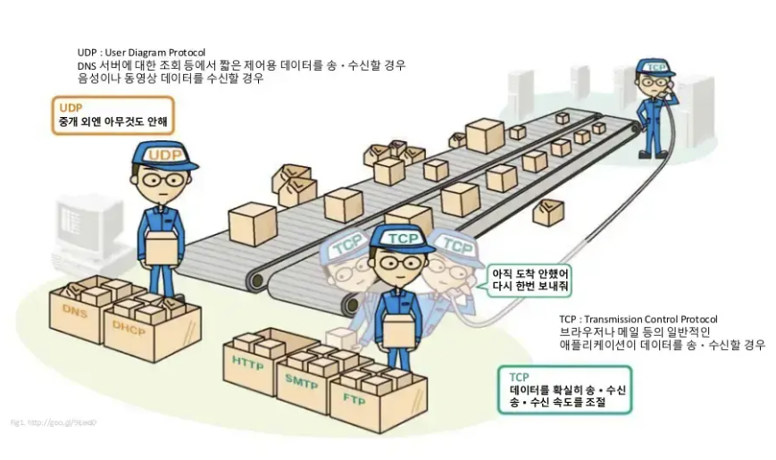

# [8주차] TCP/UDP

날짜: 2022년 9월 17일
진행상황: Done
태그: network

---

# OSI, TCP/IP 계층 별 프로토콜

# TCP( Transmission Control Protocol )

---

<aside>
💡 인터넷상에서 데이터를 메시지의 형태로 보내기 위해 IP와 함께 사용되는 `프로토콜`

</aside>

`프로토콜` : 컴퓨터와 컴퓨터 간, 또는 두 장치 사이에서 **데이터를 원활하게** 주고받기 위하여 약속한 **여러가지 규약**

- 일반적으로 IP와 함께 사용된다.
    
    `IP` : 데이터의 배달을 처리
    
    `TCP` : 패킷을 추적 및 관리한다
    
- 연결형 서비스로 **가상 회선 방식**을 제공한다.
    
    → 발신지와 수신지를 연결하여 패킷을 전송하기 위한 논리적 경로를 배정한다.
    
- **3-way handshaking**과정을 통해 **연결을 설정**하고, **4-way handshaking**을 통해 **해제**한다.
- **흐름 제어 및 혼잡 제어**
    
    `흐름 제어` : 송신측과 수신측의 **데이터 속도 차이를 조절**해주는 것
    
    `혼잡 제어` : 네트워크 내의 **패킷 수가 넘치지 않도록 방지**하는 것
    
- 높은 신뢰성을 보장한다.
- UDP보다 속도가 느리다.
- 전이중( Full-Duplex ), `점대점( Point-to-Point )`방식
    
    
    `점대점 방식`
    
    : 네트워크에 있어 물리적으로는 중개 장치를 통과하지 않고 한 지점에서 다른 지점으로 직접 가는 채널을 말한다.
    

❗️ 이러한 특성 때문에 TCP는 연속성보다 **신뢰성있는 전송이 필요할 때**에 유리하게 사용된다.

## TCP 서버의 특징

---

- **서버소켓**은 **연결만을 담당**한다.
- 연결과정에서 반환된 **클라이언트 소켓**은 **데이터의 송수신에 사용**된다.
- 서버와 클라이언트는 **1대1로 연결**된다.
- **스트림 전송**으로 **전송 데이터의 크기가 무제한**이다.
- **패킷에 대한 응답**을 해야하기 때문에 ( 시간 지연, CPU 소모 ) **성능이 낮다**.
- Streaming 서비스에 불리하다.
    
    → ❓ 손실된 경우 해당 데이터를 재전송 요청 하게 되므로
    

## TCP 통신 과정

---

# UDP( User Datagram Protocol )

---

<aside>
💡 데이터를 `데이터그램` 단위로 처리하는 프로토콜

</aside>

`데이터그램` : 독립적인 관계를 지니는 패킷

- UDP는 비연결형 프로토콜이다.
    
    → 연결을 위해 할당되는 논리적인 경로가 없으므로, 각 패킷은 다른 경로로 전송되며 독립적인 관계를 갖는다
    
    → 정보를 주고 받을 때 정보를 보내거나 받는다는 신호절차를 거치지 않는다.
    
- 데이터그램 방식을 제공한다.
- 신뢰성이 낮다.
- TCP보다 속도가 빠르다.

❗️ 이러한 특성 때문에 신뢰성보다는 **연속성이 중요한 서비스**( 스트리밍 )에 주로 사용된다.

## UDP 서버의 특징

---

- UDP에는 연결 자체가 없어서 **서버 소켓과 클라이언트 소켓의 구분이 없다.**
- 소켓 대신 I**P를 기반으로 데이터를 전송**한다.
- 서버와 클라이언트는 `1 : 1, 1 : N, N : M` 등으로 연결될 수 있다.
- **데이터그램( 메시지 ) 단위**로 전송되며 그 범위는 65535바이트로 **해당 범위보다 크다면 잘라서 보낸다.**
- 흐름제어를 하지 않으므로 **패킷이 제대로 전송되었는지, 오류가 있는지 확인할 수 없다.**
- 파일 전송과 같은 신뢰성이 필요한 서비스보다 **성능이나 연속성이 중요시 되는 경우에 사용**된다.

## UDP 통신 과정

---

# TCP와 UDP 비교

---

# 🔗  참조 링크

[[TCP/UDP] TCP와 UDP의 특징과 차이](https://mangkyu.tistory.com/15)

[TCP 와 UDP 차이를 자세히 알아보자](https://velog.io/@hidaehyunlee/TCP-%EC%99%80-UDP-%EC%9D%98-%EC%B0%A8%EC%9D%B4)

[TCP와 UDP의 개념과 차이점 & 특징](https://choseongho93.tistory.com/3)