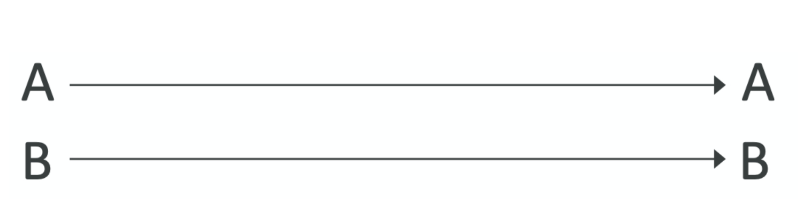
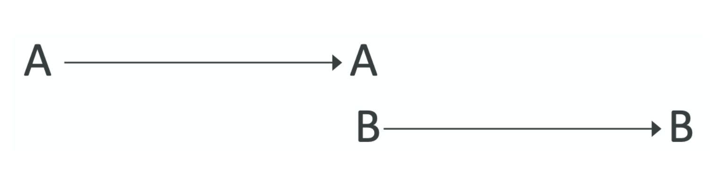
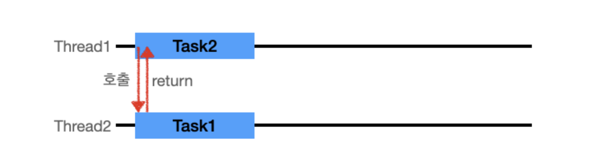
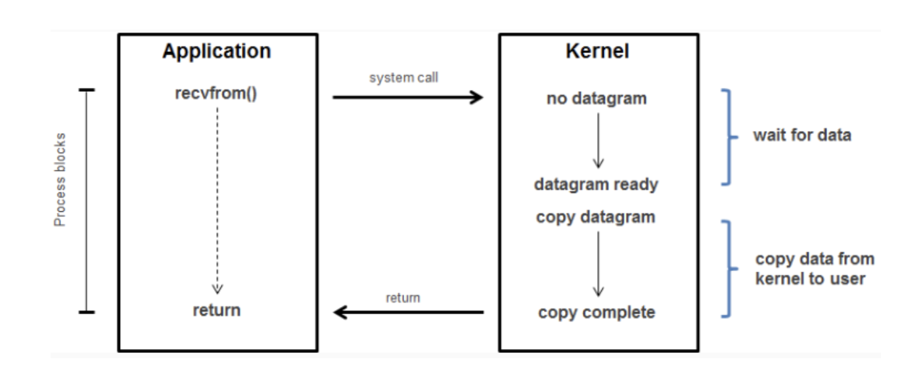
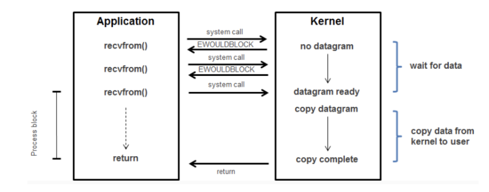
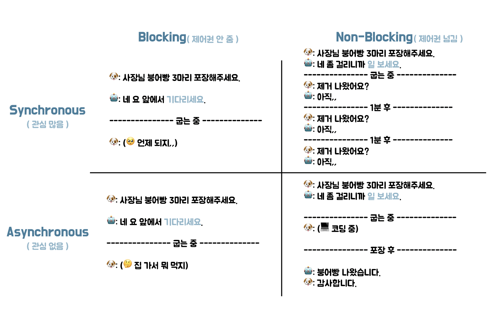

# [9주차] blocking/non-blocking

날짜: 2022년 9월 28일
진행상황: Done
태그: network

---

# Sync / Async ( 동기와 비동기 )

---

- Synchoronous의 Syn은 **together,** chorono는 **time**을 뜻한다.
    
    → Synchronous는 함께 **시간을 맞춘다라는 뜻으로 해석**할 수 있다.
    
- Asynchronous는 Synchronous앞에 *A*라는 접두사가 붙어 **부정하는 형태**가 된다.
    
    → Asynchronous는 **시간을 맞추지 않는다라는 뜻**으로 해석할 수 있다.
    

## Synchrnous ( 동기 )

---

<aside>
💡 두 가지 이상의 대상( 함수, 애플리케이션 등 )이 서로 시간을 맞춰 행동하는 것

</aside>

- 호출한 함수가 호출된 함수의 작업이 끝나서 반환되기를 기다리는 경우
    
    → 작업 요청을 했을 때, 요청의 **결과값을 직접 받는 경우**
    
- **호출한 함수가 작업 완료를 신경 쓰는 구조**
    
    → 지속적으로 **호출된 함수에게 확인 요청**
    

### 동기적으로 처리하는 방법

---

### [1]. 시작 시간 또는 종료 시간이 일치하는 경우

- A,  B Thread가 **동시에 작업을 시작하는 경우**
    
    → 자바에서의 `CyclicBarrier`
    
- 메서드 **리턴 시간(A)과 결과를 전달받는 시간(B)이 일치**하는 경우

### [2]. 하나의 메서드의 종료시간과 다른 메서드의 시작시간이 같은 경우

---

- A가 끝나는 시점과 B가 시작하는 시점이 같으면 동기식 방식이다.
    
    → 자바에서의 `synchronized` 와 `BlockingQueue`
    

## Asynchronous ( 비동기 )

---

<aside>
💡 Sync와 반대로 대상들이 서로 시간을 맞추지 않는 것을 뜻한다

</aside>

- 호출하는 함수가 호출되는 함수에게 **작업을 맡겨놓고 신경쓰지 않는 것**을 말한다
- Thread1 이 작업을 요청 후 기다리지 않으며 다른 작업을 처리할 수 있다.
    
    → **요청의 결과값을 간접적으로 받는다**
    
- **호출된 함수(callback 함수)가 작업 완료를 신경 쓴다**

# Blocking / Non-Blocking

---

- Blocking과 Non-Blocking은 주로 I/O 작업에서 사용된다.

## I/O 작업

---

<aside>
💡 Input/Output의 약자로 소켓의 read/send

</aside>

- 두 대 이상의 컴퓨터끼리 서로 네트워크를 통해 통신하는 경우
    
    한 컴퓨터에서 **출력( Send )**이 이루어지고 다른 컴퓨터에서 **입력 ( Read )**을 받는 과정을 통해 통신이 이루어진다.
    
- I/O 작업은 User 레벨에서 직접 수행할 수 없고, Kernel 레벨에서만 가능하다.
- 유저 프로세스(또는 쓰레드)는 커널에게 요청을 하고, 커널이 반환하는 결과를 기다릴 뿐이다.

## Blocking Model ( I/O 관점 )

---

<aside>
💡 I/O 작업이 진행되는 동안 유저 프로세스는 **자신의 작업을 중단한 채 대기**하는 방식

</aside>

- 가장 기본적인 I/O 모델로, linux에서 모든 소켓 통신은 **기본 Blocking으로 동작**한다.

1. 유저 ( Application )은 커널에게 read **작업을 요청**한다.
2. 데이터가 입력될 때 까지 대기한다.
3. 데이터가 입력되면 **유저에게( 커널 → 유저 ) 결과값이 반환되어야만 자신의 작업에 복귀**할 수 있다.

❗️ **말 그대로 Block이 되고, 애플리케이션에서 다른 작업을 수행하지 못하고 대기하므로 자원이 낭비**

## Non-Blocking Model ( I/O 관점 )

---

<aside>
💡 I/O 작업이 진행되는 동안 **유저 프로세스의 작업을 중단시키지 않는 방식**

</aside>

- Blocking 방식의 **비효율성( 자원 낭비 )을 극복하고자 도입**된 방식이다.

1. 유저 ( Application )은 커널에게 read **작업을 요청**한다.
2. **데이터의 입력 유무에 상관없이** 요청하는 그 순간 바로 **결과가 반환**된다.
    
    → **입력 데이터가 없는 경우** : 입력 데이터가 없다는 **결과메시지 ( EWOULDBLOCK )을 반환**
    
3. 입력 데이터가 있을 때 까지 **1, 2번 반복**
    
    → 2번에서 결과 메시지를 받은 유저는 다른 작업 진행이 가능하다.
    
4. 입력 데이터가 있으면 유저에게 결과가 전달된다.

**❗️ 반복적으로 시스템 호출이 발생하기 때문에 이 경우 역시 자원이 낭비될 수 있다.**

# Sync / Acync와 Blocking / Non-Blocking

---

## Blocking / Non - Blocking

---

> 📌 키워드 : `제어권`
> 
- `Non-Blocking` : 제어권 넘김
- `Blocking` : 제어권 넘기지 않음

`Blocking` 시 붕어빵 사장님 앞에서 하염없이 기다린다. ( **= 다른 일을 할 수 없다.** )

`Non-Blocking` 시 붕어빵 사장님이 다른 일을 보러 갔다오라고 한다. ( **= 내 할 일을 하면 된다.** )

➡️ 일 시작 시 **바로 제어권을 리턴해주는 지**, **할 일을 마친 뒤 리턴해주는지**에 따라 나뉜다.

## Sync  / Async

---

> 📌 키워드 : `동시성`
> 
- `Synchronous` : 관심 많음
- `Asynchronous` : 관심 없음

`Synchronous` : 붕어빵을 기다리면서 **계속 현재 작업 상황을 체크**한다.

`Asynchronous` : 붕어빵 사장님이 알아서 해준다. ( **Callback** )

➡️   손님이 붕어빵을 신경쓰는지, 붕어빵 사장님만 붕어빵을 신경쓰는지에 따라 나뉜다.

 `Asynchronous` 는 호출 시 **Callback**을 전달해 작업의 완료 여부를 호출한 함수에게 알린다.

# 🔗   참조 링크

---

[블로킹(Blocking), 논블로킹(Non-Blocking) - I/O 모델 (1)](https://ju3un.github.io/network-basic-1/)

[[CS] Blocking / Non-Blocking & Synchronous / Asynchronous + I/O](https://velog.io/@dbsrud11/CS-Blocking-Non-Blocking-Synchronous-Asynchronous)

[Sync VS Async, Blocking VS Non-Blocking](https://velog.io/@codemcd/Sync-VS-Async-Blocking-VS-Non-Blocking-sak6d01fhx)

[동기 vs 비동기 (feat. blocking vs non-blocking)](https://velog.io/@wonhee010/%EB%8F%99%EA%B8%B0vs%EB%B9%84%EB%8F%99%EA%B8%B0-feat.-blocking-vs-non-blocking)