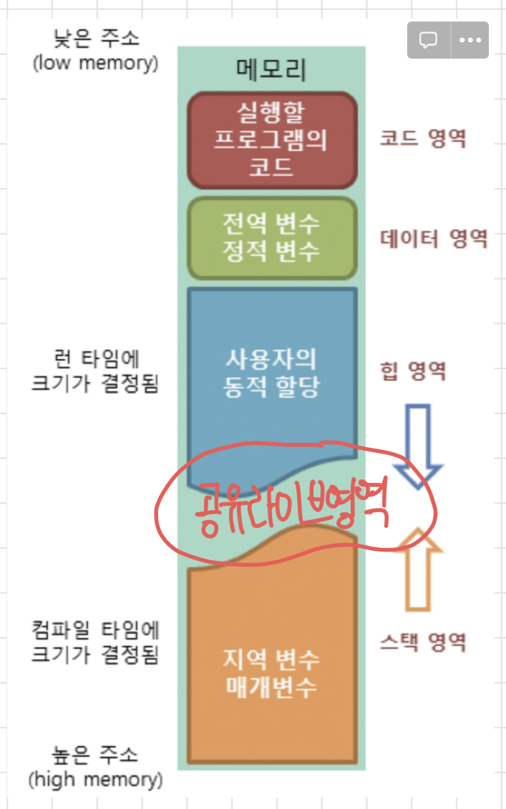

## Stack

---

<aside>
💡 LIFO (Last In First Out) 방식의 자료구조

</aside>

- 모든 원소들의 삽입(Insert)와 삭제(Delete)가 리스트의 `한쪽 끝(top)에서만 수행`되는 제한 조건을 가진 선형 자료구조
- 원소를 넣을 때, 아래에서 위로 쌓아올리는 형식
- 삭제할 때에는 가장 마지막에 넣어진 자료를 가장 먼저 삭제하는 식으로 동작합니다. (LIFO)
- 대표적인 연산 : push(), pop()

## [java] method
---

| name | return type | TimeComplexity | 설명 |
| --- | --- | --- | --- |
| empty() | boolean  | O(1) | 해당 스택이 비어있으면 true를 반환 그렇지 않으면 false를 반환 |
| peek() | E  | O(1)
맨 꼭대기 가리킴 | 해당 스택의 제일 상단에 있는 요소(마지막으로 저장된 요소)를 반환  |
| pop() | E  | O(1)
맨 꼭대기 빼기 | 해당 스택의 제일 상단에 있는 요소(마지막으로 저장된 요소)를 반환 + 스택에서 제거 |
| push() | E  | O(1)
맨 꼭대기에 쌓아올림 | 해당 스택의 제일 상단에 전달된 요소를 넣음 |
| search()
(어떻게 동작하는지 궁금해서 실행시켜봄) | int  | O(N) : 최악의 시간 | 찾고싶은 element가 존재하는 위치의 인덱스를 반환 (인덱스는 제일 상단부터 1부터 시작) |

❗ peek과 pop은 반환하는 것은 같지만, pop은 반환한 다음 제거하는 작업이 더 있습니다.

즉, peek 은 top에 뭐가 있는지 알려주는 것이고 pop은 꺼내서 주는 것입니다.

<aside>

```java
import java.util.Stack;

public class StackTest {
	public static void main(String[] args) {
		Stack<Integer> stack = new Stack<Integer>();
		stack.push(1);
		stack.push(2);
		stack.push(3);
		stack.push(4);
		System.out.println(stack.search(2));    // 3
		System.out.println(stack.toString());   // [1,2,3,4]
	}
}

```
</aside>

<br>

<div>

<p>
넣어진 순서대로라고 생각했지만, top에 있는 값을 1로하고 시작
</p>
</div>

<br> 

> <그림> stack 의 push와 pop하는 과정


stack은 메모리를 높은주소에서 낮은주소로 할당받습니다. → 스택 메모리상의 변경이 없어야 하기 때문에

> 메모리를 높은 주소에서 낮은 주소로 할당받는 이유

1. 스택이 낮은 주소에서 높은 주소로 데이터가 저장될 경우, 큰 데이터들이 저장되어 스택이 커진다면, 커널 영역을 침범할 수 있기 때문에 (커널영역 보호)?
2. 공유 라이브러리 영역을 기준으로 서로 마주보는 형태가 되면 메모리 낭비를 줄일 수 있기 떄문


> “이 그림 2개는 메모리 맵에 대한 그림입니다.”

1. 추가 설명

    
    <p>
    메모리맵 낮은 주소에서 높은 주소로 쌓이게 되다보면 커널영역을 침범합니다.
    </p>


2. 추가 설명
    
    
    
    힙은 낮은주소에서 높은 주소로 쌓이고
    스택은 높은주소에서 낮은주소로 쌓임으로써, 그 사이 남는 공간인 공유 라이브러리영역을 최대한 활용할 수 있습니다. 
    


> reference
> 

[코딩교육 티씨피스쿨](http://www.tcpschool.com/c/c_memory_structure)

[스택(Stack)](https://moc0.tistory.com/12)

[[리버싱] 왜 스택은 높은 주소에서 낮은 주소로 채워질까?](https://jihyeong-ji99hy99.tistory.com/19)

[](https://www.hackerschool.org/Sub_Html/HS_University/BOF/essential/PDF_Files/15.pdf)

[메모리 구조 [Memory Structure]](https://st-lab.tistory.com/198)

<br>

### 🤜 **스택이 활용되는 곳**

- **브라우저 히스토리**
    
    브라우저의 기록을 스택으로 쌓고 `뒤로가기`를 누를때마다 스택(바로 이전의 브라우저)을 pop하는 형식을 사용합니다.
    
- **문서작업에서 Ctrl + Z**
    
    가장 나중에 실행했던 작업을 pop!
    
- **괄호검사, 후위표기식**
    
    스택으로 괄호가 잘열리고 닫혔는지를 검사하며, 스택으로 후위표기식을 계산합니다.
    
- **역순 문자열만들기**
    
    역순 문자열을 만들때 차례로 쌓인 문자열을 하나하나 가져오면 쉽게 역순 문자열을 만들 수 있습니다.
    
- **프로그램 호출 스택**
    
    보통 재귀적인 구조를 호출할 때 스택이 사용되곤 합니다.
    
- **재귀적 알고리즘 → 아래의 stackoverflow를 보면서 더 자세하게 설명하겠습니다.**

- Stack 관련 용어
    - `StackUnderFlow` : 비어있는 스택에서 자료를 꺼내려고 할 때
    - `StackOverFlow` : 꽉 차있는 스택에서 자료를 넣으려고 할 때
        
        Example : 재귀함수를 구현할때 만날 수 있는 현상
        함수의 재귀 호출이 무한히 반복되면, 해당 프로그램은 스택 오버플로우(stack overflow)에 의해 종료된다고 했습니다.
        
        만약 함수의 재귀 호출이 무한히 반복되면, 위 그림에서 Step 3 이후로는 재귀 호출에 의한 스택 프레임이 계속해서 쌓여만 갈 것입니다.
        
        이렇게 스택의 모든 공간을 다 차지하고 난 후 더 이상의 여유 공간이 없을 때 또 다시 스택 프레임을 저장하게 되면(함수 호출을 계속한다면), 해당 데이터는 스택 영역을 넘어가서 저장되게 됩니다.
        
        
        
        재귀함수를 무한으로 호출할 경우, stack overflow가 발생하는 과정
        

## Queue

---

> 💡 FIFO ( First In First Out) 방식의 자료구조


- 정해진 곳(top)에서만 자료의 삽입과 삭제가 이루어지는 스택과는 다르게 큐는 Rear부분에서 자료의 삽입이, Front부분에서 자료의 삭제가 이루어집니다.
- 리스트의 한쪽 끝에서는 원소들의 삭제만 이루어지고 반대쪽 끝에서는 원소들의 삽입만 가능하게 만든 순서화된 리스트

<br>

### ✨큐 관련 용어

---

- `front`
    
    큐의 맨 앞, 데이터가 나가는 곳 (자료의 삭제)
    
- `rear`
    
    큐의 맨 뒤, 데이터가 들어오는 곳 (자료의 삽입))
    
- `enqueue`
    
    큐의 뒤에 데이터 추가
    
- `dequeue`
    
    큐의 앞에 데이터 삭제
    
- `empty/full`
    
    큐가 비었는지 가득 찼는지 검사
    
- `getfront`
    
    큐의 맨 앞을 알려주는 것 (스택의 peek)
    
- `size(level)`
    
    큐의 크기 리턴
    
<br>

### ✨ 큐 시간복잡도

---

- 삽입: O(1)
- 삭제: O(1)
- 검색: O(N)

※ 큐의 삽입은 front에서만 일어나고 삭제는 항상 rear에서만 일어나므로삽입과 삭제에 소요되는 시간복잡도는 O(1)로 고정

<br>

## java [method]

---

> Queue 인터페이스는 큐 메모리 구조를 표현하기 위해, 다음과 같은 Collection 인터페이스 메소드만을 상속받아 사용합니다.
> 
- 수행이 실패했을 때 exception 발생 : add, element, remove
    - `boolean add(E e)` : 해당 item을 queue에 삽입, 삽입에 성공하면 true 반환, 공간이 없으면 예외(IllegalStateException)발생
    - `E element()` : queue의 head에 있는 item 삭제하지 않고 반환, queue가 비어있다면 예외발생
    - `E remove()` : queue의 front에 있는 item을 삭제하고 반환, queue가 비어있다면 예외발생
- 수행이 실패했을 때 null 또는 false 반환 : offer, peek, poll
    - `boolean offer(E e)` : queue에 삽입, 성공 시 true 반환, 실패 시 false 반환
    - `E poll()`: 해당 큐의 맨 앞에 있는(제일 먼저 저장된) 요소를 반환하고, 해당 요소를 큐에서 제거함. 만약 큐가 비어있으면 null을 반환함.
    - `E peek()` : 해당 큐의 맨 앞에 있는(제일 먼저 저장된) 요소를 반환함.
    만약 큐가 비어있으면 null을 반환함.
    - `isEmpty` : 큐가 비어있을 때 true 반환

- 큐의 종류
    - 선형 큐 (Linear Queue)
        
        기본적인 큐의 형태로써 막대 모양으로 된 큐이다.
        
        배열로 구현 시 크기가 제한되어 있고 빈 공간을 사용하려면 모든 자료를 꺼내거나 자료를 한 칸씩 옮겨야 한다는 단점이 있고 많은 수의 enqueue 및 dequeue 작업이 있는 경우 어느 시점에서 큐가 비어있어도 자료를 삽입하지 못하는 경우가 발생한다.
        
        
        
    - 원형 큐 (Circular Queue)
        
        선형 큐의 문제점을 보완한 것이 환형 큐이다.
        
        환형 큐는 1차원 배열 형태의 큐를 원형(Circular)으로 구성하여 `배열의 처음과 끝을 연결`하여 만든다. 
        
        
        
        삽입할 때 선형 큐와 다른 점이라고 한다면, 데이터가 삭제된 부분에도 다시 삽입이 가능하다는 점이다.위 배열에서 A와 B를 지우고 다시 삽입을 한다고 하면, 데이터를 다시 삽입할 때 A와 B자리에도 데이터를 삽입할 수 있다.
        
        단, **원형 큐의 경우에는 배열이 꽉차있는지, 비어있는지를 구분하기 위하여 한 칸의 공백은 무조건 있어야 한다.** 위 배열에서 E, F, G를 삽입 했다면 한 칸이 남음에도 불구하고 front가 가리키는 위치에는 데이터를 삽입할 수 없다.
        
        
        
        선형 큐와 동일
        

### 🤜 큐 활용

- **은행창구 번호표 대기**
    
    빠른 번호표를 가진 사람이 먼저 업무를 봅니다.
    
- **프린터 출력**
    
    가장 먼저 대기열에 오른 프린트가 먼저 출력됩니다.
    
- **컴퓨터 운영체제의 테스크 스케쥴링**
    
    가장 간단한 형태의 선입선 처리 스케쥴링 정책
    
- **너비 우선 탐색(BFS) 알고리즘**

## Heap
---
> 💡 완전이진트리 형식의 자료구조

- 자료구조에 들어있는 데이터들의 최대값 혹은 최소값을 빠르게 찾아내기 위해 고안되었다.
- Top 연산으로 현재 상태의 최대값(혹은 최소값)을 확인할 수 있다.
- Pop 연산으로 최대값(최소값)을 꺼내 쓰고, Push 연산으로 새로운 값을 추가한다.
- 새로 값이 추가되면 정렬 순서에 맞게 자료가 저장된다.
- 부모 노드의 키값과 자식 노드의 키갑 사이에는 대소관계가 성립한다.
- 최소힙
    - 부모 노드의 키 값이 자식 노드의 키 값보다 작거나 같은 완전 이진 트리
    - 가장 작은 값이 루트 노드에 위치
- 최대힙
    - 부모 노드의 키 값이 자식 노드의 키 값보다 크거나 같은 완전 이진 트리
    - 가장 큰 값이 루트 노드에 위치

- 삽입/삭제의 속도 때문에 완전 이진 트리로 나타내며, 대개 배열로 표현하는데 계산을 편하게 하기 위해 인덱스는 1부터 사용해요
- 두 종류, 최대 힙(부모 노드가 항상 자식들보다 큰 힙)과 최소 힙(부모가 항상 자식들보다 작은 힙)으로 나뉘어요
- 최댓값(최솟값)을 O(1)안에 찾을 수 있어요
- 데이터의 삽입/삭제는 O(logN)이 소요돼요
- 데이터의 삽입은 다음 프로세스로 이루어져요
    
    > 가장 끝의 자리에 노드 삽입그 노드와 부모 노드를 비교하여 규칙(최대/최소)에 맞으면 보존, 아니면 교환규칙에 맞을 때까지 2번 과정 반복
    
- 데이터의 삭제는 루트 노드만 가능하며, 다음 프로세스로 이루어져요
    
    > 루트 노드(최상위 노드)를 제거그 자리에 가장 마지막 노드 삽입올라간 노트와 자식 노드들을 비교(최대 힙) 부모보다 더 큰 자식들 중 큰 값과 교환, 없으면 종료(최소 힙) 부모보다 더 작은 자식들 중 작은 값과 교환, 없으면 종료4번을 반복
    

힙을 저장하는 표준적인 자료구조는 배열이다.일반적으로 구현을 쉽게 하기 위해 `index 0` 사용하지 않고, 루트 노드를 `index 1`에 위치시킨다.

- i번째 노드의 부모 노드 index: ⌊i / 2⌋
- i번째 노드의 왼쪽 자식 노드 index: 2 * i
- i번째 노드의 오른쪽 자식 노드 index: 2 * i + 1


<br>

> ref

[Stack , Queue, Heap 의 구조와 메모리 영역에 대한 이해](https://ddunnimlabs.tistory.com/104)

[Stack, Queue, Heap](https://velog.io/@hanhs4544/Stack-Queue-Heap)

[TIL_5 | 자료구조(feat. Stack, Queue, Hash, Heap)](https://velog.io/@code_sign/TIL5-%EC%9E%90%EB%A3%8C%EA%B5%AC%EC%A1%B0feat.-Stack-Queue-Hash-Heap)

[코딩교육 티씨피스쿨](http://www.tcpschool.com/java/java_collectionFramework_stackQueue)

[CS 공부 - [스택] - Kyun2da Blog](https://kyun2da.github.io/2021/01/12/stack/)


> heap

[[Data Structure] Heap](https://huilife.tistory.com/25)

[[우선순위 큐/힙]Heap이란?](https://technote-mezza.tistory.com/40)

[[CS 기초 - 자료구조] Heap](https://velog.io/@deannn/CS-%EA%B8%B0%EC%B4%88-%EC%9E%90%EB%A3%8C%EA%B5%AC%EC%A1%B0-Heap)

> queue

[[자료구조] 큐(Queue)](https://velog.io/@kang9366/%EC%9E%90%EB%A3%8C%EA%B5%AC%EC%A1%B0-%ED%81%90Queue)
