### 비선형 자료구조

<aside>
💡 *트리 또한 그래프이며, 그 중 **사이클이 허용되지 않는** **그래프**를 말한다.*

</aside>

자료의 삽입,삭제에 중점인 선형구조와 다르게, 자료의 표현에 중점을 맞춘 것

하나의 자료 뒤에 여러개의 자료가 존재하는 형태

- 그래프
- 트리

 

# 📌 그래프

<aside>
💡 정점(vertex)들과 이 정점들을 연결하는 간선(edge)들로 구성된 비선형 자료구조

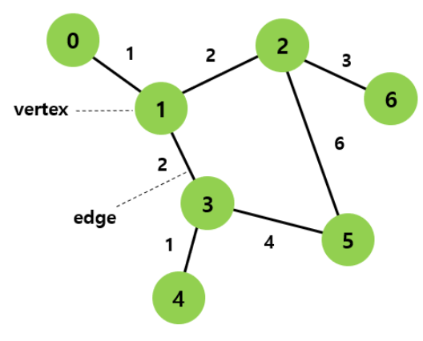

</aside>

 

## 🤜 관련 용어

---

- `정점 (vertex)` : 그래프의 구성요소로 하나의 연결점 == node
    - `인접 정점` : 간선에 의해 직접 연결된 정점 ex. (3,4), (2,6)
- `간선 (edge)` : 두 정점을 연결하는 선, 분기(branch)라고도 불림
- `차수 (degree)` : 정점에 연결된 간선의 수 ex. 1의 차수 : 3
    - `진입 차수 (in-degree)` : 유향 그래프에서 **다른 정점에서 정점 *V* 로 향하는 방향을 가진 간선의 수**를 정점 *V*의 진입 차수(내차수)
    - `진출 차수 (out-degree)` : 유향 그래프에서 **정점 *V* 에서 다른 정점으로 향하는 방향을 가진 간선의 수**를 정점 *V*의 진출 차수 (외차수)
- `경로 (Path)` : 한 정점에서 다른 한 정점으로 향하는 **연속된 간선들의 Sequence**
    - `단순 경로 (simple path)` : 경로 중에서 반복되는 정점이 없는 경우(Path 중에서 **한 번 방문한 정점은 다시 방문하지 않는 Sequence)**
    - `경로 길이 (path length)` : 경로를 구성하는데 사용된 간선의 수
- `사이클 (cycle)` : 단순 경로의 시작 정점과 종료 정점이 동일한 경우

 

## 🤜 특징

---

- 그래프는 **네트워크 모델**이다
- 2개 이상의 경로가 가능하다.
    
     즉, 노드들 사이에 무방향/방향에서 양방향 경로를 가질 수 있다. 
    
- self-loop 뿐만 아니라 loop/circuit 모두 가능하다.
- 부모-자식 관계 개념이 없다.   → 루트 노드 없 음
- 간선의 유무는 그래프에 따라 다르다.
- 순회는 DFS나 BFS로 이루어진다.

 

## 🤜 종류

---

### 방향의 유무

---

- **유향 그래프(Directed Graph)**
    - **방향성이 있는** 간선들로 이루어진 그래프
    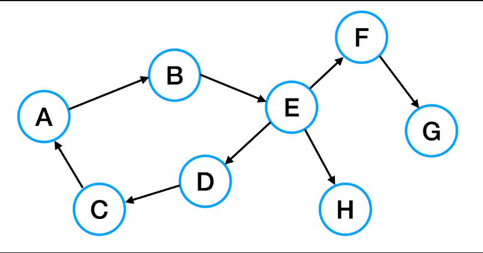
    **화살표의 방향대로만 이동이 가능**
    

- **무향 그래프(Undirected Graph)**
    - **방향성이 없는** 간선들로 이루어진 그래프
    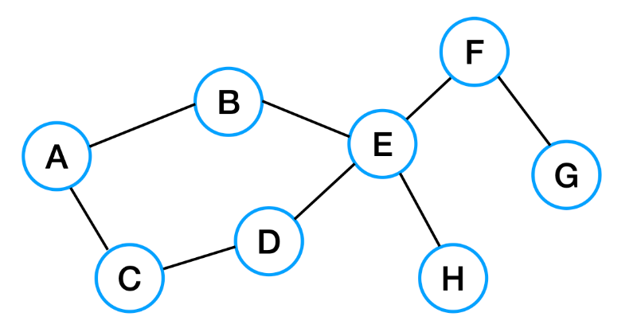
    무방향 그래프는 방향 그래프와 다르게 **양방향 이동이 가능**하다.
    

<aside>
👉 - A에서 D로 가고싶다!
   유향그래프의 최단경로 : {A→B→E→D}
   무향그래프의 최단경로 : {A→C→D}       (물론, A→B→E→D 가능!)
</aside>

 

### 순환(cycle)의 유무

---

- **순환 그래프 (Cycle Graph)**
    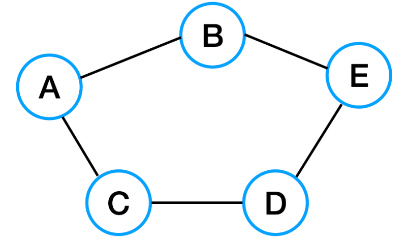
    **단순 경로의 시작 정점과 종료 정점이 동일한 경우**
    

- **비순환 그래프 (Acycle Graph)**
    - 순환 그래프의 반대 (사이클이 없는 그래프)
    - 여기서, `트리` 는 비순환 그래프이다!
    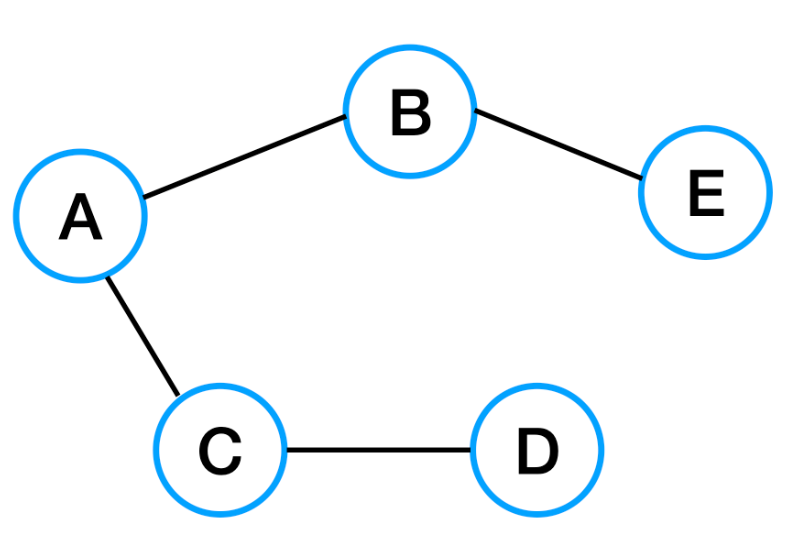
    

### 정점의 개수 vs 간선의 개수

- 희소 그래프 (Sparse Graph)
    - 정점(node)의 개수보다 간선(edge)의 개수가 작은 그래프
    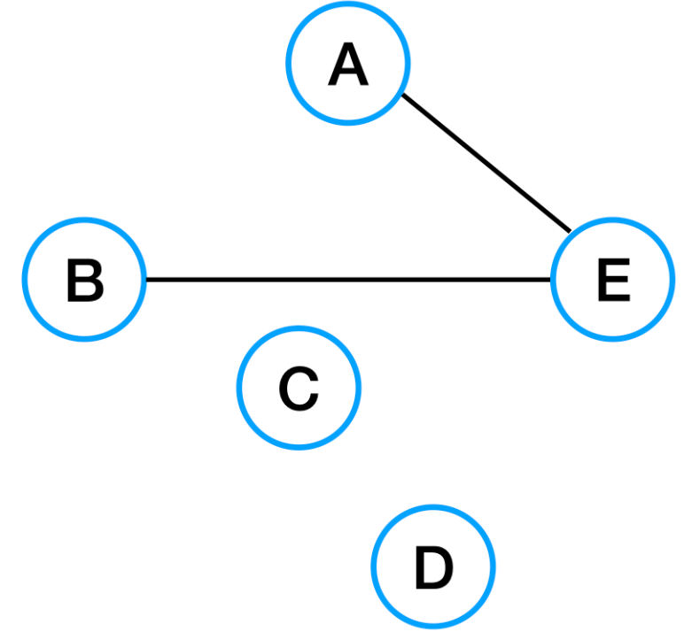
    
- 밀집 그래프 (Dense Graph)
    - 정점(node)의 개수보다 간선(edge) 개수가 많은 그래프    
    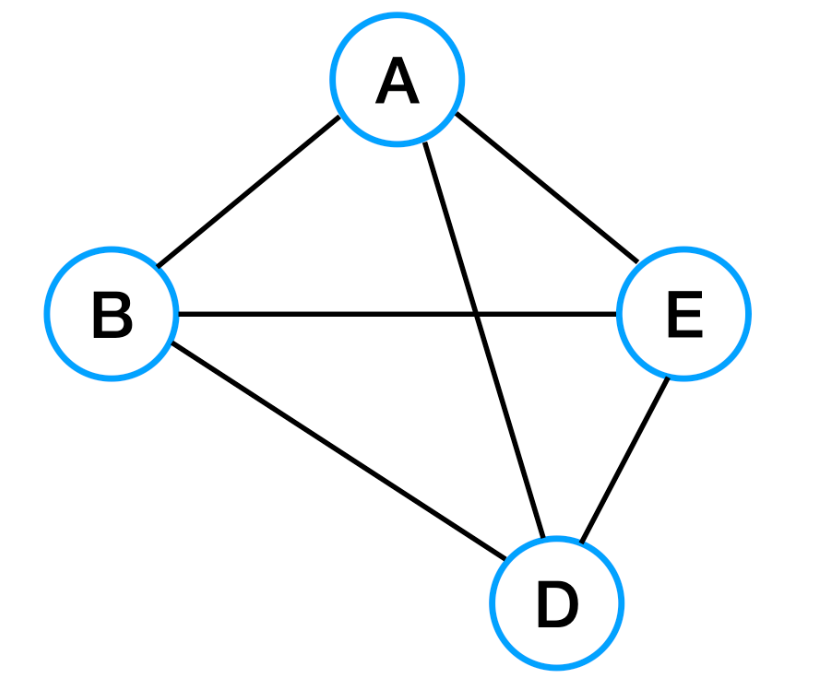
    

### 그 외

- **가중치 그래프(Weighted Graph)**
    - 그래프를 구성하는 간선에 가중치가 할당된 그래프
    - `네트워크(Network)` 라고도 한다. ex. 통신망의 사용료, 도로의 길이, ..
    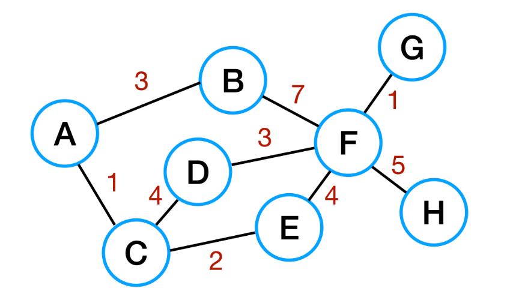
    
- **완전 그래프 (Complete Graph)**
    - 그래프에 속해 있는 모든 정점이 하나의 간선으로 연결되어 있는 그래프!
    - 무방향 완전 그래프인 경우, 정점이 n개일 때, 간선의 수 `n*(n-1)/2`
    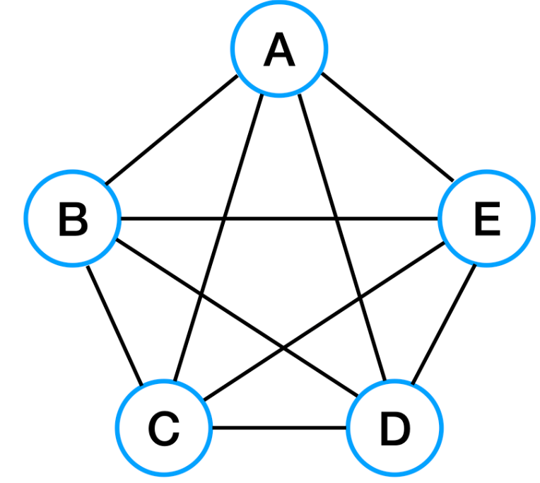

    
 

## 🤜 구현

---

### 📍 인접 리스트 (adjacent list)

“연결 리스트를 사용하는 방법” → 가장 일반적인 방법

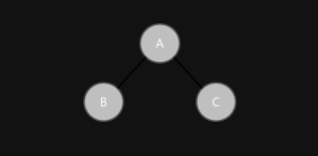

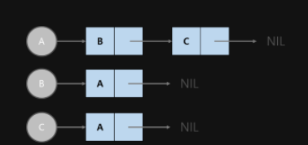

 

- `정점의 인접 리스트`를 이용하여 구현하는 방법이다.
- `**모든 정점(노드)의 인접 정점을 리스트로 만드는 방법**이다. 배열과 배열의 각 인덱스마다 존재하는 또다른 리스트(배열, 동적 가변 크기 배열(ArrayList), 연결 리스트(Linked List) 등)를 이용하여 인접 리스트를 표현한다.
- 무방향 그래프에서는 하나의 간선이 두번씩 저장된다.
    - (a, b)와 (b, a)으로써 같은 간선이지만 출발 정점에 모두 저장되기 때문이다.
- 정점의 수 V, 간선의 수 E, 무방향 그래프의 경우,
    
    V개의 리스트, V개의 배열, 2E개의 노드가 필요하다.
    
- 트리에서는 특정 노드(루트 노드)에서 다른 모든 노드로 접근이 가능하기에 `Tree` 클래스가 필요 없다.
    
    그래프에서는 특정 노드에서 다른 모든 노드로 접근이 가능하지 않기에 `Graph` 클래스가 필요하다.
    

---

### 📍 인접 행렬 (adjacent matrix)

“정방 행렬을 사용하는 방법”

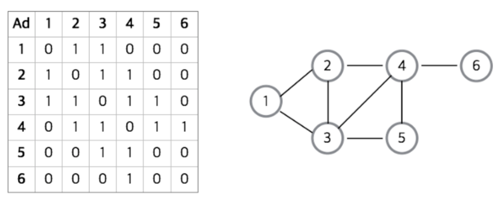

- 그래프에 V개의 정점이 있을 때, **V 크기의 정방행렬을 이용하여 구현하는 방법**이다.
    
    `Matrix[i][j] == 1`이면 정점 i에서 j로 가는 간선이 존재하고`Matrix[i][j] == 0`이면 정점 i에서 j로 가는 간선이 존재하지 않는다는 뜻이다.
    
- 값으로 1, 0 대신 boolean 자료형 true, false을 사용해도 된다.
- 해당하는 위치의 값을 통해서 정점 간의 연결 관계를 `O(1)`로 알 수 있다.
    
    ex. 2와 3의 연결관계를 알고싶다 → `Matrix[2][3] ==1` ?
    
- 모든 정점에 대해 다른 모든 정점과의 관계를 표현한 행렬이므로,간선 유무에 상관없이 **V^2의 메모리 공간이 필요**하다.
- 무방향 그래프를 인접 행렬로 표현한다면, 대칭 행렬이 된다.

---

### ❓ 구현할 때의 선택

> 인접 리스트
> 

---

- `**희소 그래프(Sparse Graph)**`를 표현하는 데에 적당하다.
    
    인접 리스트는 ***간선의 개수에 따라 필요한 메모리 공간의 크기가 달라지기 때문***이다.
    
- 장점
    - 어떠한 정점의 인접 정점들을 쉽게 찾을 수 있다.
    - 그래프에 존재하는 모든 간선의 수를 `O(V + E)` 안에 알 수 있다. (인접 리스트 전체를 조사하는 방법)
- 단점
    - 모든 정점의 인접 리스트를 확인해야 하므로, 정점 간에 연결되어 있는지 확인하는 데에 오래 걸린다.
    

> 인접 행렬
> 

---

- `**밀집 그래프(Dense Graph)**`를 표현하는 데에 적당하다.
- 장점
    - 두 정점을 연결하는 **간선의 존재 여부**(M[i][j])를 **O(1)**안에 즉시 알 수 있다.
    - 정점의 차수는 O(V)안에 알 수 있다.
        
        인접배열의 i번째 행(또는 열)을 모두 더하면 된다.
        
- 단점
    - 어떤 노드에 인접한 노드들을 찾기 위해서는 ~~모든 노드를 전부 순회해야 한다.~~> 전부 순회하지 않고 i번째 행 or i번째 열을 조사하면 된다.
        - 어떤 노드에 인접한 모든 노드들을 찾는다면, 인접 리스트같은 경우, 그 정점에 해당한 리스트만 확인하면 되지만, 인접 행렬은 V번을 끝까지 확인해야할 것이다.
    - 그래프에 존재하는 모든 간선의 수는 **O(V^ 2)** 안에 알 수 있다. (인접 행렬 전체를 조사하는 방법)

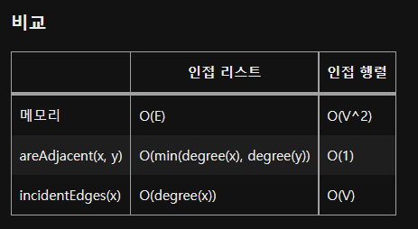

 

## 🤜 그래프 탐색 (순회)

---

### DFS

그래프 상에 존재하는 임의의 한 정점을 기준으로 잡고(루트 노드) 시작하여

**다음 정점을 탐색하기 전에 해당 정점을 완벽하게 탐색 후 다음 정점을 탐색하는 방법**이다.

즉, 넓게 탐색하기 보다는 **깊게 탐색하는 것이 우선**인 방법이다.

- 사용하는 경우 : 모든 노드를 방문 하고자 하는 경우에 이 방법을 선택한다.

### BFS

그래프 상에 존재하는 임의의 한 정점을 기준으로 잡고(루트 노드) 시작하여 **인접한 정점을 먼저 탐색**하는 방법이다.

즉, 깊에 탐색하기 보다는**넓게 탐색하는 것이 우선**인 방법이다.

BFS는 거리가 가까운 순서대로 탐색하기 위해서는 거리가 가까운 순서대로 저장될 자료구조가 필요하다. 따라서 Queue 자료구조를 사용한다.

- 사용하는 경우 : 두 노드 사이의 `최단 경로` 혹은 `임의의 경로`를 찾고 싶을 때 이 방법을 선택

<aside>
💡 시간복잡도

DFS와 BFS 모두 **인접 리스트**로 구현한 경우엔 ***O(V + E)*** 시간복잡도를 갖고 **인접 행렬**로 구현한 경우엔 ***O(V^2)*** 시간복잡도를 갖습니다.

</aside>

 

## 그래프, 트리 차이

---

<aside>
💡 큰 범위 안에서는 트리 또한 그래프 내에 속하게 되지만, 보통 2가지를 구별하여 취급한다. 그래프와 트리는 대표적으로 다음과 같은 차이점을 가진다.

</aside>

- 그래프는 경로가 여러가지 있을 수 있지만, 트리같은 경우는 경로가 하나밖에 없다.

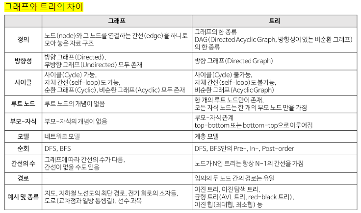

 

> ref
> 

[[CS 기초 - 자료구조] Graph](https://velog.io/@deannn/CS-%EA%B8%B0%EC%B4%88-%EC%9E%90%EB%A3%8C%EA%B5%AC%EC%A1%B0-Graph)

[[CS] Data Structure Part.3 Graph](https://velog.io/@hwi_chance/CS-Data-Structure-Part.3-Graph)

[[자료구조] 그래프(Graph)란 - Heee's Development Blog](https://gmlwjd9405.github.io/2018/08/13/data-structure-graph.html)

[Interview_Question_for_Beginner/DataStructure at master · JaeYeopHan/Interview_Question_for_Beginner](https://github.com/JaeYeopHan/Interview_Question_for_Beginner/tree/master/DataStructure#graph)

[Tech-Stack/Graph.md at master · HyeminNoh/Tech-Stack](https://github.com/HyeminNoh/Tech-Stack/blob/master/docs/DataStructure/Graph.md)