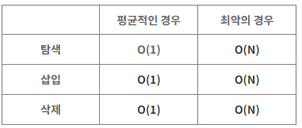
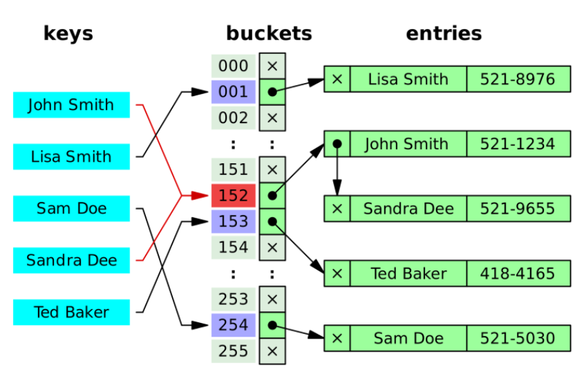

## 📌 해싱 (hashing)

---

<p>
💡 유사한 개체 그룹에서 특정 개체를 고유하게 식별하는 데 사용되는 기술로, 키(key)에 산술적인 연산을 적용하여 항목이 저장되어 있는 테이블의 주소를 계산하여 항복에 접근한다.
</p>

- 해시 함수 (hash function)을 사용하여 데이터를 해시 테이블 (hash table)에 저장하고 검색하는 기법


## 📌 해시 함수 (hash function)

---

- `임의의 길이를 갖는 메시지`를 입력 받아서 `고정된 길이의 해시 값`을 출력하는 함수
- 어떠한 입력 값에도 항상 고정된 길이(해시 함수에 따라 비슷한 길이까지 포함)의 해시값을 출력한다.
- 데이터가 저장되어 있는 곳을 가리켜주기 때문에 다량의 데이터 중에서 원하는 데이터를 빠르게 찾을 수 있도록 해줍니다.

ex. SHA (Secure Hash Algorithm) 알고리즘

<p>
💡 해싱에서 사용하는 자료구조는 `배열`과 `Linked List`의 조합으로 되어 있습니다.
저장할 데이터의 키를 해시함수에 넣으면 `배열`의 한 요소를 얻게 되고, 다시 그 곳에 연결되어 있는 `Linked List`에 저장하게 됩니다.
</p>

<br>

## 📌 해시 테이블 (hash table)

---

### 🤜 해시 테이블의 시간복잡도



**😀 충돌이 일어나지 않았으면 (평균적인 경우)**

**탐색)** 인덱스로 값을 탐색하니 **`O(1)`**

**삽입)** 해시 함수를 통해 인덱스가 정해지니 **`O(1)`**

**삭제)** 인덱스와 인덱스 안에 값만 지워주면 되니 **`O(1)`** (배열처럼 지워졌다고 순서를 다시 정리할 필요가 없다)

**😡 충돌이 일어날 경우(최악의 경우)**

**탐색)** 인덱스로 값을 탐색한 후 링크드리스트를 순차탐색해야한다. 결국 링크드리스트의 길이 n만큼 시간이 소요된다. **`O(N)`**

**삽입)** 링크드리스트의 탐색을 거치게 되니 링크드리스트 탐색 시간복잡도와 같다. **`O(N)`**

**삭제)** 링크드리스트의 탐색을 거치게 되니 링크드리스트 탐색 시간복잡도와 같다. **`O(N)`**

### 👍 해시 테이블의 장점

---

- 어떤 것과 다른 것 사이의 관계를 모형화할 수 있다.
- 중복을 막을 수 있다. (충돌을 피하는 설계를 하게 되니 가장 이상적이다)
- 서버에 작업을 시키지 않고 자료를 캐싱할 수 있다.
- 해시테이블은 key-value가 1:1로 매핑되어 있기 때문에 삽입, 삭제, 검색의 과정에서 모두 평균적으로 O(1)의 시간복잡도를 가지고 있다.

### 👎 해시 테이블의 단점

---

- 해시 충돌이 발생 (개방 주소법, 체이닝 과 같은 기법으로 해결해 줘야 한다.)
- 순서/관계가 있는 배열에는 어울리지 않는다.
- 공간 효율성이 떨어진다. 데이터가 저장되기 전에 저장공간을 미리 만들어놔야한다. 공간을 만들었지만 공간에 채워지지 않는 경우가 발생한다.
- hash function의 의존도가 높다. 해시함수가 복잡하다면 hash를 만들어 내는데 오래 걸릴 것이다.

### 🤜 **해시 테이블(Hash Table) VS 해시 맵(Hash Map)**

---

Java에서 HashTable과 HashMap의 차이는 `**동기화 지원 여부**`이다. 키(Key)에 대한 해시(Hash)값을 사용하여 값을 저장, 조회 하는 것은 동일하다.

- **해시 테이블(Hash Table)**
    - 병렬 처리를 할 때 (동기화를 고려해야하는 상황)
    - Null 값을 허용하지 않는다.
- **해시 맵(Hash Map)**
    - 병렬 처리를 하지 않을 때 (동기화를 고려하지 않는 상황)
    - Null 값을 허용한다.

## 📌 해시 충돌

---

<aside>
💡 해시 함수가 서로 다른 두 개의 입력값에 대해 동일한 출력값을 내는 상황

</aside>

### 해결방법 1.  (Separate) Chaining

체이닝(Chaining)은 자료 저장 시, 저장소(bucket)에서 충돌이 일어나면 해당 값을 기존 값과 연결시키는 기법이다.



위의 사진에서 Sandra를 저장할 때 충돌이 일어났고, 기존에 있던 John에 연결시켰다. 이 때 연결리스트(Linked List) 자료구조를 이용한다. 다음에 저장된 자료를 기존의 자료 다음에 위치시키는 것이다.

### 👍 **장점**

- 미리 충돌을 대비해서 공간을 많이 잡아놓을 필요가 없다. 출돌이 나면 그때 공간을 만들어서 연결만 해주면 된다.

### 👎 **단점**

- 같은 hash에 자료들이 많이 연결되면 검색시 효율이 낮아진다.해결 방법 2. Open Addressing(개방주소법)개방 주소법은 충돌이 일어나면 비어있는 hash에 데이터를 저장하는 방법이다. 개방주소법의 해시 테이블은 hash와 value가 1:1관계를 유지한다.

### Chaining 시간복잡도(Big-O)

복잡도를 계산하기 전, 한 가지를 추가하자면 해시 테이블의 저장소(Bucket)의 길이를 ‘n’, 키(key)의 수를 ‘m’이라고 가정했을 때, 평균적으로 저장소에서 1개의 hash당 (m/n)개의 키가 들어있다. 이를 ‘α’라고 정의한다.

```
m/n = α (1개의 Hash당 평균적으로 α개의 키가 들어있다.)
```

### Insertion :

충돌이 일어났을 때, 해당 해시(Hash)가 가진 연결리스트의 Head에 자료를 저장할 경우, O(1)의 시간복잡도를 가진다. 해당 해시(Hash)를 산출하고 저장하면서 기존 값(value)를 연결하는 행위만 하면 되기 때문이다.

반면 Tail에 자료를 저장할 경우, O(α)의 시간 복잡도를 가진다. 해당 해시(Hash)를 저장할 때 모든 연결리스트를 지나서 Tail에 접근해야 하기 때문이다. 최악의 경우, O(n)의 시간 복잡도를 가진다. 한 개의 해시(Hash)에 모든 자료가 연결되어 있을 수 있기 때문이다.

### Deletion & Search :

삭제와 검색은 시간 복잡도 측면에서 비슷한 개념을 공유한다. 산출된 Hash의 연결리스트를 차례로 살펴보아야 하므로 O(α)의 시간 복잡도를 가진다. 최악의 경우 O(n)의 시간복잡도를 가진다. 한 개의 해시(Hash)에 모든 자료가 연결되어 있을 수 있기 때문이다. 이 경우 모든 자료를 다 살펴보아야 한다.

### 해결 방법 2. Open Addressing(개방주소법)

개방주소법은 데이터의 해시(hash)가 변경되지 않았던 chaining과는 달리 비어있는 해시(hash)를 찾아 데이터를 저장하는 기법이다. 따라서 개방주소법에서의 해시테이블은 1개의 해시와 1개의 값(value)가 매칭되어 있는 형태로 유지된다.

위의 그림을 보면, Sandra가 저장될때 해시가 John으로 채워져 있어서 그 다음 Hash에 Sandra를 저장했다. 그리고 Ted의 해시도 Sandra가 저장되어 있으므로 그 다음 해시에 Ted를 저장했다. 이처럼 비어있는 해시를 찾아 저장하는 방법을 Open Addressing라고 한다.

이 때, 비어있는 해시(Hash)를 찾는 과정은 동일해야 한다.(일정한 규칙을 따라 찾아가야 한다.)

Open Addressing는 위에서 언급한 비어있는 해시를 찾는 규칙에 따라 다음과 같이 구분할 수 있다.

- 선형 탐색(Linear Probing): 다음 해시(+1)나 n개(+n)를 건너뛰어 비어있는 해시에 데이터를 저장한다.
- 제곱 탐색(Quadratic Probing): 충돌이 일어난 해시의 제곱을 한 해시에 데이터를 저장한다.
- 이중 해시(Double Hashing): 다른 해시함수를 한 번 더 적용한 해시에 데이터를 저장한다.

### Open Addressing의 장단점

### 👍 장점

1) 또 다른 저장공간 없이 해시테이블 내에서 데이터 저장 및 처리가 가능하다.

2) 또 다른 저장공간에서의 추가적인 작업이 없다.

### 👎 단점

1) 해시 함수(Hash Function)의 성능에 전체 해시테이블의 성능이 좌지우지된다.

2) 데이터의 길이가 늘어나면 그에 해당하는 저장소를 마련해 두어야 한다.

### Open Addressing 시간 복잡도 (Big-O)

Chaining 에서 정의한 ‘α’를 Open Addressing 에서도 정의하자면, 해시 테이블의 저장소(Bucket)의 길이를 ’n’, 키(key)의 수를 ‘m’이라고 가정했을 때, ‘α’는 1보다 작거나 같다. 저장소 1개 버킷 당 1개의 값(value)만 가지기 때문이다.

```
m/n = α (α <= 1)
```

### Insertion & Deletion & Search :

삽입, 삭제, 검색 모두 대상이 되는 Hash를 찾아가는 과정에 따라 시간복잡도가 계산이 된다. 해시함수를 통해 얻은 Hash가 비어있지 않으면 다음 버킷을 찾아가야 한다. 이 찾아가는 횟수가 많아지면 많아질 수록 시간복잡도가 증가한다. 최상의 경우 O(1) ~ 최악의 경우 (O(n)).

따라서 Open Addressing에서는 비어있는 공간을 확보하는 것(= 저장소가 어느 정도 채워졌을 때 저장소의 사이즈를 늘려주는 것)이 필요하다.

최악의 경우 저장소를 모두 살펴보아야 하는 경우가 생길 수 있다.(O(n))


> ref
> 

[[자료구조] Hash의 개념 및 설명](https://go-coding.tistory.com/30)

[자료구조 | 해시 테이블 hash table](https://velog.io/@edie_ko/hashtable-with-js)

[[자료구조] 해시(Hash)란 무엇인가](https://ablue-1.tistory.com/68)

[[자료구조] Hash/HashTable/HashMap](https://hee96-story.tistory.com/48)

---

[Hash, Hashing, Hash Table(해시, 해싱 해시테이블) 자료구조의 이해](https://velog.io/@cyranocoding/Hash-Hashing-Hash-Table%ED%95%B4%EC%8B%9C-%ED%95%B4%EC%8B%B1-%ED%95%B4%EC%8B%9C%ED%85%8C%EC%9D%B4%EB%B8%94-%EC%9E%90%EB%A3%8C%EA%B5%AC%EC%A1%B0%EC%9D%98-%EC%9D%B4%ED%95%B4-6ijyonph6o)