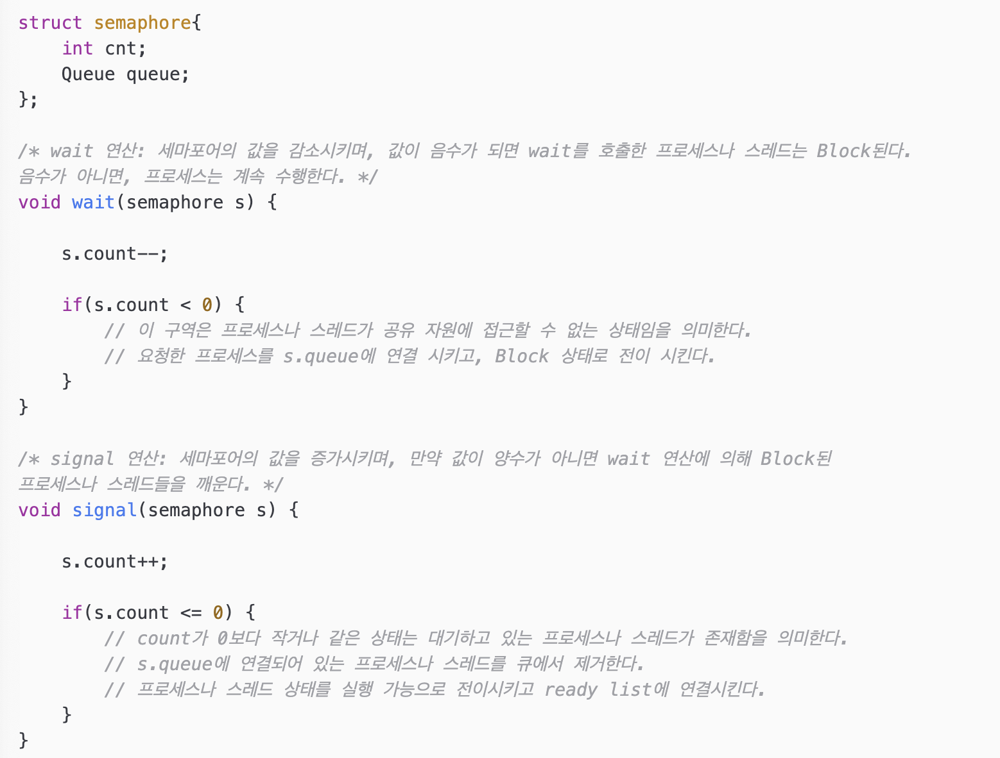
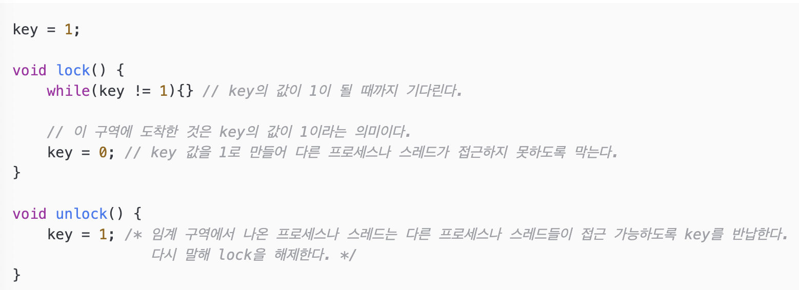
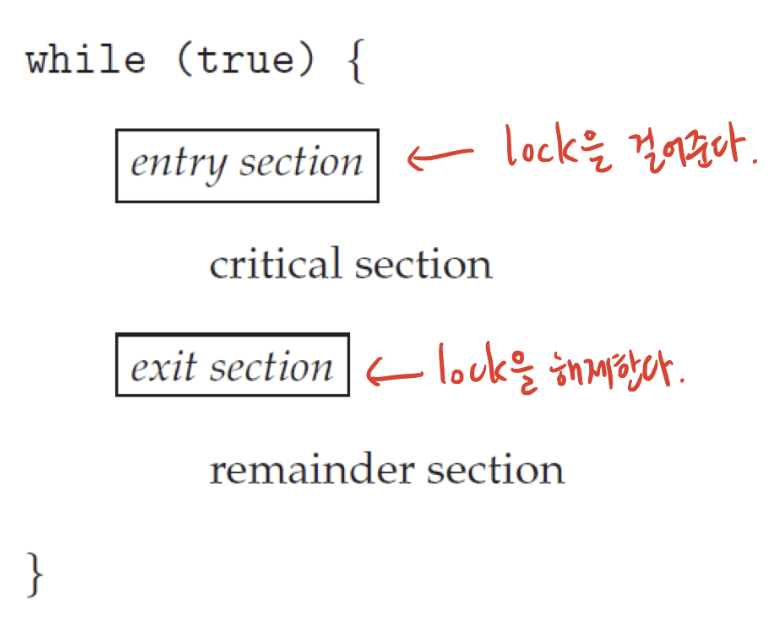

# 동기화 문제

# 📌 동기화

---

<aside>
💡 여러 스레드에게 하나의 자원에 대한 처리 권한을 주거나 순서를 조정하는 기법

</aside>

- 한정적인 시스템 자원에 여러 스레드가 동시에 접근해서 사용하면 문제가 발생할 수 있다.
- 즉, 여러 프로세스가 공유하는 자원들의 일관성을 유지하는 것이 핵심!
- 문제 상황 예시(읽어보면 바로 이해감)
    
    A, B 사람이 동시에 한 계좌에서 출금을 하려고 합니다.
    
    현재 잔액이 100만 원 있다고 가정했을 때, 각각 10만 원씩 출금을 시도하면 이 거래를 처리할 프로세스 쓰레드가 생기겠죠?
    
    은행계좌에서 출금하는 간단한 코드를 보겠습니다.
    
    ```python
    def withdraw(account, amount):
        balance = get_balance(account)
        balance = balance - amount
        put_balance(account,balance)
    ```
    
    get_balance , put_balance는 각각 쓰레드를 생성해주고 get_balance는 현재 잔액을 가져오고, put_balance는 변경된 잔액을 갱신해주는 함수입니다.
    
    withdraw라는 함수를 수행하면 쓰레드가 동시에 두 개가 생성이 됩니다. 현재 잔액이 100만 원 있다고 가정했으니까 A가 10만 원을 출금하면 3번째 줄에서 balance는 90만 원이 되죠. 여기까지는 문제가 없습니다.
    
    자, 이제 3번째 줄이 실행된 후, timer 인터럽트가 걸렸다고 가정해보겠습니다.
    
    인터럽트가 걸리면 인터럽트 핸들러가 수행이 되고, 운영체제가 수행이 되죠. 운영체제가 현재 프로세스를 다 처리한 후, CPU에 다음 프로세스를 올리기 위해서 스케쥴링을 시도하게 됩니다. 대기 중인 프로세스를 보니, A 프로세스는 3 번째 줄까지 완료가 되어있는 거 같습니다. 그래서 다음 B 프로세스로 스케쥴링을 시도했습니다.
    
    B 사람이 get_balance로 현재 잔액을 가져오면 얼마가 남았다고 찍힐까요? 원래는 A가 10만 원을 출금했으니 90만원이 나와야할텐데요, A 프로세스에서 put_balance가 실행되기 전에 인터럽트가 발생했으니까 B 한테 계좌 잔액은 100만원이 찍히게 됩니다.
    
    그럼 B가 10만원 출금을 시도했으면 80만 원이 남아있어야 하는데 잔액이 90만 원이 남게 되죠. 현실 세계에 이런 일이 있다면 큰일 나겠죠?
    

# 📌 스레드 동기화

---

1. **실행 순서**의 동기화
    - 스레드의 실행 순서를 정의하고, 이 순서를 반드시 따르도록 하는 것.
    - 한 순간에 하나의 스레드만 접근
2. **메모리 접근**에 대한 동기화
    - 메모리 접근에 있어서 동시 접근을 막는 것.
    - 실행의 순서가 중요한 것이 아니라 한 순간에 하나의 스레드만 해당 자원에 접근하도록 하는 것.

# 📌 동기화 기법

---

- **유저 모드의 동기화**
    - 커널의 힘을 빌리지 않는 동기화 기법 (커널의 코드가 실행되지 않는다.)
    - **성능상 이점이 있으나, 기능상의 제한점**이 존재
    - 종류: 임계 구역 기반의 동기화, 인터락 함수 기반의 동기화.
- **커널 모드의 동기화**
    - 커널에서 제공하는 동기화 기능을 이용하는 방법
    - **커널 모드로의 변경이 필요하고 이는 성능 저하**로 이어짐. 그러나 **다양한 기능을 활용**할 수 있음.
    - 종류: 세마포어, 뮤텍스, 모니터 등등

## 🔥 유저 모드 동기화

---

**1. 임계 구역 기반의 동기화**

- 열쇠를 얻은 프로세스만 임계 구역에 들어갈 수 있다. 즉, 한번에 하나의 스레드만 접근이 가능하다.
- 임계 구역 진입을 위해 **Critical Section Object**를 얻는다.
- 다른 스레드가 열쇠를 가지고 있을 시에는 반환할 때까지 블로킹된다. 열쇠가 반환되면 **블로킹 상태**에서 빠져나와 열쇠를 얻고 임계 구역에 접근한다.

**2. 인터락 함수 기반 동기화**

- **함수 내부적으로 한 순간에 하나의 스레드에 의해서만 실행**되도록 동기화된다.
- **임계 구역 기반의 동기화**도 내부적으로 **인터락 함수를 기반으로 구현**된다.
- 유저 모드 기반으로 동작해서 **속도가 빠르다.**

## 🔥 커널 모드 동기화

---

**1. 세마포어 (Semaphore)**

- **공유된 자원의 데이터를 여러 프로세스, 스레드가 접근하는 것**을 막는다.
- 동시에 접근 할 수 있는 '허용 가능 갯수'를 갖고 있는 Counter 존재
    - Counter: 공유자원에 접근할 수 있는 스레드 혹은 프로세스 수를 나타내는 값 → 공통으로 관리하는 하나의 값
- ex) 화장실을 예로 보자. 세마포어는 1개 이상의 열쇠라고 할 수 있다. 화장실 칸이 4개이고 열쇠가 4개라면, 4명까지는 대기없이 이용 가능하다. 그 다음부터는 대기해야 한다.
- 세마포어 Counter의 갯수에 따라 다음과 같이 나뉜다.
    - 1개 : Binary Semaphore(뮤텍스)
    - 2개 이상 : Counting Semaphore
- 세마포어는 소유할 수 없다.
    - 세마포어를 소유하지 않은 스레드가 세마포어를 해제할 수 있는 문제가 발생할 수 있기 때문



**2. 뮤텍스 (Mutal Exclusion)**

- **공유된 자원의 데이터를 여러 프로세스, 스레드가 접근하는 것을 막는 것**이다.
- 임계 구역을 가진 스레드들의 Running time이 서로 겹치지 않게 각각 단독으로 실행되게 하는 기술이다.
- **뮤텍스 객체를 두 스레드가 동시에 사용할 수 없다.**
- 일종의 Lock 매커니즘으로 공유 자원에 대한 접근을 조율하기 위해 lock과 unlock을 사용한다.
- **Lock**에 대한 소유권이 있으며 lock을 가지고 있을 경우에만 공유 자원에 접근할 수 있고, Lock을 가진 스레드만 반납할 수 있다.
- 뮤텍스는 **무조건 1개의 열쇠**만 가질 수 있다. 열쇠를 가진 사람만이 화장실에 갈 수 있고, 다음 사람이 화장실에 가기 위해서는 앞 사람이 열쇠를 반납해야 한다.



**3. 모니터 (Monitor)**

- 하나의 프로세스 내에서 다른 스레드 간의 동기화에 사용된다.
- Mutex(Lock)와 Condition Variables를 가지고 있는 Synchronization 매커니즘이다.
- 프레임워크나 라이브러리 그 자체에서 제공되며, C언어는 없고 Java에서 제공된다.

### 뮤텍스 vs 세마포어

---

- 뮤텍스와 모니터는 상호 배제를 함으로써 임계 구역에 **하나의 스레드만** 들어 갈 수 있다.
- 세마포어는 **하나의 스레드만 들어가거나 혹은 여러 개의 스레드가** 들어갈 수 있다.

## Q&A

**Q. 뮤텍스와 모니터의 차이는?**

- 뮤텍스는 다른 프로세스나 스레드 간에 동기화를 위해 사용한다.
- 모니터는 하나의 프로세스내에서 다른 스레드 간에 동기화할 때 사용한다.
- 뮤텍스는 운영체제 커널에 의해 제공된다.
    - 무겁고 느리다.
- 모니터는 프레임워크나 라이브러리 그 자체에서 제공된다.
    - 가볍고 빠르다.
    

**Q. 세마포어와 모니터의 차이는?**

- 자바에서는 모니터를 모든 객체에게 기본적으로 제공하지만 C에서는 사용할 수 없음.
- 세마포어는 카운터라는 변수값으로 프로그래머가 상호 배제나 정렬의 목적으로 사용시 매번 값을 따로 지정해줘야 하는 등 조금 번거롭다.
- 반면, 모니터는 이러한 일들이 캡슐화되어 있어서 개발자는 카운터 값을 0 또는 1으로 주어야 하는 고민을 할 필요가 없이 synchronized, wait(), notify() 등의 키워드를 이용해 좀 더 편하게 동기화할 수 있다.

**Q. 세마포어와 뮤텍스의 차이는?**

- 세마포어는 뮤텍스가 될 수 있지만, 뮤텍스는 세마포어가 될 수 없다.
- 세마포어는 소유할 수 없으며, 뮤텍스는 소유할 수 있고 소유주가 그 책임을 진다.
- 뮤텍스의 경우 뮤텍스를 소유하고 있는 스레드가 이 뮤텍스를 해제할 수 있다. 하지만 세마포어는 소유하지 않고 있는 다른 스레드가 세마포어를 해제할 수 있다.
- 뮤텍스는 동기화 대상이 1개일 때 사용하고 세마포어는 동기화 대상이 여러 개일때 사용한다.

# 📌 임계 구역(Critical Section)

---

<aside>
💡 둘 이상의 쓰레드가 동시에 접근해서는 안되는 **공유 자원(변수, 파일 등)을 접근하는 코드의 일부**를 말함

</aside>



- 임계 구역에서 동기화를 진행하지 못하면 치명적인 문제가 발생함
- **임계 구역 문제를 해결하기 위한 3가지 필수조건**
    
    **1. 상호 배제(Mutual Exclusion)**
    
    프로세스 P1이 공유자원을 접근하는 임계구역 코드를 수행하고 있다면 다른 프로세스들은 공유자원을 접근하는 임계 구역 코드를 수행할 수 없다. 즉, 한 순간에 하나의 스레드만 실행 될 수 있다.
    
    **2. 진행 (Progress)**
    
    임계 구역에서 실행중인 프로세스가 없고 별도의 동작이 없는 프로세스들만 임계 구역 진입 후보로서 참여 될 수 있다.
    
    **3. 한정된 대기 (Bounded Waiting)**
    
    P1이 임계 구역에 진입 신청 후부터 받아들여질때까지, 다른 프로세스들이 임계 구역에 진입하는 횟수는 제한이 있어야 한다.
    


## Reference

---

[[OS] 동기화 문제](https://velog.io/@jaeyunn_15/OS-%EB%8F%99%EA%B8%B0%ED%99%94-%EB%AC%B8%EC%A0%9C)

[[운영체제(OS)] 동기화(Synchronization) 와 임계구역 문제(Critical Section Problem) - 1](https://resilient-923.tistory.com/371)

[[운영체제] 유저 모드의 동기화 vs 커널 모드의 동기화](https://wookkingkim.tistory.com/entry/%EC%9A%B4%EC%98%81%EC%B2%B4%EC%A0%9C-%EC%9C%A0%EC%A0%80-%EB%AA%A8%EB%93%9C%EC%9D%98-%EB%8F%99%EA%B8%B0%ED%99%94-vs-%EC%BB%A4%EB%84%90-%EB%AA%A8%EB%93%9C%EC%9D%98-%EB%8F%99%EA%B8%B0%ED%99%94)

[Ready-For-Tech-Interview/동기화 문제.md at master · WooVictory/Ready-For-Tech-Interview](https://github.com/WooVictory/Ready-For-Tech-Interview/blob/master/Operating%20System/%EB%8F%99%EA%B8%B0%ED%99%94%20%EB%AC%B8%EC%A0%9C.md)