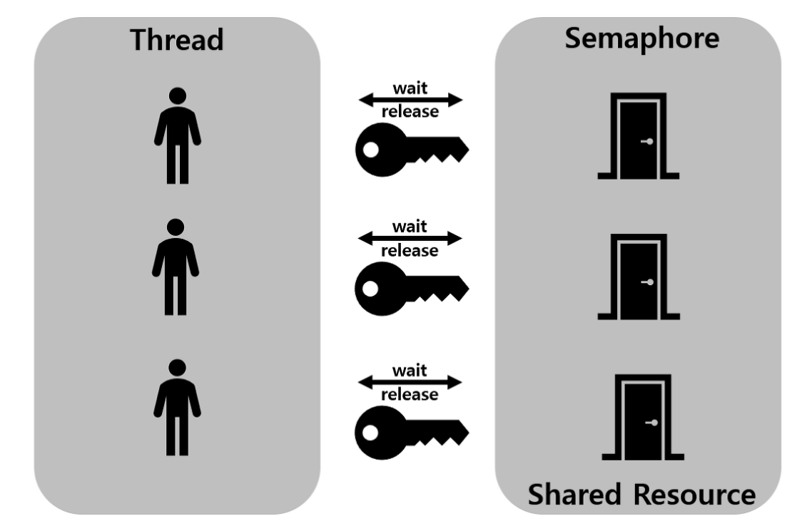

# 스핀락, 세마포어, 뮤텍스, 페이징과 세그멘테이션, 페이지 교체 알고리즘, 단편화

## 📌 복습 - 임계 구역(Critical Section)

---

<aside>
💡 둘 이상의 쓰레드가 동시에 접근해서는 안되는 **공유 자원(변수, 파일 등)을 접근하는 코드의 일부**를 말함

</aside>

- 임계 구역에서 동기화를 진행하지 못하면 치명적인 문제가 발생함
- **임계 구역 문제를 해결하기 위한 3가지 필수조건**
    
    **1. 상호 배제(Mutual Exclusion)**
    
    프로세스 P1이 공유자원을 접근하는 임계구역 코드를 수행하고 있다면 다른 프로세스들은 공유자원을 접근하는 임계 구역 코드를 수행할 수 없다. 즉, 한 순간에 하나의 스레드만 실행 될 수 있다.
    
    **2. 진행 (Progress)**
    
    임계 구역에서 실행중인 프로세스가 없고 별도의 동작이 없는 프로세스들만 임계 구역 진입 후보로서 참여 될 수 있다.
    
    **3. 한정된 대기 (Bounded Waiting)**
    
    P1이 임계 구역에 진입 신청 후부터 받아들여질때까지, 다른 프로세스들이 임계 구역에 진입하는 횟수는 제한이 있어야 한다.
    

→ 상호 배제를 위한 기법들 소개!!

# 📌 스핀락(Spinlock)

---

<aside>
💡 특정한 자원을 획득(lock) 또는 해제(unlock)를 통해 공유 자원에 대한 접근 권한을 관리하는 방법

</aside>

- '조금만 기다리면 바로 쓸 수 있는데 굳이 Context Switching으로 부하를 줄 필요가 있나?'라는 컨셉으로 개발된 것으로 Critical Section에 진입이 불가능할 때 컨텍스트 스위칭을 하지 않고 잠시 루프를 돌면서 재시도를 하는것
- Lock-Unlock 과정이 아주 짧아 lock하는 경우가 드문 경우 유용
- 상태: 획득(lock), 해제(unlock)
- **권한을 획득하기 전: Busy Waiting**
    - CPU가 무의미한 코드를 수행하는 상태 ⇒ **무한루프**를 돌면서 최대한 다른 스레드에게 CPU를 양보하지 않는 것
- **접근 권한을 얻은 후: 내부 코드 수행 및 종료 후 권한 해제**
- lock과 Unlock의 주체는 동일해야함
- **Lock이 곧 사용해질 경우 문맥교환을 줄여 CPU의 부담을 줄여주지만, 만약 어떤 스레드가 Lock을 오랫동안 유지한다면 오히려 CPU 시간을 많이 소모할 가능성이 있음**
- 하나의 CPU나 하나의 코어만 있는 경우에는 유용하지 않음
    - 그 이유는 만약 다른 스레드가 Lock을 가지고 있고 그 스레드가 Lock을 풀어 주려면 싱글 CPU 사용률 100%를 만드는 상황이 발생하므로 주의해야한다.
    - 스핀락은 기본적으로 무한 for루프를 돌면서 lock을 기다리므로 하나의 스레드가 lock을 오랫동안 가지고 있다면, 다른 Blocking된 스레드는 busy waiting을 하므로 CPU를 쓸데없이 낭비하게 된다.

# 📌 뮤텍스(Mutex)

---

<aside>
💡 한 스레드, 프로세스에 의해 소유될 수 있는 Key를 기반으로 한 상호배제 기법

</aside>

- Mutual Exclusion. 상호 배제
- 획득(lock), 해제(unlock) 상태가 있는 것은 스핀락과 동일
- 접근 권한을 획득할 때까지 Sleep 상태로 들어가고, Wakeup 되면 권한 획득 시도
- Locking 메커니즘: 오직 하나의 스레드만이 동일 시점에 뮤텍스를 얻어 임계구역에 접근 가능, lock을 걸은 스레드만이 임계영역 나갈때 lock 해제 가능
- lock, unlock 주체는 동일해야함
- 뮤텍스는 **무조건 1개의 열쇠**만 가질 수 있다. 열쇠를 가진 사람만이 화장실에 갈 수 있고, 다음 사람이 화장실에 가기 위해서는 앞 사람이 열쇠를 반납해야 한다.

# 📌 세마포어(Semaphore)

---

<aside>
💡 현재 공유자원에 접근할 수 있는 스레드, 프로세스의 수를 나타내는 값을 두어 상호배제를 달성하는 기법

</aside>

- 스핀락과 뮤텍스와 달리 표현형이 정수형. → 하나 이상의 스레드가 공유자원에 접근할 수 있도록 허용할 수 있음
- 표현형이 정수이므로 lock, unlock이 아닌 값을 올리고 내리는 방식으로 사용
- 컴포넌트가 특정 자원에 접근할 때 semWait이 먼저 호출 → 임계 구역에 들어갈 수 있는지 확인
- 확인 후 semWait을 빠져나와 임계 구역에 들어가고, 이후 semSignal이 호출되어 임계 구역을 빠져나오게 됨
- semWait 연산
    - 세마포어의 값을 감소시킴. 만약 값이 음수가 되면 semWait을 호출한 스레드는 블록 되지만 음수가 아니라면 스레드는 작업을 수행
- semSignal 연산
    - 세마포어의 값을 증가시킴. 만약 값이 양수가 아니라면 semWait 연산에 의해 블록 된 스레드들을 wake 시킴
- 세마포어 Counter의 갯수에 따라 다음과 같이 나뉨. (counter: 공유자원에 접근할 수 있는 스레드 혹은 프로세스 수를 나타내는 값 → 공통으로 관리하는 하나의 값)
    - 1개 : Binary Semaphore
        - 뮤텍스로도 사용 가능하지만, 뮤텍스와 다름
        - 뮤텍스는 lock을 가진 자만 unlock이 가능하지만, 세마포어는 아님!
        - 뮤텍스는 priority inheritance 속성이 있지만, 세마포어는 없음
        - 참고: [https://www.youtube.com/watch?v=gTkvX2Awj6g&t=1130s](https://www.youtube.com/watch?v=gTkvX2Awj6g&t=1130s)
    - 2개 이상 : Counting Semaphore

## ？ 뮤텍스 vs 세마포어

---

- 뮤텍스와 모니터는 상호 배제를 함으로써 임계 구역에 **하나의 스레드만** 들어 갈 수 있다.
- 세마포어는 **하나의 스레드만 들어가거나 혹은 여러 개의 스레드가** 들어갈 수 있다.
- 세마포어는 뮤텍스가 될 수 있지만, 뮤텍스는 세마포어가 될 수 없다.
- 세마포어는 소유할 수 없으며, 뮤텍스는 소유할 수 있고 소유주가 그 책임을 진다.
- 뮤텍스의 경우 뮤텍스를 소유하고 있는 스레드가 이 뮤텍스를 해제할 수 있다. 하지만 세마포어는 소유하지 않고 있는 다른 스레드가 세마포어를 해제할 수 있다.
- 뮤텍스는 동기화 대상이 1개일 때 사용하고 세마포어는 동기화 대상이 여러 개일때 사용한다.

## 🔍 메모리 관리 기법

---

1. **연속 메모리 기법**
    - 프로그램 전체가 메모리에 연속적으로 할당
    - 고정 분할 기법 : 메모리가 고정된 파티션으로 분할. **내부 단편화 발생**
    - 동적 분할 기법 : 파티션들이 동적으로 생성되고 자신의 크기와 같은 파티션에 메모리 할당. **외부 단편화 발생**
2. **불연속 메모리 기법**
    - 프로그램의 일부가 서로 다른 주소 공간에 할당될 수 있는 기법
    - Page : 프로세스를 고정된 크기로 나눈 블록
    - Frame : 메모리를 고정된 크기로 나는 블록
    - Segment : 서로 다른 크기의 논리적 블록

### **가상 메모리**

- 실제 메모리 크기와 관계없이 메모리를 사용할 수 있도록 가상 메모리 주소를 사용
- 프로세스의 일부분만 메모리에 로드하고 나머지는 보조 기억 장치(가상 메모리 공간)에 할당
- MMU(Memory Management Unit)를 통해 논리 주소, 물리 주소를 나누어서 사용
- 가상 주소를 주기억장치의 실제적인 주소로 매핑(Mapping)하는 방법을 통해 구현

# 📌 메모리 단편화

---

<aside>
💡 기억 장치의 빈 공간 또는 자료가 여러 조각으로 나뉘는 현상

</aside>

어떠한 프로그램을 실행할 때, 컴퓨터에서는 프로그램들을 메모리 공간에 연속적으로 할당하게 됨

만약 여러 프로그램들이 메모리에 할당되고 해제되는 것이 반복되다 보면 메모리 공간이 조각조각 나뉘게 되어 총메모리가 충분함에도 불구하고 프로그램에 메모리를 할당하는 것이 불가능한 상태가 발생

## 🎯 내부 단편화

---

<aside>
💡 주기억장치 내의 실행 프로그램보다 사용자 영역이 커서 메모리 할당 후 사용되지 않고 남아있는 공간

</aside>

- 프로세스가 사용하는 메모리 공간에 남는 부분
- 프로세스가 요청한 양보다 더 많은 메모리를 할당할 때 발생하며, 메모리 분할 자유 공간과 프로세스가 사용하는 공간의 크기 차이

## 🎯 외부 단편화

---

<aside>
💡 주기억장치 내의 사용자 영역보다 실행 프로그램이 커서 프로그램이 메모리가 할당되지 않고 남아있는 공간을 의미

</aside>

- 메모리 공간 중 사용하지 못하게 되는 부분
- 메모리가 할당되고 해제되는 작업이 반복적으로 일어날 때 발생
- 중간중간에 생긴 사용하지 않는 메모리가 존재해서 총 메모리 공간은 충분하지만 실제로 할당할 수 없는 상황
- 외부 단편화를 해결하기 위해 **압축**을 이용하여 프로세스가 사용하는 공간을 한쪽으로 몰 수 있지만, 작업 효율이 좋지는 않음

# 📌 페이징(Paging)

---

<aside>
💡 프로세스를 일정한 크기의 페이지로 분할하여 메모리에 적재하는 방식

</aside>

- 프로세스의 주소 공간을 고정된 사이즈의 페이지 단위로 나누어 물리적 메모리에 불연속적으로 할당하는 방식
- **페이지(Page)** : 고정 사이즈의 가상 메모리 내 **프로세스 조각**
- **프레임(Frame)** : 페이지 크기와 같은 주기억장치 **메모리 조각**
    
    ⇒ 하나의 프로세스가 사용하는 메모리 공간이 연속적이어야 한다는 제약을 없애는 메모리 관리 방법
    
- 페이지와 프레임은 크기가 같음
- 페이지와 프레임을 대응시키는 page mapping 과정이 필요하여 paging table을 생성해야 함
- 연속적이지 않은 공간도 활용할 수 있기 때문에 외부 단편화 문제 해결
- 페이지 테이블에는 각 페이지 번호와 해당 페이지가 할당된 프레임의 시작 물리 주소를 저장

- 👍 장점
    - 논리 메모리는 물리 메모리에 저장될 때 연속되어 저장될 필요가 없고, 물리 메모리의 남는 프레임에 적절히 배치되기 때문에 **외부 단편화 발생 X**
- 👎 단점
    - 프로세스의 크기가 페이지 크기의 배수가 아닐 경우 마지막 페이지에 **내부 단편화**가 발생하고 페이지의 크기가 클수록 내부 단편화가 커짐
        
        ⇒ 페이지 단위를 작게 하면 내부 단편화 문제도 해결할 수 있겠지만 page mapping 과정이 많아지므로 효율이 떨어짐
        
        
        

## 🌼 페이징 테이블(Paging Table)

---

- 물리 메모리는 고정 크기의 프레임으로, 가상 메모리는 고정 크기의 페이지로 분리되어 있음. 개별 페이지는 순서에 상관 없이 물리 메모리에 있는 프레임에 mapping 되어 저장된다.
- 즉, 모든 프로세스는 하나의 **페이징 테이블**을 가지고 있으며, 여기에는 메인 메모리에 적재되어 있는 **페이지 번호**와 해당 페이지가 위치한 메인 메모리의 **시작 주소**가 있음.
- 이를 통해 하나의 프로세스를 나눈 가상 메모리 페이지들이 각각 실제 메인 메모리의 어디 프레임에 적재되어 있는지 알아낼 수 있음

- ex) PMT(Page Mapping Table, 페이징 테이블)에서는 P1 프로세스의 0번 째 페이지가 메인 메모리의 5번째 프레임에 있는 것을 알 수 있음!

이외에도…

- 논리주소와 페이징 테이블
    
    ⇒ 메모리 관리 장치(MMU, Memory Management Unit)는 가상주소(논리주소)를 이용해 실제 데이터가 있는 주소로 변환해줌.
    
    - **논리 주소**(Logical Address)는 <page, offset>과 같은 형태로 구성되는데, 이를 이용해 **물리 주소**
    (Physical Address)로 변환
- 가상메모리
    - 실제 **물리 메모리 개념**과 **사용자의 논리 메모리 개념**을 분리한 것 ⇒ 가상 주소 공간(한 프로세스가 **메모리에 저장되는 논리적인 모습**을 가상 메모리에 구현한 공간)
    - 메모리의 공간은 한정적이므로, 사용자에게 더 많은 메모리를 제공하기 위해 **가상 주소**를 사용

# 📌 세그멘테이션(Segmentation)

---

<aside>
💡 프로세스를 물리적 단위인 페이지가 아닌 논리적 단위인 세그먼트로 분할해서 메모리에 적재하는 방식

</aside>

- 프로세스를 서로 크기가 다른 논리적인 블록 단위인 세그먼트(Segment)로 분할하여 메모리에 할당
    - 논리적 단위
        - 프로세스가 동작하려면 기본적으로 코드, 데이터, 스택, 3가지 세그먼트를 가지고 있어야함. 코드에는 main 함수를 포함하여 다른 함수나 루틴이 있을 수 있고, 데이터에는 구조체나 배열이 있을 수 있다
        - 이렇게 세그먼트는 의미가 같은 논리적 내용을 기준으로 프로그램을 분할하기 때문에 크기가 같지 않은 것
- 각 세그먼트는 연속적인 공간에 저장
- 세그먼트들의 크기가 서로 다르기 때문에 프로세스가 메모리에 적재될 때 빈 공간을 찾아 할당하는 기법
- 페이징과 마찬가지로 mapping을 위한 segment table 필요

- 👍 장점
    - **내부 단편화 문제 해소**
    - **보호와 공유 기능**을 수행할 수 있음
    - 프로그램의 중요한 부분과 중요하지 않은 부분을 분리하여 저장할 수 있고, 같은 코드 영역은 한번에 저장할 수 있음
- 👎 단점
    - 중간에 메모리를 해제하면 생기는 **외부 단편화 문제가 커짐**
    

## 🌼 Segment table

---

- 분할 방식을 제외하곤 페이징과 세그멘테이션이 동일하기 때문에, 매핑 테이블의 동작 방식도 동일

- 다만 논리 주소의 앞 비트들은 페이징 번호가 아니라 세그먼트 번호!
- 즉, <segment, offset> 형태로 구성되며, 세그먼트 번호를 통해 세그먼트의 기준(세그먼트의 시작 물리 주소)과 한계(세그먼트의 길이)를 파악할 수 있음

## ？ Paging vs Segmentation

---

### Paging

- 각 프로세스는 프레임들과 같은 길이를 가진 균등 페이지로 나뉨(고정 크기 가짐)
- 외부 단편화가 생기지 않음
- 소량의 내부 단편화 존재

### Segmentation

- 각 프로세스는 여러 세그멘트들로 나뉨
- 내부 단편화가 생기지 않음
- 메모리 효율 개선
- 동적 분할을 통한 오버헤드 감소(가변 크기 가짐)
- 외부 단편화 존재

## 페이지 교체 알고리즘 들어가기 전에…

### 1. 가상메모리

---

<aside>
💡 물리 메모리의 크기의 한계를 극복하기 위해 나온 기술. 프로세스 전체가 메모리 내에 올라오지 않더라도 실행이 가능하도록 하는 기법

</aside>

- 프로그램이 CPU에서 실행되려면 실행에 필요한 부분이 메모리에 올라와 있어야 한다. 또한 여러 프로그램이 동시에 수행되는 환경에서는 한정된 메모리 공간을 여러 프로그램이 조금씩 나누어서 사용하는데 운영체제가 적절히 프로세스에게 메모리를 할당해주어야 한다.
- 운영체제는 CPU에서 당장 수행해야 하는 부분만 디스크에 올리고 나머지는 디스크의 swap 영역으로 놓았다가 다시 필요해지면 기존에 메모리에 있었던 부분과 교체하는 방식을 사용
- 이처럼 메모리의 연장 공간으로 디스크의 swap영역을 사용하게 된다면 물리적 메모리 크기에 대한 제약을 고려할 필요가 없어짐

### 2. 요구 페이징(Demand Paging)

---

<aside>
💡 프로세스의 주소 공간을 메모리로 적재하는 방법

</aside>

- 프로그램 실행 시 프로세스를 구성하는 모든 페이지를 한꺼번에 메모리에 올리는 것이 아니라 **당장 사용될 페이지만을 올리는 방식**. 특정 페이지에 대해 CPU의 요청이 들어온 후에 해당 페이지를 메모리에 적재
- 특정 프로세스를 구성하는 페이지 중, 어떤 페이지가 메모리에 존재하고 어떤 페이지가 메모리에 존재하지 않는지를 구별이 필요 → 요구페이징에선 **valid-invalid bit(유효-무효 비트)** 를 사용하여 각 페이지가 메모리에 존재하는지를 표시
    
    
    
- 프로세스가 실행되기 전에는 모든 페이지의 유효-무효 비트가 무효값으로 초기화되어 있지만, 특정 페이지가 참조되어 메모리에 적재되는 경우 해당 페이지의 유효-무효 비트는 유효값으로 바뀌게 된다. 그리고 다시 디스크의 swap 영역으로 쫓겨날 때에는 무효값으로 가지게 된다.
- **CPU가 참조하려는 페이지가 현재 메모리에 올라와있지 않아 유효-무효 비트가 무효로 세팅되어 있는 경우를 페이지 부재(page fault) 라고 한다.**

### 3. 페이지 부재(Page fault)

---

<aside>
💡 CPU가 접근하려는 페이지가 메모리에 없는 상황. (즉, 페이지 테이블의 valid bit값이 0인 경우)

</aside>

- 페이지 부재 발생 시 페이지를 디스크에서 읽어와야 하는데 이 과정에서 막대한 overhead가 발생. 따라서 요구 페이징 기법은 페이지 부재 발생률이 성능에 큰 영향을 끼침.
- 페이지 부재 시 동작 과정
    
    
    
    1. ( 찾으려는 페이지가 TBL에 없는 경우) 찾으려는 페이지가 메모리에 있는지 Page Table에서 valid bit를 확인.
    2. valid bit가 0이라면 MMU(Memory Management Unit)가 페이지 부재 트랩을 발생시킨다. 이 때 CPU의 제어권이 커널 모드(kernel mode)로 전환되고, 운영체제의 페이지 부재 처리 루틴(page fault handler)이 호출되어 페이지 부재를 처리하게 된다.
    3. 3&4 페이지 부재 처리 실행 :
        - 운영체제는 해당 페이지에 대한 접근이 문제가 없는지 확인함. 사용되지 않은 주소 영역에 속한 페이지를 접근하려 했거나, 해당 페이지에 접근 위반(protection violation)일 경우에는 해당 프로세스를 종료시킴. (접근 위반의 예: 읽기 전용 페이지에 대해 쓰기 접근을 시도하려는 경우)
        - 해당 페이지에 대한 접근이 허용 가능한 접근이라면, 물리적 메모리에서 비어있는 프레임(free frame)을 할당받아 그 공간에 페이지를 읽어옴. 만약 비어 있는 프레임이 없다면 기존에 메모리에 올라와 있는 페이지 중 하나를 디스크의 swap 영역으로 쫓아냄
        
        → 이처럼 이미 메모리에 있는 페이지 중 하나를 다시 backing store에 보내는 것을 **page-out**, 새로운 페이지를 메모리에 올리는 것을 **page-in** 이라고 함.
        
        만약 비어 있는 프레임이 없다면 페이지 교체 알고리즘을 통해 물리적 메모리에 있는 프레임 하나를 스왑 영역으로 쫓아내 비어 있는 프레임을 만든 후 적재함.
        
        이 때, 디스크 스왑 영역에 있던 페이지를 물리 메모리에 적재하기 위해서는 시간이 많이 소요되므로, 해당 프로세스는 CPU 제어권을 뺏기고 현재까지 수행되던 CPU 레지스터 상태 및 프로그램 카운터 값을 프로세스 제어 블록(PCB)에 저장해둠.
        
    
     5. 페이지 테이블에서 해당 페이지의 유호-무효 비트를 유효비트로 설정하고 프로세스를 준비큐로 이동시킴
    
    1. 다시 CPU를 할당 받았을 때 PCB에 있던 값을 복원시켜 중단되었던 명령을 수행한다.
    

### 4. 페이지 교체

---

<aside>
💡 페이지 부재시, 메모리에 올라와 있는 페이지 중 하나를 디스크로 쫓아내(page-out) 메모리에 빈 공간을 확보하여 새로운 페이지를 메모리에 올리는 과정.(page-in)

</aside>

- 페이지 부재가 발생하면 요청된 페이지를 디스크에서 메모리로 읽어와야 하는데, 물리적 메모리에 빈 프레임이 존재하지 않는 경우 존재
- 이러한 경우, 메모리에 올라와 있는 페이지 중 하나를 디스크로 쫓아내(page-out) 메모리에 빈 공간을 확보하여 새로운 페이지를 메모리에 올려야함.(page-in)
- 이러한 과정을 페이지 교체(page replacement)라고 부르며, page-out이 된 페이지를 희생양 페이지(victim page)라고 함.
- 희생양 페이지(Victim Page)
    - 희생양 페이지는 보통 메모리에 올라가 있는 페이지 중 **CPU에 수정(modify)되지 않는 페이지**를 고르는 것이 효율적임. 수정되지 않은 페이지는 page-out이 될 때 backing store에 쓰기(write) 연산을 할 필요가 없기 때문.
    - 해당 페이지가 수정되었는지 안 되었는지를 판단하기 위해, 페이지 테이블에 **modified bit(=dirty bit)** 를 추가하여 이를 검사함. 해당 페이지가 수정되었다면 이 비트를 1로 두고, 수정되지 않으면 0으로 둠. 이를 이용해서 victim page는 최대한 수정되지 않은 페이지를 선택함!
        
        
        
    - 위 예시에서 수정되지 않은 페이지는 0, 2, 3번 3개의 페이지가 존재하는데 이 중에서도 하나의 페이지를 선택해서 교체해야함
    - 페이지 교체를 할 때 어떠한 프레임에 있는 페이지를 쫓아낼 것인지 결정하는 알고리즘 ⇒ 페이지 교체 알고리즘(page replacement algorithm)이라고 하며, 페이지 부재율을 최소화하는 것이 페이지 교체 알고리즘의 목표.

# 📌 페이지 교체 알고리즘

---

<aside>
💡 페이지 교체를 할 때 어떠한 프레임에 있는 페이지를 쫓아낼 것인지 결정하는 알고리즘

</aside>

- 페이지 부재율을 최소화하는 것이 페이지 교체 알고리즘의 목표!

## 🎧 OPT(Optimal)

---

<aside>
💡 앞으로 가장 오랫동안 사용되지 않을 페이지 교체

</aside>

- 빌레디의 최적 알고리즘, MIN, OPT등으로 불림
- 가장 이상적임
- 프로세스가 앞으로 사용할 페이지를 미리 알아야하기 때문에 실제 시스템에서 온라인으로 사용할 순 없음(오프라인 알고리즘)
- 어떠한 알고리즘보다도 가장 적은 페이지 부재율을 보장하므로 다른 알고리즘 성능에 대한 상한선을 제공

## 🎧 FIFO(First In First Out)

---

<aside>
💡 가장 먼저 들어온 페이지를 교체

</aside>

- 메모리에 가장 먼저 올라온 페이지를 먼저 교체
- 들어온 시간을 저장하거나 올라온 순서를 큐에 저장하고 페이지 부재 시 메모리에 가장 먼저 올라온 페이지를 먼저 교체하는 방식
- 보통 프레임의 수가 많아질수록 페이지 결함의 횟수는 감소할 것이라 생각할 수 있지만, 물리적 공간이 늘어났음에도 성능이 더 나빠지는 경우도 발생. 이러한 상황을 FIFO의 이상현상, Belady's Anomaly(FIFO anomaly) 이라고 함
    
    
    

## 🎧 LRU(Least Recently Used)

---

<aside>
💡 가장 오랫동안 사용하지 않은 페이지를 교체

</aside>

- FIFO의 이상현상이 발생하지 않음
- 메모리 페이지의 참조 성향 중 **시간 지역성(temporal locality) : 근에 참조된 페이지가 가까운 미래에 다시 참조될 가능성이 높음" 을 고려한 알고리즘**
    
    ⇒ "가장 오랫동안 사용하지 않았던 데이터라면 앞으로도 사용할 확률이 적을 것이다."
    
- 사용된 시간을 알수있는 부분을 저장하여 가장 오랫동안 참조되지 않는 데이터를 제거. 마지막 참조 시점이 가장 오래된 페이지를 교체
- 페이지마다 카운터가 필요하며, 큐로도 구현가능. 사용한 데이터를 큐에서 제거하여 맨 위로 다시 올리고, 프레임이 모자랄 경우 맨 아래에 있는 데이터를 삭제
    - 카운터 : 각 페이지별로 존재하는 논리적인 시계(Logical Clock)로, 해당 페이지가 사용될때마다 0으로 클리어 시킨 후 시간을 증가시켜 시간이 가장 오래된 페이지를 교체
- 단점: 프로세스가 주기억장치에 접근할때마다 참조된 페이지 시간을 기록해야 하므로 막대한 오버헤드가 발생

## 🎧 LFU(Least Frequently Used)

---

<aside>
💡 참조 횟수가 가장 낮은 페이지를 교체

</aside>

- 페이지의 참조 횟수로 교체할 페이지 결정 ( 물리적 메모리 내에 존재하는 페이지 중 과거에 참조 횟수(reference count)가 가장 적었던 페이지를 쫓아내고 그 자리에 새로 참조될 페이지를 적재함)
- 만약 최저 참조 횟수를 가진 페이지가 여러개면 임의로 하나를 선정해 쫓아내는데, 성능 향상을 위해선 그들 중 상대적으로 더 오래전에 참조된 페이지를 쫓아내도록 구현하는게 효율적
- LRU는 직전 참조된 시점만을 반영하지만, LFU는 참조횟수를 통해 장기적 시간규모에서의 참조성향 고려할 수 있음
- 단점: 가장 최근에 불러온 페이지가 교체될 수 있으며, 막대한 오버헤드 발생
- 예시
    
    
    
    - LRU는 1번 페이지가 가장 오래전에 사용되었기 때문에 1번을 내쫓는다. 1번 페이지는 마지막 참조시점이 다른 페이지들에 비해 오래되기는 했지만 참조 횟수가 가장 많았던 것을 LRU알고리즘은 인지하지 못한다.
    - 반면 LFU는 가장 참조 횟수가 적었던 4번 페이지를 내쫓는다. 그러나 4번 페이지는 가장 최근에 참조된 페이지로 지금부터 많이 사용되기 시작할 페이지일 수 있지만, LFU는 이러한 사실을 인지하지 못한다.

## 🎧 MFU(Most Frequently Used)

---

<aside>
💡 참조 횟수가 가장 많은 페이지를 교체

</aside>

- "가장 많이 사용된 페이지가 앞으로는 사용되지 않을 것이다"라는 가정에 의한 알고리즘

## 🎧 NUR(Not Used Recently, Not Recently Used)

---

<aside>
💡 최근에 사용하지 않은 페이지 교체

</aside>

- LRU 근사 알고리즘. LRU처럼 오랫동안 참조하지 않은 페이지중 하나를 선택하지만 가장 오래된 페이지라는 보장은 없음
- 각 페이지마다 참조 비트(Reference Bit) 와 변형 비트(Modified Bit, Birty Bit)가 사용됨
    - **참조 비트(Reference Bit)**: 페이지가 참조되지 않았을 때 0, 호출되었을 때 1 (모든 참조비트를 주기적으로 0으로 변경)
    - **변형 비트(Modified Bit)**: 페이지 내용이 변경되지 않았을 때는 0, 변경되었을 때 1
- 어떤 고정된 시간 간격이 있어서 그 시간 간격이 지나면 주기적으로 모든 페이지의 참조비트를 clear함. 페이지를 교체하려 할때에는 페이지들을 다음과 같이 4가지의 클래스로 나누고, 가장 낮은 클래스의 랜덤한 페이지를 선택하여 제거
    - Class 0 : 참조되지 않음, 수정되지 않음
    - Class 1 : 참조되지 않음, 수정됨
    - Class 2 : 참조됨, 수정되지 않음
    - Class 3 : 참조됨, 수정됨

## 🎧 SCR(Second Chance Replacement)

---

<aside>
💡 2차 기회 페이지 교체. FIFO에서 한번 더 기회를 주고 교체함

</aside>

- 가장 오랫동안 주기억장치에 있던 페이지 중 자주 사용되는 페이지의 교체를 방지하기 위한 것으로, FIFO 기법의 단점을 보완하는 기법
- 큐의 상단에서 꺼낸 대상의 참조 비트를 검사하여 0이면 교체 대상으로 선택하고, 1이면 0으로 바꿔 큐의 뒤에 삽입
- 만약 모든 페이지의 참조 비트가 세팅되어 있다면 큐의 첫번째 요소였던 페이지가 두 번 검사될 것이고, 해당 페이지가 내쫓아짐

## 🎧 Clock (클럭 알고리즘)

---

<aside>
💡 SCR과 동일한 알고리즘을 원형 큐를 이용하여 구현한 것

</aside>

- 2차 기회 페이지 교체를 원형 큐를 이용하여 구현한 것
- LRU 알고리즘과 LFU 알고리즘과는 달리 하드웨어적인 지원을 통해 동작함.(전자는 페이지의 참조 시각 및 참조 횟수를 sw적으로 유지 및 비교해야 했음)
- 페이지 프레임의 참조 비트를 조사해서 참조비트가 1인 페이지는 0으로 바꾼 후 지나가고, 0인 페이지를 찾으면 그 페이지와 교체함.

### Question

### **페이징 또는 세그멘테이션을 사용하는 이유는 무엇일까**

프로그램을 실행하기 위해 코드를 디스크에서 메인 메모리로 적재하는 과정에서 단편화가 발생할 수 밖에 없습니다. 이렇게 단편화가 많이 발생하면 사용하지 못하는 메모리 공간이 많아져 낭비하게 되기 때문에 최대한 피해야 하는 문제입니다. 최초 적합과 최적 적합, 압축 등의 방식을 통해서도 해결할 수 있지만, 메모리 계산의 비용이 적은 페이징 또는 세그멘테이션을 사용합니다

### **페이징의 특징은 무엇인가**

페이징은 프로그램을 실행하기 위해 코드를 메모리에 적재하기 위해 사용하는 기법으로, 불연속 메모리 관리 기법이라는 특징이 있습니다. 다시 말해 프로그램 전체가 전체가 메모리에 연속적으로 올라가 있는 것이 아니라 페이지라는 고정된 크기로 분할되어 올라가 있습니다.

페이징의 또 다른 특징은 연속 메모리 관리 기법의 단점 중 하나였던 외부 단편화를 해결할 수 있다는 점입니다.

### **페이징과 세그멘테이션의 차이는 무엇인가**

페이징과 세그멘테이션 모두 프로그램을 실행하기 위해 디스크에 있는 내용을 분할하여 메모리에 적재하는 불연속 메모리 관리 기법입니다. 둘의 차이는 프로그램을 어떻게 분할할 것인가입니다. 페이징의 경우 프로그램을 같은 크기의 페이지로 분할하는 데에 비해, 세그멘테이션은 논리적 의미를 기준으로 세그먼트를 분할합니다.

## Reference
---

[[운영체제] 스핀락(Spin Lock)이란?](http://itnovice1.blogspot.com/2019/09/spin-lock.html)

[뮤텍스(Mutex)와 세마포어(Semaphore)의 차이](https://medium.com/@kwoncharles/%EB%AE%A4%ED%85%8D%EC%8A%A4-mutex-%EC%99%80-%EC%84%B8%EB%A7%88%ED%8F%AC%EC%96%B4-semaphore-%EC%9D%98-%EC%B0%A8%EC%9D%B4-de6078d3c453)

[나중은 없다 : 네이버 블로그](https://blog.naver.com/myca11/222626631093)

[cs-study/Paging & Segmentation.md at main · alstjgg/cs-study](https://github.com/alstjgg/cs-study/blob/main/%EC%9A%B4%EC%98%81%EC%B2%B4%EC%A0%9C/Paging%20%26%20Segmentation.md)

[cs-study/페이징 교체 알고리즘.md at main · alstjgg/cs-study](https://github.com/alstjgg/cs-study/blob/main/%EC%9A%B4%EC%98%81%EC%B2%B4%EC%A0%9C/%ED%8E%98%EC%9D%B4%EC%A7%95%20%EA%B5%90%EC%B2%B4%20%EC%95%8C%EA%B3%A0%EB%A6%AC%EC%A6%98.md)