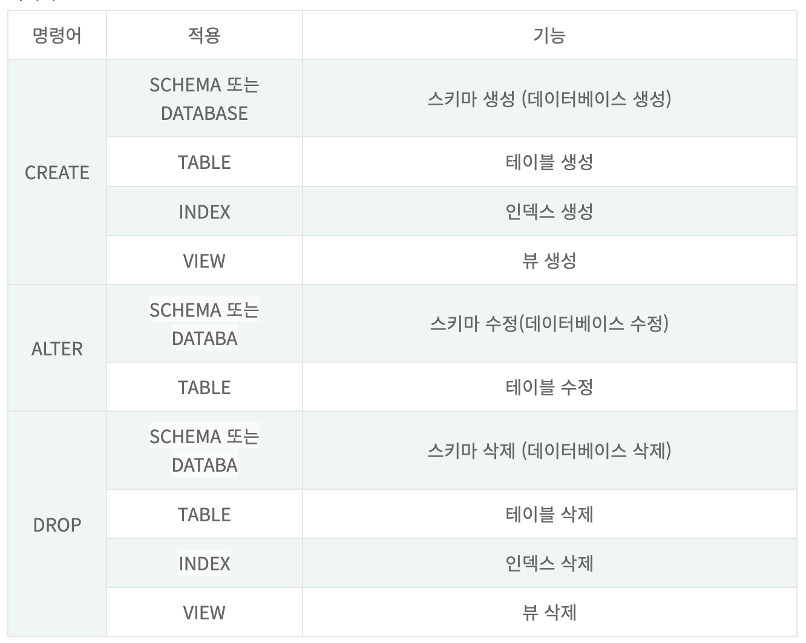
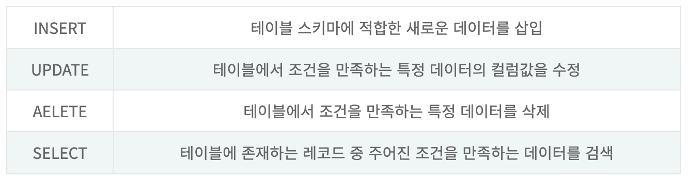
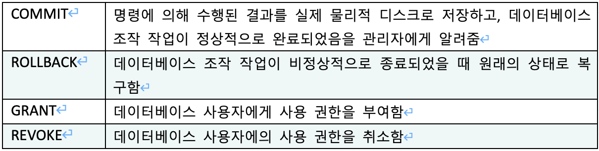
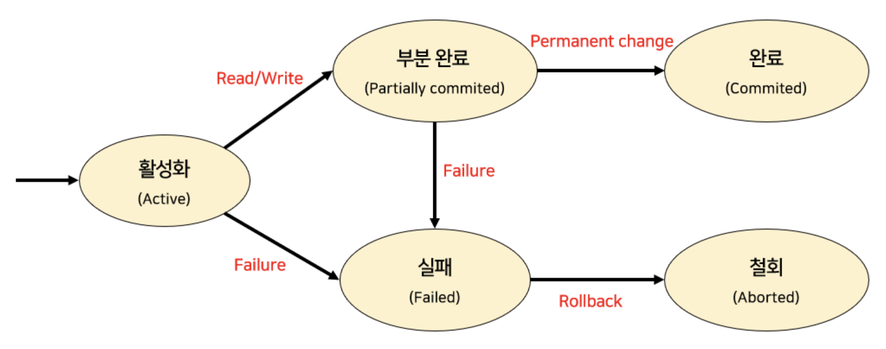

# SQL 종류, 트랜잭션, Commit&Rollback

# 📌SQL의 종류(DDL, DML, DCL, TCL)

---

## ✏ DDL(Data Definition Language, 데이터 정의어)

---

<aside>
💡 데이터를 저장할 구조를 정의하는 언어

</aside>

## ✏ DML(Data Manipulation Language, 데이터 조작 언어)

---

<aside>
💡 데이터 구조에 데이터를 조작(입력, 수정, 삭제, 조회)하는 언어

</aside>

## ✏ DCL(Data Control Language, 데이터 제어 언어)

---

<aside>
💡 데이터 구조에 접근 권한이나 CRUD 권한을 정의하는 언어

</aside>

- DBMS의 동작 설정 및 DBMS 접근에 대한 사용자의 권한을 관리하는 SQL명령어의 집합
- GRANT, REVOKE, BEGIN 등의 명령어로 구성되며, 주로 데이터베이스 관리자(DBA)가 사용

## ✏ TCL(Transaction Control Language)

---

<aside>
💡 DCL에서 트랜잭션을 제어하는 명령인 COMMIT, ROLLBACK만을 따로 분리해서 표현

</aside>

# 📌트랜잭션(Transaction)

---

<aside>
💡 데이터베이스의 상태를 변화시키는 하나의 논리적 기능을 수행하기 위한 작업의 단위

</aside>

- 데이터베이스 상태를 변화시킴
    
    == 질의어(SQL: select, insert, delete, update)를 이용하여 데이터베이스에 접근하는 것
    
- 작업 단위: 사람이 정하는 기준에 따라 한꺼번에 모두 수행되어야 할 일련의 연산들

즉,

- 데이터베이스 시스템에서 병행 제어 및 회복 작업 시 처리되는 작업의 논리적 단위
- 사용자가 시스템에 대한 서비스 요구 시 시스템이 응답하기 위한 상태 변환 과정의 작업 단위
- Commit 되거나 Rollback 되거나 둘 중 하나

## Transaction 성질

---

<aside>
💡 데이터의 무결성(Integrity)을 보장하기 위해 DBMS 트랜잭션이 가져야 할 특징 ⇒ ACID

</aside>

1. **Atomicity(원자성)**
    - 트랜잭션 내의 모든 명령은 반드시 완벽히 수행되어야 함(부분적으로 실행되거나 중단되지 않는 것을 보장) ⇒ 모두 반영되던가 아님 아예 안 되던가
    - 어느 하나라도 오류가 발생하면 트랜잭션 전부가 취소되어야 함
    - 트랜잭션의 연산은 모두 반영되도록 Commit 되거나 전혀 반영되지 않도록 Rollback 되어야 함
    
2. **Consistency(일관성)**
    - 트랜잭션의 작업 처리 결과는 항상 일관성이 있어야 함
    - 이런 의미
        - 트랜잭션이 진행되는 동안에 데이터베이스가 변경 되더라도 업데이트된 데이터베이스로 트랜잭션이 진행되는것이 아니라, 처음에 트랜잭션을 진행 하기 위해 참조한 데이터베이스로 진행된다.
        - 이렇게 함으로써 각 사용자는 일관성 있는 데이터를 볼 수 있는 것이다.
        
    
3. **Isolation(독립성, 격리성)**
    - 트랜잭션 수행 시 다른 트랜잭션 연산에 끼어들지 못하도록 보장
    - 수행 중인 트랜잭션은 완전히 완료될 때까지 다른 트랜잭션에서의 수행 결과를 참조할 수 없음
    
4. **Durability(영속성, 지속성)**
    - 성공적으로 완료된 트랜잭션의 결과는 시스템이 고장 나더라도 영구적으로 반영되어야 함

## Transaction 상태

---

- 활동(Active) : 트랜잭션이 실행 중인 상태
- 실패(Failed) : 트랜잭션 실행에 오류가 발생하여 중단된 상태
- 철회(Aborted) : 트랜잭션이 비정상적으로 종료되어 Rollback 연산을 수행한 상태
- 부분 완료(Partially Committed) : 트랜잭션의 마지막 연산까지 실행했지만, Commit 연산이 실행되기 직전의 상태
- 완료(Committed) : 트랜잭션이 성공적으로 종료되어 Commit 연산을 실행한 후의 상태

# 📌Commit과 Rollback

---

## Commit

<aside>
💡 하나의 트랜잭션이 성공적으로 끝나 데이터베이스가 일관성 있는 상태에 있음을 의미

</aside>

## Rollback

<aside>
💡 하나의 트랜잭션 처리가 비정상적으로 종료되어 트랜잭션의 원자성이 깨진 상태를 의미

</aside>

- 트랜잭션의 원자성을 지키기 위해 해당 트랜잭션이 행한 모든 연산을 재시작하거나 취소(Undo)함

### Reference
---

[SQL종류 정리(이론)](https://mimi-coding.tistory.com/10)
