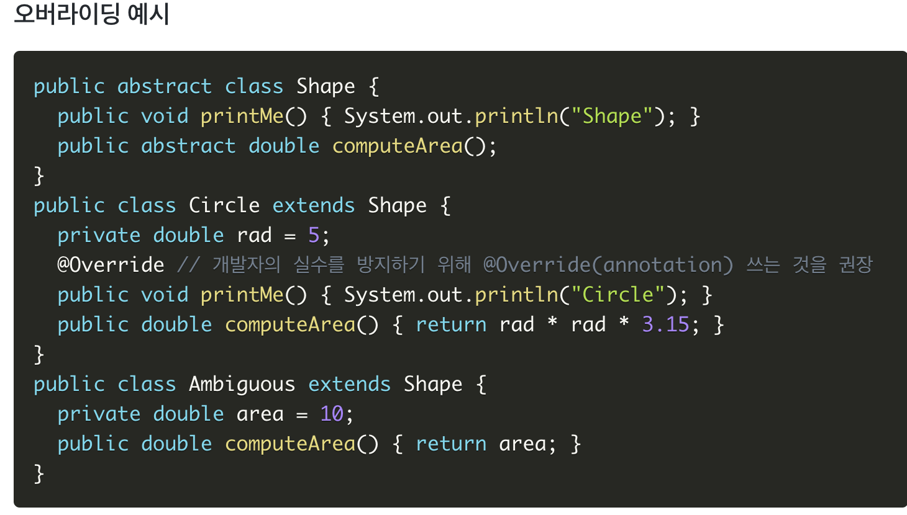
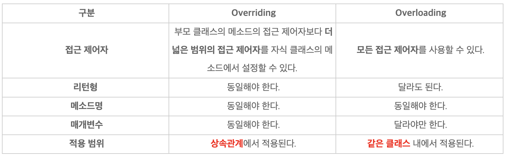

# Java (2)

# Primitive type vs Reference type

---

## 기본형(Primitive type)

---

- 총 8가지 타입이 존재한다.
- 기본값이 있기 때문에 Null이 존재하지 않는다. 만약 기본형 타입에 Null을 넣고 싶다면 래퍼 클래스를 활용한다.
- **실제 값**을 저장하는 공간으로 **스택(Stack)** 메모리에 저장된다.
- 만약 컴파일 시점에 담을 수 있는 크기를 벗어나면 에러를 발생시키는 컴파일 에러가 발생한다. 주로 문법상의 에러가 많다. 예를 들어 ;을 안붙였다는 이유로 빨간 줄이 쳐지는 경우


## 참조형(Reference type)

---

- 기본형 타입을 제외한 타입들이 모두 참조형 타입(Reference type)이다.
- 빈 객체를 의미하는 Null이 존재한다.
- Java에서 **`실제 객체`는 `힙 영역`에 저장**되며 **`참조 타입 변수`는 `스택 영역`에 실제 객체들의 주소를 저장**하여, 객체를 사용할때 마다 **참조 변수에 저장된 객체의 주소를 불러와 사용하는 방식**
이다.
- 기본타입 변수들과는 다르게 크기가 정해져 있지 않다.
- **프로그램 실행시 메모리에 동적으로 할당**된다.
- **참조하는 변수가 없으면 자바의 `가비지 컬렉터`가 제거**한다.
    - `가비지 컬렉터(Garbage collector)` : 메모리의 힙 영역에 할당된 더 이상 사용되지 않는 객체를 제거 하는 역할


# String & StringBuffer & StringBuilder

---

- 기본적인 차이: String은 불변, StringBuffer, StringBuilder는 변함!

## String

---

<aside>
💡 String 클래스 객체는 Heap 메모리 영역(가비지 컬렉션이 동작하는 영역)에 생성하고 한번 생성된 객체의 내부 내용을 변화시킬 수 없다. (기존 객체가 제거되면 Java의 가비지 컬렉션이 회수한다.)

</aside>

- String 객체는 한번 생성되면 할당된 메모리 공간이 변하지 않는다.
- concat, + 연산을 통해 다른 문자열을 넣어도 새로운 String 객체를 만든 후 새 String 객체에 연결된 문자열을 저장하고, 그 객체를 참조한다!

- 따라서 문자열 연산이 많은 경우 성능이 좋지 않다.


## StringBuffer & StringBuilder

---

- 문자열 연산 등으로 기존 객체의 공간이 부족하게 되는 경우 기존의 버퍼 크기를 늘리며 유연하게 동작한다.
- StringBuffer와 StringBuilder 클래스가 제공하는 메서드는 서로 동일하다.

- 차이점 : 동기화 여부
    - StringBuffer는 각 메서드별로 Synchronized Keyword가 존재하여, 멀티스레드 환경에서도 동기화를 지원한다.
    - StringBuilder는 동기화를 보장하지 않는다.
        
        
        

- 참고
    - 사실 JDK 1.5버전 이전에서는 문자열연산(+, concat)을 할때에는 조합된 문자열을 새로운 메모리에 할당하여 참조함으로 인해서 성능상의 이슈가 있었습니다. 그러나 JDK1.5 버전 이후에는 컴파일 단계에서 String 객체를 사용하더라도 StringBuilder로 컴파일 되도록 변경되었습니다. 그리하여 JDK 1.5 이후 버전에서는 String 클래스를 활용해도 StringBuilder와 성능상으로 차이가 없어졌습니다.
    - 하지만 반복 루프를 사용해서 문자열을 더할 때에는 객체를 계속 추가한다는 사실에는 변함이 없습니다. 그러므로 String 클래스를 쓰는 대신, 스레드와 관련이 있으면 StringBuffer를, 스레드 안전 여부와 상관이 없으면 StringBuilder를 사용하는 것을 권장합니다.
    - 단순히 성능만 놓고 본다면 연산이 많은 경우,StringBuilder > StringBuffer >>> String 입니다.
    

### 정리

---

- String
    - 짧은 문자열을 더할 경우
    - 문자열 연산이 적고 멀티스레드 환경일 경우
- StringBuffer
    - 스레드에 안전한 프로그램이 필요할 때나, 개발 중인 시스템의 부분이 스레드에 안전한지 모를 경우
    - 문자열 연산이 많고 멀티스레드 환경일 경우
- StringBuilder
    - 스레드에 안전한지 여부가 전혀 관계 없는 프로그램을 개발할 경우
    - 문자열 연산이 많고 단일스레드이거나 동기화를 고려하지 않아도 되는 경우


# Overriding vs Overloading

---

## 오버로딩(Overloading)

---

<aside>
💡 두 메서드가 같은 이름을 갖고 있으나 인자의 수나 자료형이 다른 경우

</aside>

- 메소드 이름이 같고, 매겨변수의 개수나 타입이 달라야 함. **리턴 값만 다른 것은 불가!!**
- 마찬가지로 접근제한자만 다르다고 오버로딩 되는건 아님


### 오버로딩을 사용하는 이유

---

**1. 같은 기능을 하는 메소드를 하나의 이름으로 사용할 수 있다.**

우리가 흔히 콘솔창에 텍스트를 출력할 때 사용하는 println라는 메소드를 대표적인 예로 들어볼 수 있다. 실은 이 함수가 오버로딩의 결정체이다. 우리는 println의 인자 값으로 int, double, boolean, String 등의 아주 다양한 타입의 매개변수들을 집어넣어도 우리는 그 함수들이 어떻게 실행되지는 모르지만 콘솔창에 아주 잘 출력해주는 것을 볼 수 있다.

이렇게 '출력하다.'라는 같은 기능을 가진 메소드들를 println이라는 하나의 이름으로 정의가 가능한 것이다.

**2. 메소드의 이름을 절약할 수 있다.**

이 위에서 예로 들었던 println을 생각해보자. 이 메소드를 매개변수의 종류에 따라서 다르게 지정한다고 생각해보자. printlnInt, printlnDouble, printlnBoolean 등 수많은 메소드들의 이름을 정해줘야 할 것이다. 이는 프로그래머의 입장에서는 메소드의 네이밍에 고민을 가중시킨다. 그리고 이런 이름들은 다른 곳에 사용할 가능성도 생기게 된다.

## 오버라이딩(Overriding)

---

<aside>
💡 부모 클래스로부터 상속받은 메소드를 자식 클래스에서 재정의하는 것

</aside>

- 상위 클래스의 메서드와 이름과 용례(signature)가 같은 함수를 하위 클래스에 재정의하는 것
- 오버라이딩하고자하는 메소드의 이름, 매개변수, 리턴 값이 모두 같아야함
- 오버라이딩을 할 때 개발자의 실수를 방지하기 위해 메서드 위에 @Override 를 관례적으로 적는다.

### 오버라이딩 규칙

---

**1. 자식 클래스에서 오버라이딩하는 메소드의 접근 제어자는 부모 클래스보다 더 좁게 설정할 수 없다.**

만약, 부모클래스의 접근제어자가 default로 설정되어 있다면, 자식 클래스들은 default보다 같거나 더 넓은 범위의 접근제어자만 설정할 수 있으므로 default, protected, public 이 세 개의 접근 제어자는 사용이 가능하다.

**2. 예외(Exception)는 부모 클래스의 메소드 보다 많이 선언할 수 없다.**

부모 클래스에서 어떤 예외를 throws 한다고 하면, 자식 클래스에서는 그 예외보다 더 큰 범위의 예외를 throws할 수 없다는 것이다.

**3. static메소드를 인스턴스의 메소드로 또는 그 반대로 바꿀 수 없다.**

부모 클래스의 static 메소드를 자식에서 같은 이름으로 정의할 수 있지만 이것은 다시 정의하는 것이 아니라 같은 이름의 static 메소드를 새로 정의하는 것이다.



### 오버로딩 vs 오버라이딩

---



# Thread 활용

---

<aside>
💡 하나의 프로세스 내부에서 독립적으로 실행되는 하나의 작업 단위를 말하며, 세부적으로는 운영체제에 의해 관리되는 하나의 작업 혹은 태스크를 의미 (스레드 == 태스크)

</aside>

1. JVM에 의해 하나의 프로세스가 발생하고 main( ) 안의 실행문 들이 하나의 스레드입니다.
2. main( ) 이외의 또 다른 스레드를 만들려면 Thread 클래스를 상속하거나 Runnable 인터페이스를 구현합니다.
3. 다중 스레드 작업 시에는 각 스레드 끼리 정보를 주고받을 수 있어 처리 과정의 오류를 줄일 수 있습니다.
4. 프로세스끼리는 정보를 주고받을 수 없습니다.

장점

---

1. 메모리 공유로 인한 시스템 자원 소모가 줄어든다.
2. 동시에 두가지 이상의 활동을 하는 것이 가능해집니다.

단점

---

1. 서로 자원을 소모하다가 충돌이 일어날 가능성이 존재한다. ⇒ 데드락
2. 코딩이 난해해져 버그생성확률이 높아집니다.

### 예시

1. 싱글 스레드(Thread 클래스 상속)

```java
public class SingleThreadEx extends Thread{
    private int[] temp;
    public SingleThreadEx(String threadname){
	super(threadname);
	temp = new int[10];
		
	for(int start=0;start<temp.length;start++){
		temp[start]=start;
	}
    }
	
    public void run(){
	    for(int start:temp){
		try {
			Thread.sleep(1000);
				
		} catch (InterruptedException ie) {
			ie.printStackTrace();
			// TODO: handle exception
		}
		System.out.println("스레드이름:"+currentThread().getName());
		System.out.println("temp value :"+start);
	}
    }
	
    public static void main(String[] args) {
	SingleThreadEx st = new SingleThreadEx("첫번째");
	st.start();
    }
}
```

1. 싱글 스레드(Runnable 인터페이스 상속)

```java
public class SingleThreadEx2 implements Runnable{

    private int[] temp;
	
    public SingleThreadEx2(){
	temp = new int[10];
		
	for(int start=0;start<temp.length;start++){
		temp[start]=start;
	}
    }
	
    @Override
    public void run() {
	// TODO Auto-generated method stub
	for(int start:temp){
		try {
			Thread.sleep(1000);
				
		} catch (InterruptedException ie) {
			ie.printStackTrace();
			// TODO: handle exception
		}
			
		System.out.println("스레드이름:"+Thread.currentThread().getName());
		System.out.println("temp value :"+start);
	}
    }
	
    public static void main(String[] args) {

	SingleThreadEx2 ct = new SingleThreadEx2();
	Thread t = new Thread(ct,"첫번째");

	t.start();
    }
}
```

1. 멀티스레드

```java
public class Main {
    public static void main(String[] args) {
	ThreadEX threadex = new ThreadEX();
	ThreadEX threadex2 = new ThreadEX();
	Thread thread1 = new Thread(threadex,"A");
	Thread thread2 = new Thread(threadex2,"B");
		
	thread1.start();
	thread2.start();
		
	Thread.currentThread().getName();
    }
}

public class ThreadEX implements Runnable{

    int TestNum=0;
    @Override
    public /*synchronized 하나가 끝나야 실행됨*/ void run() {
	// TODO Auto-generated method stub
	for(int i=0;i<10;i++){
		if(Thread.currentThread().getName().equals("A")){
			System.out.println("=======================");
			TestNum++;
		}
		System.out.println("ThreadName ="+Thread.currentThread().getName()+"TestNum ="+TestNum);
			
		try {
			Thread.sleep(500);
		} catch (InterruptedException e) {
			// TODO Auto-generated catch block
			e.printStackTrace();
		}
	 }
      }
}
```

1. 멀티 스레드(ATM 예시)

```java
class ATM implements Runnable {
    private long depositeMoney = 10000;

    public void run() {
	synchronized (this) {
			
	    for (int i = 0; i < 10; i++) {
	           notify();
		try {
			wait();
			Thread.sleep(1000);
		} catch (InterruptedException e) {
			e.printStackTrace();
		}
		if (getDepositeMoney() <= 0)
			break;
		withDraw(1000);
	    }
	}
}

public void withDraw(long howMuch) {
	if (getDepositeMoney() > 0) {
		depositeMoney -= howMuch;
		System.out.print(Thread.currentThread().getName() + " , ");
		System.out.printf("잔액 : %,d 원 %n", getDepositeMoney());
	} else {
		System.out.print(Thread.currentThread().getName() + " , ");
		System.out.println("잔액이 부족합니다.");
	}
}

public long getDepositeMoney() {
	return depositeMoney;
    }
}

public class SynchronizedEx {
    public static void main(String[] args) {
	ATM atm = new ATM();
	Thread mother = new Thread(atm, "mother");
	Thread son = new Thread(atm, "son");
	mother.start();
	son.start();
    }
}
```

# Casting (업캐스팅 & 다운캐스팅)

---

<aside>
💡 타입을 변환하는 것(형변환). 상속 관계에 있는 부모와 자식 클래스 간에는 서로 간의 형변환이 가능함

</aside>

### Upcasting

---

<aside>
💡 자식 클래스의 객체가 부모 클래스 타입으로 형변환 되는 것

</aside>

예시

```java
static class Person{
	String name;
	Person(String name){
		this.name = name;
	}
}

static class Student extends Person{
	String check;
	Student(String name){
		super(name);
	}
}

public class Main{
	public static void main(String[] args){
		Student s = new Student("홍길동");
		Person p = s;	// 업캐스팅
		p.name = "이름이다.";

		p.check = "컴파일 에러 발생";	// 컴파일 에러 발생
	}
}
```

- p가 Student 객체를 가리키지만, p는 Person 타입이기 때문에 Person 클래스의 멤버에만 접근이 가능하다. 그렇기 때문에 p.check에서 컴파일 타임 에러가 발생한다.

### Downcasting

---

<aside>
💡 부모 클래스의 객체가 자식 클래스 타입으로 형변환 되는 것(업캐스팅과 반대)

</aside>

- 하위 클래스로의 다운캐스팅을 할 때는 타입을 명시적으로 지정해줘야한다!

예시

```java
static class Person{
	String name;
	Person(String name){
		this.name = name;
	}
}

static class Student extends Person{
	String check;
	Student(String name){
		super(name);
	}
}

public class Main{
	public static void main(String[] args){
		Person p = new Student("홍길동");
        
		Student s = (Student)p;	// 다운캐스팅
		s.name = "김유신";
		s.check = "check!";

		System.out.println("s name : " + s.name); //김유신
    System.out.println("s check : " + s.check); //check!
    System.out.println("p name : " + p.name); // 김유신
	}
}
```

- 객체의 타입을 구분하기 위해 instanceof 연산자를 사용할 수 있음!

# 질문

---

1. 오버라이딩과 오버로딩에 대해 설명해 주세요
    - 답변 예시
        
        오버로딩이란,
        
        - 오버로딩이란, 같은 이름을 가지는 메소드를 여러개 가지는 것을 말합니다.
        - 메소드의 이름은 같지만, 매개변수의 개수, 타입 등을 다르게 함으로써, 같은 메소드의 이름을 다른 기능으로 재정의하여 사용할 수 있습니다.
        - 메소드 이름 1개로 여러 기능으로 재정의하여 사용할 수 있기 때문에 가독성이 좋아집니다.
        
        오버라이딩이란,
        
        - 하위 클래스에서 상위 클래스의 메소드를 재정의하여 사용하는 것을 말합니다.
        - 상위 클래스의 기능을 하위클래스에서 필요한 부분만 재정의하여 원하는 기능으로 구현하는 것을 말합니다.
        - 오버라이딩의 이점으로, 코드 중복을 줄이고, 기능 확장에 이점이 있다고 생각합니다,
2. String, StringBuffer, StringBuilder의 차이점 및 사용되면 좋을 때?
    - 답변 예시
        
        
        
        사용되면 좋을 경우
        
        - String
            - 변하지 않을 문자열을 자주 사용할 경우
        - StringBuilder
            - 단일 스레드 환경과 문자열의 추가, 수정, 삭제 등이 빈번히 발생하는 경우
        - StringBuffer
            - 동기화를 지원하며 멀티 스레드 환경에도 안전하게 동작하므로,
            - 멀티 스레드환경과 문자열의 추가, 수정, 삭제 등이 빈번하게 발생하는 경우
        

**Reference**
---

[자바의 데이터 타입(Primitive type, Reference type)](https://gbsb.tistory.com/6)

[원시타입, 참조타입(Primitive Type, Reference Type)](https://velog.io/@gillog/%EC%9B%90%EC%8B%9C%ED%83%80%EC%9E%85-%EC%B0%B8%EC%A1%B0%ED%83%80%EC%9E%85Primitive-Type-Reference-Type)

[[자바] String, StringBuilder, StringBuffer의 차이](https://12bme.tistory.com/42)

[String, StringBuffer, StringBuilder 차이 및 장단점](https://dejavuhyo.github.io/posts/string-stringbuffer-stringbuilder/)

[[Java] 오버로딩과 오버라이딩의 차이(Overloading VS Overriding) - Heee's Development Blog](https://gmlwjd9405.github.io/2018/08/09/java-overloading-vs-overriding.html)

[[Java]오버로딩 & 오버라이딩(Overloading & Overriding)](https://hyoje420.tistory.com/14)

[[Java] 자바 Thread(스레드) 사용법 & 예제](https://coding-factory.tistory.com/279)

[자바 쓰레드 예제 및 사용 이유 알아보기](https://wakestand.tistory.com/93)

[[자바, Java] 캐스팅 - 업캐스팅(Upcasting), 다운캐스팅(Downcasting)](https://computer-science-student.tistory.com/335)

[자바 업캐스팅 다운캐스팅](https://madplay.github.io/post/java-upcasting-and-downcasting)