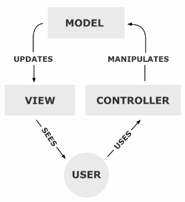
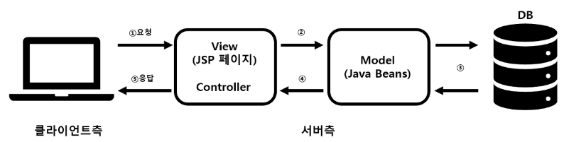
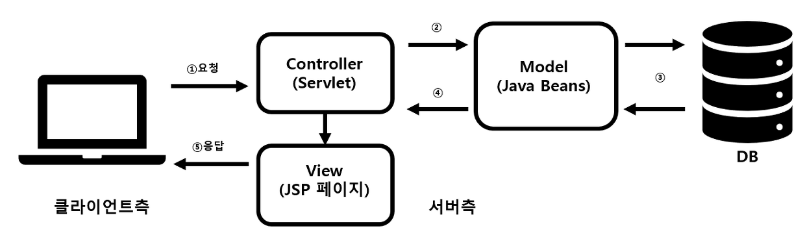
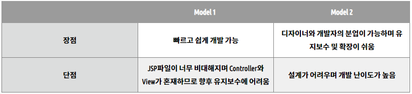
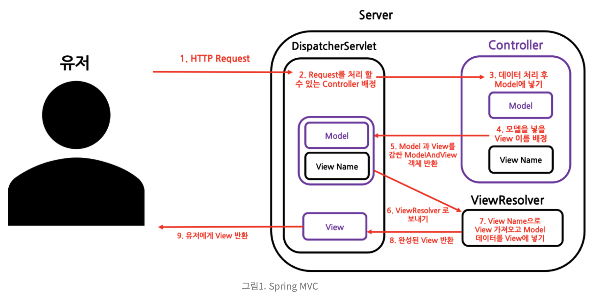
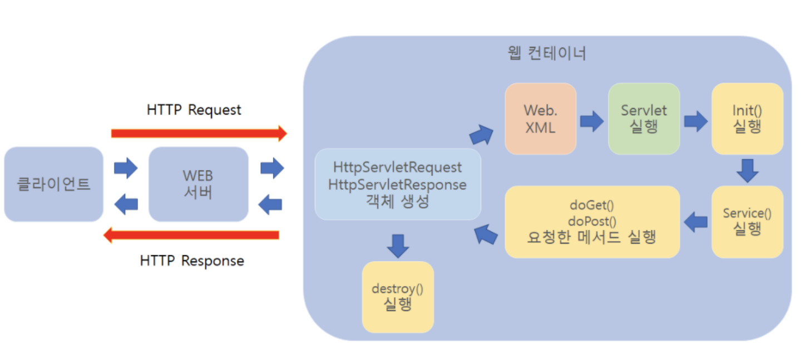

# MVC 패턴, Spring-MVC, 서블릿

# MVC 패턴

---

<aside>
💡 Model-View-Controller의 약자로 애플리케이션을 세 가지 역할로 구분한 개발 방법론

</aside>

- 사용자가 controller를 조작하면 controller는 model을 통해 데이터를 가져오고, 그 데이터를 바탕으로 view를 통해 시각적 표현을 제어하여 사용자에게 전달

### Web에 적용시?

---

1. 사용자가 웹사이트에 접속 (Users)
2. Controller는 사용자가 요청한 웹페이지를 서비스하기 위해서 모델을 호출 (Manipulates)
3. Model은 데이터베이스나 파일과 같은 데이터 소스를 제어한 후 그 결과를 Return
4. Controller는 Model이 리턴한 결과를 View에 반영 (Updates)
5. 데이터가 반영된 View는 사용자에게 보여짐 (Sees)

## MVC 패턴 방식

---

### Model 1 방식

---

<aside>
💡 JSP에서 출력과 로직을 전부 처리

</aside>

- Controller 영역에 View 영역을 같이 구현하는 방식
- 사용자의 요청을 JSP가 모두 처리
- 요청을 받은 JSP는 JavaBean Service Class를 이용해 웹 브라우저 사용자가 요청한 작업을 처리하고 결과를 출력

### Model 2 방식

---

<aside>
💡 JSP에서 출력만 처리

</aside>

- 웹 브라우저 사용자의 요청을 서블릿이 받음
- 서블릿은 해당 요청으로 View로 보여줄 것인지 Model로 보낼 것인지를 판단하여 전송
- HTML 소스와 JAVA 소스를 분리해놓음 → 모델 1에 비해 확장, 유지보수가 쉬움

### Model 1 vs Model 2

---

- Model 1 방식으로 개발시 백엔드와 프론트엔드의 역할 분담이 모호해져 협업이 쉽지 않아 거의 쓰지 않음!

## Controller

---

<aside>
💡 사용자의 입력 처리와 흐름 제어 담당. 화면과 Model과 View를 연결시켜주는 역할

</aside>

- 사용자의 요청사항을 파악한 후 그 요청에 맞는 데이터를 Model에 의뢰, 데이터를 View에 반영하여 사용자에게 알려주는 역할
- 모델에 명령을 보냄으로써 뷰의 상태를 변경할 수 있음 ⇒ (워드에서 문서 편집)
- 컨트롤러가 관련된 모델에 명령을 보냄으로써 뷰의 표시 방법을 바꿀 수 있음 ⇒ (문서를 스크롤하는 것)

**컨트롤러 규칙**

- 모델이냐 뷰에 대해서 알고 있어야 함
- 모델이나 뷰의 변경을 모니터링해야 함

## Model

---

<aside>
💡 백그라운드에서 동작하는 비즈니스 로직(데이터) 처리

</aside>

- 데이터를 가진 객체
- 내부의 상태에 대한 정보를 가질 수도 있고, 모델을 표현하는 이름 속성으로 가질 수도 있음
- 모델의 상태에 변화가 있을 때 컨트롤러와 뷰에 이를 통보
- 이를 통해 뷰는 최신의 결과를 보여줄 수 있고, 컨트롤러는 모델의 변화에 따른 적용 가능한 명령을 추가, 제거, 수정 가능

**모델 규칙**

- 사용자가 편집하길 원하는 모든 데이터를 가지고 있어야만 함
- 뷰나 컨트롤러에 대해서 어떠한 정보도 알지 말아야 함
- 변경이 일어나면, 변경 통지에 대한 처리방법을 구현해야 함

## View

---

<aside>
💡 정보를 화면으로 보여주는 역할

</aside>

- 클라이언트, 즉 기술은 HTML/CSS/Javascript를 모아둔 컨테이너
- 사용자가 볼 결과물을 생성하기 위해 모델로부터 정보를 얻어오는 컨테이너

**뷰의 규칙**

- 모델이 가지고 있는 정보를 따로 저장해서는 안됨
- 모델이나 컨트롤러와 같이 다른 구성 요소를 몰라야 함
- 변경이 일어나면, 변경 통지에 대한 처리방법을 구현해야 함

## MVC 패턴을 사용해야 하는 이유

---

- 비즈니스 로직과 UI로직을 분리하여 유지보수를 독립적으로 수행가능
- Model과 View가 다른 컴포넌트들에 종속되지 않아 애플리케이션의 확장성, 유연성에 유리함
- 중복 코딩의 문제점 제거

## MVC 패턴 한계

---

- View는 Controller에 연결되어 화면을 구성하는 단위 요소이므로 다수의 View를 가질 수 있음
- Model은 Controller를 통해 View와 연결되지만, Controller에 의해 하나의 View에 연결될 수 있는 Model도 여러 개가 될 수 있음
    
    ⇒ View와 Model이 서로 의존성을 띄게 됨
    
- 다수의 Model과 View가 복잡하게 연결되어 있는 상황이 발생할 수 있음

# Spring-MVC

---

- 주요 구성요소는 MVC와 같음!

### DispatcherServlet

---

<aside>
💡 제일 앞단에서 HTTP Request를 처리하는 Controller

</aside>

- Spring MVC에서는 HTTP Request가 왔을 때 DispatcherServlet이라 불리는 서블릿이 HTTP Request를 처리할 Controller을 지정함
- DispatcherServlet은 일종의 HTTP Request를 처리할 Controller을 지정하는 Controller로 Super Controller 역할을 함
- 이렇게 앞쪽에서 처리하는 컨트롤러를 두는 패턴을 Front Controller 패턴이라고 함

### Controller(Handler)

---

<aside>
💡 HTTP Request를 처리해 Model을 만들고 View를 지정

</aside>

- DispatcherServlet에 의해 배정된 Controller는 HTTP Request를 처리하고, HTTP Request의 메세지를 처리해 필요한 데이터를 뽑아 Model 에 저장
- 또한 HTTP Request에 따라서 HTTP가 보여줄 View Name를 지정함
- 이곳에서 View Name 뿐만 아니라, View를 반환할 수 있음
- 하지만, View에 Model의 데이터를 세팅하진 않음

### Model And View

---

<aside>
💡 Controller에 의해 반환된 Model과 View가 Wrapping된 객체

</aside>

- Model: Map<String, Value> 형태의 데이터 저장소
- Model은 Map 자료구조로, HTTP Request 속의 데이터를 파싱해 Key-Value 쌍으로 만들어 저장
- 이 Model은 이후에 View를 그리기 위해 사용됨

- View, View Name: ViewResolver에서 그릴 View를 지정
- ModelAndView 내부에는 View 혹은 View Name이 있는데, View가 지정되더라도 데이터가 세팅된 View가 지정되지 않음

### ViewResolver

---

<aside>
💡 ModelAndView를 처리하여 View를 그리기

</aside>

- ViewResolver에서는 ModelAndView 객체를 처리해 View를 그림
- 모델에 저장된 데이터를 사용해 View를 그려줌
- View는 사용자에게 보여줄 완성된 View이며, 여기서 그려지는 View는 그대로 유저에게 반환됨
- 우리가 특정한 url로 들어갔을 때 우리에게 보여지는 View가 바로 이곳에서 만들어지는 View

# Servlet

---

<aside>
💡 동적 웹 페이지를 만들 때 사용되는 자바 기반의 웹 애플리케이션 프로그래밍 기술

</aside>

- 서블릿은 웹 요청과 응답의 흐름을 간단한 메서드 호출만으로 체계적으로 다룰 수 있게 해줌

**특징**

- 클라이언트의 Request에 대해 동적으로 작동하는 웹 어플리케이션 컴포넌트
- 기존의 정적 웹 프로그램의 문제점을 보완하여 동적인 여러 가지 기능을 제공
- JAVA의 스레드를 이용하여 동작
- MVC패턴에서 컨트롤러로 이용됨
- 컨테이너에서 실행
- 보안 기능을 적용하기 쉬움

## 동작 과정

---

- 클라이언트가 웹 서버에 요청하면 웹 서버는 그 요청을 톰캣과 같은 WAS에 위임한다. 그러면 WAS는 각 요청에 해당하는 서블릿을 실행한다. 그리고 서블릿은 요청에 대한 기능을 수행한 후 결과를 반환하여 클라이언트에 전송한다.

1. 클라이언트 요청
2. HttpServletRequest, HttpServletResponse 객체 생성
3. Web.xml이 어느 서블릿에 대해 요청한 것인지 탐색
4. 해당하는 서블릿에서 service() 메소드 호출
5. doGet() 또는 doPost() 호출
6. 동적 페이지 생성 후 ServletResponse 객체에 응답 전송
7. HttpServletRequest, HttpServletResponse 객체 소멸

## 생명주기

---

1. 클라이언트의 요청이 들어오면 컨테이너는 해당 서블릿이 메모리에 있는지 확인하고, 없을 경우 init()메서드를 호출하여 메모리에 적재한다. init()은 처음 한번만 실행되기 때문에, 서블릿의 스레드에서 공통적으로 사용해야 하는 것이 있다면 오버라이딩 하여 구현하면 된다. 실행 중 서블릿이 변경될 경우, 기존 서블릿을 destroy()하고 init()을 통해 새로운 내용을 다시 메모리에 적재한다.
2. init()이 호출된 후 클라이언트의 요청에 따라서 service() 메소드를 통해 요청에 대한 응답이 doGet()과 doPost()로 분기된다. 이 때 서블릿 컨테이너가 클라이언트의 요청이 오면 가장 먼저 처리하는 과정으로 생성된 HttpServletRequest, HttpServleResponse에 의해 request와 response 객체가 제공된다.
3. 컨테이너가 서블릿에 종료 요청을 하면 destroy() 메소드가 호출되는데 마찬가지로 한번만 실행되며, 종료시에 처리해야 하는 작업들은 destroy() 메소드를 오버라이딩하여 구현하면 된다.

### 생명주기 메서드

---

**초기화 : init()**

- 서블릿 요청 시 맨 처음 한 번만 호출된다.
- 서블릿 생성 시 초기화 작업을 주로 수행한다.

**작업 수행 : doGet(), doPost()**

- 서블릿 요청 시 매번 호출된다.
- 실제로 클라이언트가 요청하는 작업을 수행한다.

**종료 : destroy()**

- 서블릿이 기능을 수행하고 메모리에서 소멸될 때 호출된다.
- 서블릿의 마무리 작업을 주로 수행한다.

## 컨테이너

---

<aside>
💡 구현되어있는 servlet 클래스의 규칙에 맞게 서블릿을 담고 관리해주는 컨테이너

</aside>

- 클라이언트에서 요청을 하면 컨테이너는 HttpServletRequest, HttpServletResponse 두 객체를 생성하여 post, get여부에 따라 동적인 페이지를 생성하여 응답을 보낸다.

- **웹서버와의 통신 지원**
    
    서블릿 컨테이너는 서블릿과 웹서버가 손쉽게 통신할 수 있게 해준다. 일반적으로 소켓을 만들고 listen, accept 등을 해야하지만 서블릿 컨테이너는 이러한 기능을 API로 제공하여 복잡한 과정을 생략할 수 있게 해준다. 그래서 개발자가 서블릿에 구현해야 할 비지니스 로직에 대해서만 초점을 두게끔 도와준다.
    

- **서블릿 생명주기 관리**
    
    서블릿 컨테이너는 서블릿 클래스를 로딩하여 인스턴스화하고, 초기화 메소드를 호출하고, 요청이 들어오면 적절한 서블릿 메소드를 호출한다. 또한 수명이 다 된 서블릿을 적절하게 가비지 콜렉터를 호출하여 필요없는 자원 낭비를 막아준다.
    
- **멀티쓰레드 지원 및 관리**
    
    서블릿 컨테이너는 Request가 올 때마다 새로운 자바 쓰레드를 하나 생성하는데, HTTP 서비스 메소드를 실행하고 나면, 쓰레드는 자동으로 죽게 된다. 원래는 쓰레드를 관리해야 하지만 서버가 다중 쓰레드를 생성 및 운영해주니 쓰레드의 안정성에 대해서 걱정하지 않아도 된다.
    

- **선언적인 보안 관리**
    
    서블릿 컨테이너를 사용하면 개발자는 보안에 관련된 내용을 서블릿 또는 자바 클래스에 구현해 놓지 않아도 된다. 일반적으로 보안관리는 XML 배포 서술자에다가 기록하므로, 보안에 대해 수정할 일이 생겨도 자바 소스 코드를 수정하여 다시 컴파일 하지 않아도 보안관리가 가능하다.
    

### Reference
---

[[개발상식] MVC 패턴이란? (Model-View-Controller)](https://cocoon1787.tistory.com/733)

[Spring MVC Framework란 무엇인가? Spring MVC의 구조와 의의](https://kotlinworld.com/326#DispatcherServlet%25--%25-A%25--%EC%25A-%25-C%EC%25-D%BC%25--%EC%25--%25-E%EB%25-B%25A-%EC%25--%25--%EC%25--%25-C%25--HTTP%25--Request%EB%25A-%BC%25--%EC%25B-%25--%EB%25A-%AC%ED%25--%25--%EB%25-A%25--%25--Controller)

[[Servlet] 서블릿(Servlet)이란?](https://velog.io/@falling_star3/Tomcat-%EC%84%9C%EB%B8%94%EB%A6%BFServlet%EC%9D%B4%EB%9E%80)