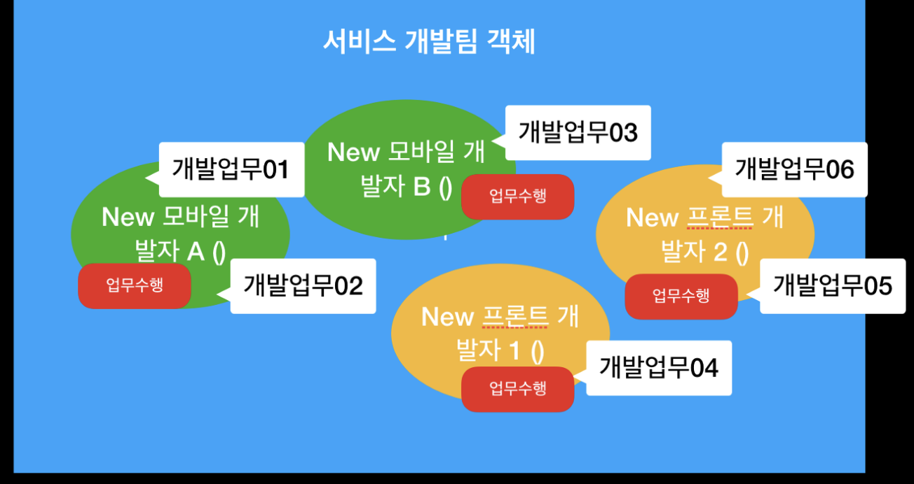
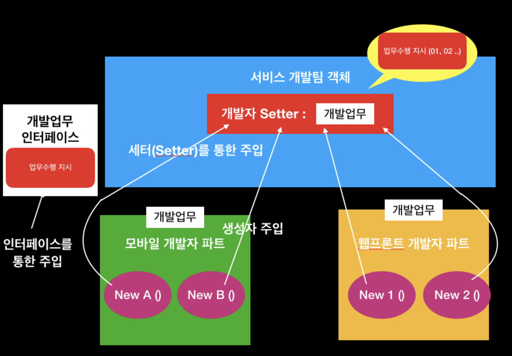
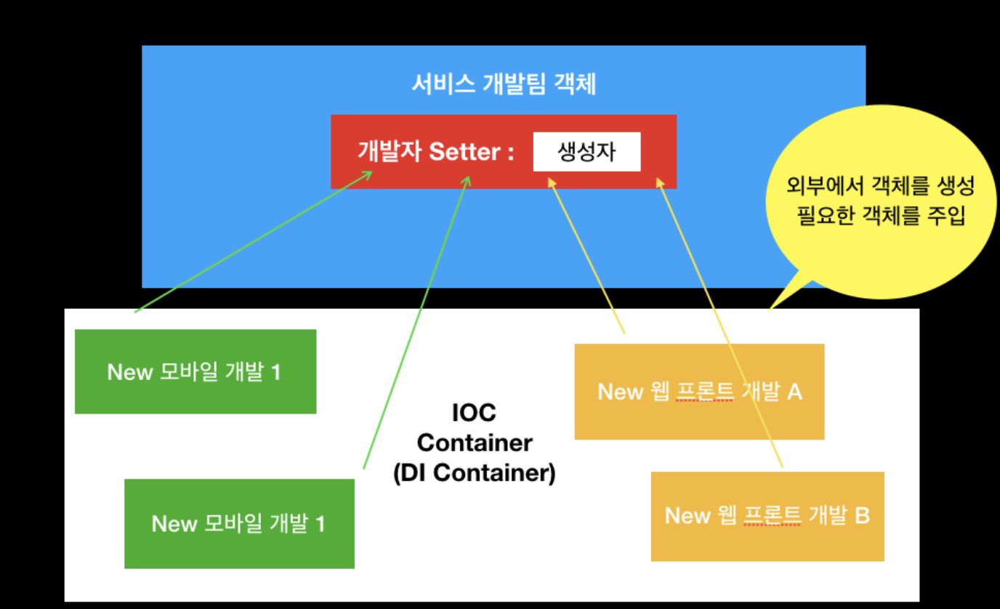

# IOC(Inversion of Control), AOP(Aspect Oriented Programming)

# IOC(Inversion of Control, 제어의 역전)

---

<aside>
💡 메소드나 객체의 호출 작업을 개발자가 결정하는 것이 아닌, 외부에서 결정되는 것

</aside>

- 객체의 의존성을 역전시켜 객체 간의 결합도를 줄이고, 유연한 코드를 작성하게 함
- 가독성을 좋게 하고 코드 중복을 방지하며 유지 보수가 편함
- IOC 기법 중 하나가 DI

- 기존 객체 생성 및 실행 방법
    1. 객체 생성
    2. 의존성 객체 생성 - 클래스 내부에서 생성
    3. 의존성 객체 메소드 호출

- Spring에서의 객체 생성 및 실행 방법
    1. 객체 생성
    2. 의존성 객체 주입 - 스스로가 만드는 것이 아닌, 스프링에게 위임하여 스프링이 만들어놓은 객체를 주입함
    3. 의존성 객체 메소드 호출

- 스프링이 모든 의존성 객체를 스프링이 실행될 때 다 만들어주고, 필요한 곳에 주입시킴
    - Bean(스프링 객체)들은 싱글턴 패턴의 특징을 가짐
- 제어의 흐름을 사용자가 컨트롤 하는 것이 아니라 스프링에게 맡겨 작업을 처리함

## IOC Container

---

<aside>
💡 IOC를 구현하는 프레임워크로 객체를 관리하고, 객체의 생성을 책임지고, 의존성을 관리하는 컨테이너

</aside>

- 모든 의존성을 컨테이너를 통해 받아옴

- 배경
    
    ```
    서비스 개발팀이 있습니다.
    이 팀은 모바일 개발 파트와 웹프론트 개발 파트를 관리하는 팀입니다.
    서비스 개발팀은 현재 5명입니다.
    팀장 : 모바일과 프론트 업무를 받아와서 모바일, 프론트 업무에 따라 담당자에게 업무를 분배합니다.모바일 업무 담당 : 모바일 개발자 A, 모바일 개발자 B,웹 프론트 업무 담당 : 프론트 개발자 1, 프론트 개발자 2모바일 개발자와 프론트 개발자는 채용하면 계속 늘어날 수 있죠.
    그리고 모바일과 프론트 개발 업무는 각각 다르겠죠.
    ```
    

- 기존 설계
    
    
    
    - 개발 팀장이 개발 업무를 받아오면, 파트에 맞는 개발자 객체를 생성하여 업무 할당
    
- DI 구현
    
    
    

- IOC 컨테이너
    
    
    

⇒ 외부에서 객체를 생성하여 주입

- 서비스 개발팀 팀장이 업무를 받아오면, 개발 업무 기능이 있는 인터페이스를 모바일 개발자, 프론트 개발자 클래스에서 플러그인함
- 서비스 개발팀 프레임워크에서는 생성할 때 혹은 관련 값을 세팅할 Setter에 개발 업무 기능이 있는 인터페이스가 있는 객체를 받도록 함
- 인터페이스에 정의되어 플러그인된 개발 업무를 지시하며, 팀장이 제어할 수 있음

### Reference
---

[[Spring] DI, IoC 정리](https://velog.io/@gillog/Spring-DIDependency-Injection)

[[Spring] Spring IoC와 DI란?](https://steady-coding.tistory.com/600)

[[DI] Inversion Of Control Container 란?](https://medium.com/@jang.wangsu/di-inversion-of-control-container-%EB%9E%80-12ecd70ac7ea)