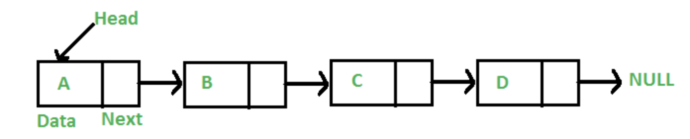
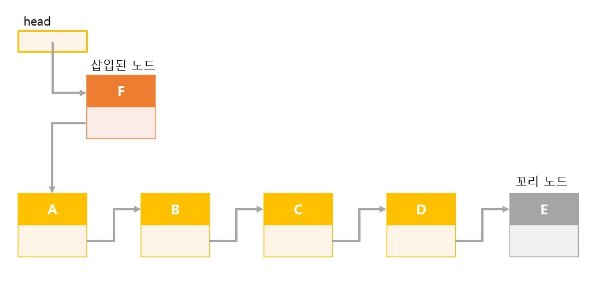
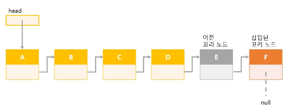
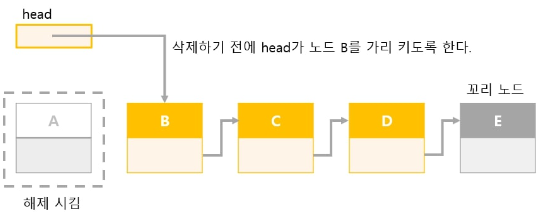
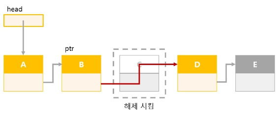
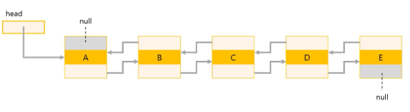

# Array, Linked List

# 📌 Array

### 👀 특징

- 데이터를 물리적 주소에 순차적으로 저장하는 자료구조
- 논리적 저장 순서와 물리적 저장 순서가 일치함
- 시간 복잡도
    - 검색: O(1)
    - 삽입, 삭제 : O(N)

### 👍 장점

- 인덱스를 이용하여 데이터에 random access 가능
    
    ⇒ 데이터 접근(탐색, 조회)이 많을 경우 사용
    

### 👎 단점

- 삽입, 삭제가 번거로움
    - 데이터를 배열의 중간에 삽입하거나 삭제할 경우, 데이터를 한 칸씩 밀거나 삭제해야하므로 연결리스트에 비해 느림
- 초기에 배열의 크기를 지정해야하고, 변경할 수 없음

### ✨ 예시 코드

```java
// Java
// 배열 생성
int[] arr = new int[3];

a[1] = 15;
a[2] = 20;

for(int i=0; i<a.length; i++)
    System.out.println("a["+i+"]="+a[i]);

/*
a[0] = 0 
a[1] = 15
a[2] = 20
*/
```

# 📌 Linked List



### 👀 특징

- 연속적인 메모리 위치에 저장되지 않는 선형 데이터 구조. 포인터를 이용하여 연결됨
- 노드: 데이터 + 다음 데이터를 가리키는 포인터
- 시간 복잡도
    - 검색, 삽입, 삭제 : O(N)

### 👍 장점

- 데이터를 중간에 삽입하거나 삭제하는 경우, 노드를 가리키는 주소의 위치만 바꿔주면 되므로 배열에 비해 빠름
    
    ⇒ 데이터를 수정(삽입, 삭제)이 많은 경우 사용
    
- 동적 크기

### 👎 단점

- 데이터 접근시 처음 위치부터 접근해야 하므로 배열에 비해 느림.
    - 즉, random access 불가
- 포인터까지 저장해야하기 때문에 메모리 낭비 존재

### ✨ 예시 코드

**💡 Node 구현**

```java
class Node<E>{
	E data;       // 데이터
	Node<E> next; // 다음 노드를 가리키는 포인터
}
```

제네릭으로 구현된 것이므로 E는 참조형! (임의의 클래스 허용)

💡**Linked list 클래스**

```java
import java.util.Comparator;

public class LinkedList<E>{
  //노드
  class Node<E>{
    E data;
    Node<E> next;

    //생성자
    Node(E data, Node<E> next){
      this.data = data;
      this.next = next;
    }
  }

  private Node<E> head;   //머리 노드
  private Node<E> crnt;   //선택 노드
}
```

💡**LinkedList** **생성자**

```java
public LinkedList(){
  head = crnt = null;
}
```

노드가 하나도 없는 비어 있는 연결리스트 생성

💡 **Linked list 판단**

- Linked list가 비어 있을 때
    - head == null
- 노드가 한 개일 때
    - head.next == null
- 꼬리 노드인지 판단할 때
    - p.next == null

**💡 메소드**

1. **검색**
    - 탐색 방법
        
        Linked list 처음부터 순서대로 노드를 스캔한다.
        
    - 종료 시점
        - data를 찾음
        - 찾지 못하고 꼬리 노드까지 도달시
    
    ```java
    public E search(E obj, Comparator<? super E> c){
      Node<E> ptr = head;
    
      while(ptr!=null){
        if(c.compare(obj, ptr.data)==0){ // 검색 성공
          crnt = ptr;
          return ptr.data;
        }
        ptr = ptr.next;                  // 다음 노드 선택
      }
      return null;                       // 검색 실패
    }
    ```
    
2. **삽입**
    - 머리에 노드를 삽입할 때
        - 리스트가 비어 있을 경우, 리스트가 비어 있지 않을 경우 모두 해당
        
        
        
        - 노드 생성
            - 삽입될 노드의 포인터: 맨 처음 노드로 설정
        - head를 삽입될 노드를 가리키도록 설정
    
    - 중간에 노드를 삽입할 때(꼬리 노드 삽입 포함)
        
        
        
        - 노드 생성
        - 삽입될 위치 이전까지 탐색
        - 삽입될 위치 이전 노드의 포인터를 삽입될 노드로 설정
        - 삽입될 노드의 포인터: 삽입될 위치 이전 노드의 포인터가 참조하는 노드로 설정
    
    ```java
    //머리에 노드 삽입
    public void addFirst(E obj){
      Node<E> ptr = head;
      head = crnt = new Node<E>(obj, ptr);
    }
    
    //꼬리에 노드 삽입
    public void addLast(E obj){
      if(head == null)
        addFirst(obj);
      else{
        Node<E> ptr = head;
        while(ptr.next!=null)   // while문 종료시 ptr은 꼬리 노드를 가리킴
          ptr = ptr.next;
        ptr.next = crnt = new Node<E>(obj, null);
      }
    }
    ```
    
3. **삭제**
    
    
    - 머리 노드 삭제
        
        
        
        - head를 삭제할 노드의 다음 노드를 가리키게 함
        - 삭제할 노드 해제
        
    - 중간 노드 삭제(꼬리 노드 삭제 포함)
        
        
        
        - 삭제할 노드 이전 노드까지 탐색
        - 이전 노드의 포인터를 삭제할 노드가 참조하던 노드로 변경
        - 삭제할 노드 해제
        
    
    ```java
    //머리 노드 삭제
    public void removeFirst(){
      if(head!=null)
        head = crnt = head.next;
    }
    
    //꼬리 노드 삭제
    public void removeLast(){
      if(head!=null){
        if(head.next==null)
          removeFirst();
      }
      else{
          Node<E> ptr = head;   // 스캔 중인 노드
          Node<E> pre = head;   // 스캔 중인 노드의 앞쪽 노드
    
          while(ptr.next!=null){
            pre = ptr;
            ptr = ptr.next;
          }
          pre.next = null;    // pre는 삭제 작업 후의 꼬리 노드
          crnt = pre;
      }
    }
    ```
    
    ```java
    //노드 p 삭제
    public void remove(Node p){
      if(head!=null){
        if(p==head)
          removeFirst();
      }
      else{
        Node<E> ptr = head;
    
        while(ptr.next!=p){
          ptr = ptr.next;
          if(ptr==null) return;   // p가 리스트에 없음
        }
        ptr.next = p.next;
        crnt = ptr;
      }
    }
    
    //선택 노드를 삭제
    public void removeCurrentNode(){
      remove(crnt);
    }
    
    //모든 노드 삭제
    public void clear(){
      while(head!=null)   //노드에 아무것도 없을 때 까지 머리노드를 삭제
        removeFirst();
      crnt = null;
    }
    ```
    

## 📌 Doubly Linked List



### 👀 특징

- Linked List의 단점인 무조건 처음부터 탐색해야 하는 것을 보완
- 양쪽에 포인터가 있음

### 👍 장점

- 노드를 탐색할 때 양방향이 가능

### 👎 단점

- 메모리를 차지하는 것이 더 늘어남
- 코드 구현이 복잡해짐

## 📌 기타 Linked List

- 원형 리스트
- 원형 이중 연결 리스트


### 그림 및 코드 출처:

[https://github.com/HyeminNoh/Tech-Stack/blob/master/docs/DataStructure/LinkedList.md](https://github.com/HyeminNoh/Tech-Stack/blob/master/docs/DataStructure/LinkedList.md)

### 참고 자료
    - [https://freestrokes.tistory.com/84](https://freestrokes.tistory.com/84)
    - [https://github.com/gyoogle/tech-interview-for-developer/blob/master/Computer Science/Data Structure/Linked List.md](https://github.com/gyoogle/tech-interview-for-developer/blob/master/Computer%20Science/Data%20Structure/Linked%20List.md)
    - [https://github.com/kho903/CS_STUDY/tree/master/Data Structure/02. 연결 리스트](https://github.com/kho903/CS_STUDY/tree/master/Data%20Structure/02.%20%EC%97%B0%EA%B2%B0%20%EB%A6%AC%EC%8A%A4%ED%8A%B8)
    - [https://github.com/jeonyeohun/Getting-Ready-For-Interview/blob/main/DataStructure/01_Array.md](https://github.com/jeonyeohun/Getting-Ready-For-Interview/blob/main/DataStructure/01_Array.md)
    - [https://cocoon1787.tistory.com/705?category=831125](https://cocoon1787.tistory.com/705?category=831125)