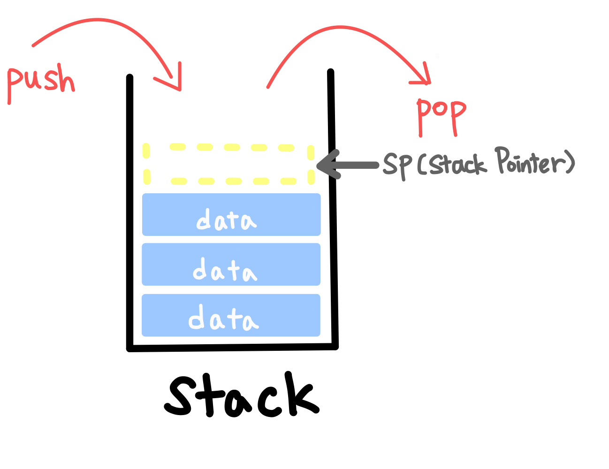
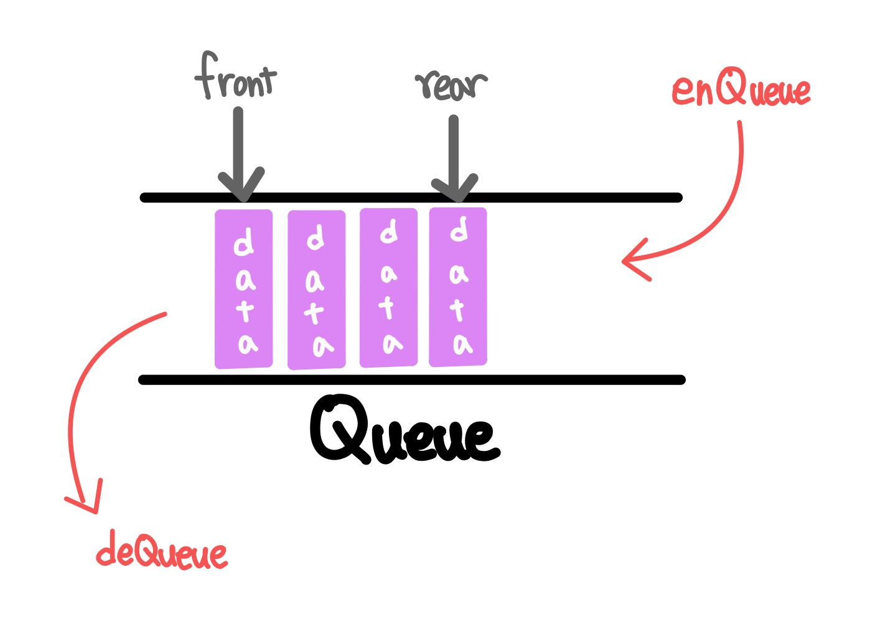

# Stack, Queue

# 📌 Stack

### 👀 특징

- 입력과 출력이 한 방향인 자료구조
- LIFO(Last In First Out), 후입선출 구조
- 구현은 배열 또는 연결리스트를 활용

### ✨ 활용법

- 함수의 호출
- 괄호 검사
- 브라우저
    - 뒤로, 앞으로 가기
- 문자열 역순 출력
- 계산기
    - 연산자 후위표기법

### **💡 메서드**

- push()
    - 스택에 데이터 삽입
    - 스택이 꽉 찼을 경우 OverflowIntStackException을 throw
- pop()
    - 스택 최상위 데이터 삭제
    - 스택이 비어있을 경우 EmptyIntStackException을 throw
- isEmpty()
    - 스택이 비어있는지 확인
- isFull()
    - 스택이 꽉 차있는지 확인
    - 스택의 크기가 정해져 있는 경우 사용
- size()
    - 스택에 쌓인 데이터 수를 반환
- peek()
    - 스택의 최상위 데이터 반환 (pop처럼 데이터를 제거하지는 않음)
    - 스택이 비어있을 경우 EmptyIntStackException을 throw
- indexOf()
    - 스택의 특정 값에 대한 인덱스 반환
    - 없다면 -1 반환
- Stack Pointer(SP)
    - push와 pop시 해당 위치를 알기 위한 포인터
    - 다음 값이 들어갈 위치를 가리킴(default: -1)
    

# 📌 Queue

### 👀 특징

- 뒤쪽으로 들어가 앞쪽으로 나오는 자료구조
- FIFO(First In First Out), 선입선출 구조
- 구현은 배열 또는 연결리스트 활용
- 스택을 두 개 연결하면 큐를 만들 수 있음

### ✨ 활용법

- buffer
- BFS
- 대기열

### **💡 메서드**

- enQueue()
    - 큐에 데이터 삽입
    - 큐가 가득 찼을 경우 OverflowIntQueueException을 throw
- deQueue()
    - 큐에 데이터 삭제
    - 큐가 비어있을 경우 EmptyIntQueueException을 throw
- isEmpty()
    - 큐가 비어있는지 확인
- isFull()
    - 큐가 꽉 차있는지 확인
    - 큐의 크기가 정해져 있는 경우 사용
- size()
    - 큐에 있는 데이터 수를 반환
- front, rear
    - 큐에 데이터를 삽입하고, 제거할 때 사용하는 포인터
    - front
        - 큐의 맨 앞의 요소
    - rear
        - 큐의 맨 뒤의 요소

### 🎈 원형 큐

- 논리적으로 배열의 처음과 끝이 연결되어 있음
- 초기 공백 상태시 front=rear=0
- 공백, 포화 상태를 구분하기 위해 자리 하나를 항상 비워둠
    - 즉, 포화 상태는 front와 rear의 인덱스 차이가 한 칸 만큼 날 때
    - (index+1) % size 로 순환
    - rear가 front보다 작아질 수 있기 때문에 %연산 활용

참고 블로그

[https://velog.io/@mcc919/Data-Structure-원형-큐Circular-Queue-알아보기](https://velog.io/@mcc919/Data-Structure-%EC%9B%90%ED%98%95-%ED%81%90Circular-Queue-%EC%95%8C%EC%95%84%EB%B3%B4%EA%B8%B0)

### 🎈 Deque(덱, 양방향 대기열, double ended queue)

- 시작과 끝 지점, 양쪽에서 데이터를 삽입하거나 삭제하는 자료구조
- Scroll: 입력 제한 덱(입력이 한쪽에서만 발생, 출력은 양쪽에서 발생)
- Shelf: 출력 제한 덱(입력은 양쪽에서 발생, 출력은 한쪽에서만 발생)

### **💡 메서드**

- addFront(), addRear()
    - 큐의 맨 앞, 맨 뒤에 요소를 삽입
- deleteFront(), deleteRear()
    - 큐의 맨 앞, 맨 뒤 요소를 삭제
- getFront(), getRear()
    - 큐의 맨 앞, 맨 뒤 요소를 가져옴(삭제하지 않는다!)

### Stack, Queue 구현

코드 확인 원한다면?

[https://github.com/gyoogle/tech-interview-for-developer/blob/master/Computer Science/Data Structure/Stack %26 Queue.md](https://github.com/gyoogle/tech-interview-for-developer/blob/master/Computer%20Science/Data%20Structure/Stack%20%26%20Queue.md)