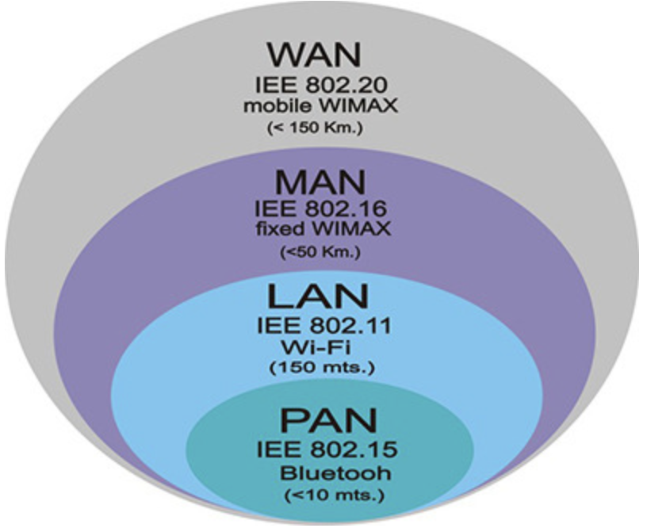
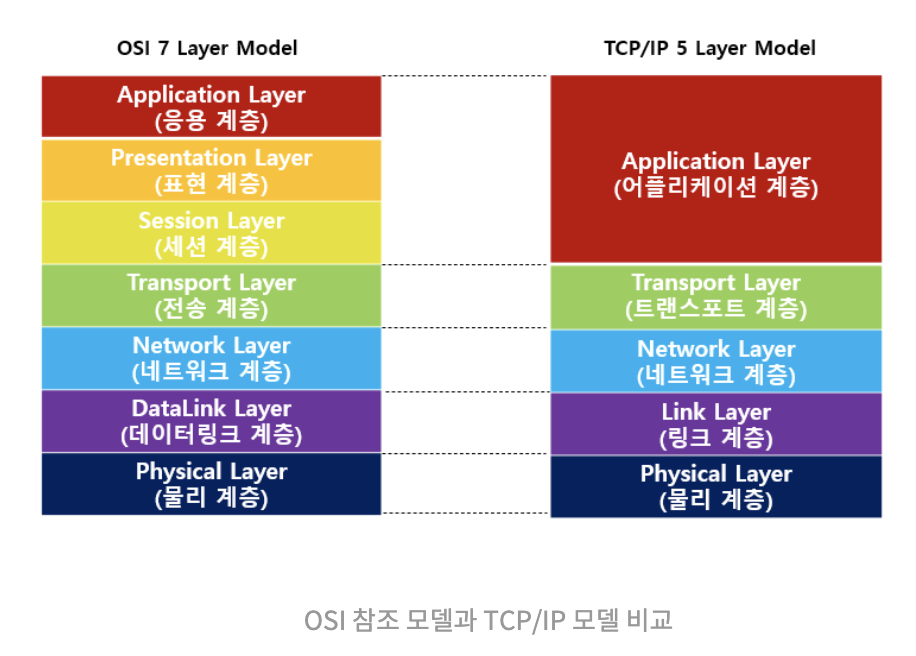
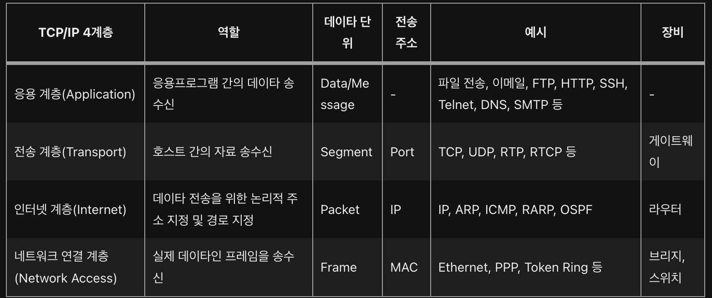

# 네트워크 & OSI 7계층

## ✍🏻 네트워크(NetWork)란?

- Net + Work 의 합성어
- 같은 노드들이 통신 기술을 이용하여 그물망처럼 연결된 통신 이용 형태
- 전송매체를 링크로 서로 연결된 장치(또는 노드)의 모임
- 노드(node)는 컴퓨터나 프린터, 스마트폰, 노트북, 데이터 송수신 장치 등등
- 2대 이상의 컴퓨터들을 연결하고 서로 통신(이야기)할 수 있는 것
- 링크를 통해 서로 간의 회선과 패킷을 교환함으로써 데이터 통신을 함
- IEEE(Institute of Electrical and Electronics Engineers:국제 전기 전자 공확회)
    
    몇 개의 독립적인 장치가 적절한 영역내에서 적당히 빠른 속도의 물리적 통신 채널을 통하여 서로가 직접 통신할 수 있도록 지원해 주는 데이타 통신 체계
    

## 👍 네트워크 장점

- 네트워크 데이터 통신을 통해 방대한 자료를 공유할 수 있음
- 사진, 음악, 영상 등의 디지털 미디어를 볼 수 있음
- 프로세스 분배를 통한 성능 향상

## 👎 네트워크 단점

- 바이러스나, 악성 코드로 인한 해킹으로 개인정보 유출 피해, 보안상의 문제
- 데이터 변조가 가능

## 네트워크 종류

- WAN(Wide Area Network)
    
    **광대역 네트워크**. 지역 간 또는 대륙간의 넓은 지역의 컴퓨터를 연결. 인터넷은 전 세계 수십억 대의 컴퓨터를 연결하는 가장 큰 WAN.
    
- MAN(Metropolitan Area Network)
    
    **대도시 영역 네트워크**. 일반적으로 도시 및 정부기관이 소유, 관리함
    
- LAN(Local Area Network)
    
    **근거리 영역 네트워크.** 상대적으로 짧은 거리에 있는 컴퓨터를 연결. 
    
    예를 들어 사무실 , 학원, 병원의 모든 컴퓨터 연결 가능
    
- PAN(Personal Area Network)
    
    **가장 작은 규모의 네트워크, 개인 네트워크.** 약 5m 전후의 인접 통신. 
    
    예를 들어 아이폰과 맥에서 정보를 공유하는 형태
    

추가적인 네트워크 종류로는 WLAN, CAN, SAN, GAN, VPN, ISDN, Intranet, Extranet 등등으로 분류

## 데이터 통신

<aside>
💡 컴퓨터와 컴퓨터가 데이터를 주고받는 것

</aside>

- 데이터 통신을 하기 위해서는 기기와 프로토콜이 필요
- 기기는 컴퓨터, 인터페이스, 통신매체 등을 가르킴
- 프로토콜: 데이터 통신상의 규칙

## 네트워크 분산 처리

- 네트워크는 장치들이 링크를 통해 많은 연결이 가능하므로 여러 대의 컴퓨터에 작업을 나누어서 처리
- 작업 전체는 하나의 대형 시스템이 담당하고 개별 노드들은 작업을 나누어 일을 분산 처리하는 방식

## 패킷 교환

<aside>
💡 데이터를 일괄적으로 한 번에 보내지 않고 여럿으로 분할해서 송신하는 것

</aside>

- 분할한 데이터를 패킷(Packet)이라고 함
- 데이터를 패킷으로 분할해서 송신하기 때문에 회선이 점유되지 않아서 다수의 기기가 동시에 사용 가능
- 패킷마다 따로따로 송신하기 때문에 송신한 순서대로 수신처에 도달한다고 할 수 없음
- 도착하는 시간이 불규칙할 수 도 있음
- 복수의 컴퓨터가 사용할 수 있다는 장점

## 라우터(Router)

<aside>
💡 패킷 교환기 역할

</aside>

- 수신처가 연결되어 있는 회선을 골라서 거기로 패킷을 송출하는 역할,사용하려고 한 회선이 사용 중일 경우 임시 저장했다가 회선이 비는 것을 기다리는 역할
- 복수의 패킷교환기가 연결되어 패킷 교환 네트워크가 만들어짐

## 네트워크 회선 구성 방식

- **포인트 투 포인트(Point-To-Point) 방식**
    - 중앙 컴퓨터와 단말기를 일대일로 연결하여 언제든지 데이터 전송이 가능
- **멀티 드롭(Multi-Drop) 방식**
    - 멀티 포인트(Multi-Point) 방식이라고도 하며 다수의 단말기들을 한 개의 통신 회선에 연결
- **회선 다중 방식**
    - 여러 대의 단말기들을 다중화 장치를 통해 중앙 컴퓨터와 연결하는 방식
    

## 네트워크 데이터 교환 방식

- **회선 교환 방식**
    - 통신을 원하는 두 지점을 교환기를 이용하여 물리적으로 접속시키는 방법 (ex: 음성 전화망)
- **공간 분할 교환 방식**
    - 기계식 접점과 전자교환기의 전자식 접정 등을 이용하여 교환을 수행하는 방식. (ex: 음성 전화용 교환기)
- **시분할 교환 방식**
    - 전자부품이 갖는 고속성과 디지털 교환 기술을 사용하여 다수의 디지털 신호를 시분할적으로 동작시켜 다중화하는 방식

## 회선 교환

<aside>
💡 교환기를 사용하여 파이프를 교체하는 방식

</aside>

- 통신매체를 파이프라고 한다면, 1개의 파이프로 1 대 1로 밖에 연결되지 않는다
    
    ⇒ 다수의 컴퓨터와 연결하려면, 여러 개의 파이프가 필요하다. 따라서 컴퓨터가 증가할 수록 계속 파이프를 증가시킬 수 없기 때문에 교환기를 사용
    
- 교환기는 적은 파이프로도 다수의 접속이 가능하도록 함
- 각각의 컴퓨터는 교환기에 연결되고 교환기 사이의 회선을 교체하여 다른 상대와 접속할 수 있음
- 회선 교환의 경우 회선이 점유되면 더 이상 접속되지 않아서 동시에 다수의 컴퓨터가 송수신 할 수 없음

## 네트워크 통신 방식

- **유니 캐스트**
    - 네트워크에 다수의 대상이 있을 때 그중 특정 대상과 1:1 통신하는 방법
- **멀티 캐스트**
    - 네트워크에 다수의 대상이 있을 때, 그중 특정 대상들과 1:N 통신하는 방법
- **브로드 캐스트**
    - 네트워크에 다수의 대상이 있을 때, 그 모든 대상과 통신하는 방법
    

### 왜 등장했을까?

데이터 통신 역사 초기에는 여러 정보통신 업체들의 장비가 서로 호환되지 않는 호환성 문제가 있었다. 

이러한 문제를 해결하기 위해 ISO(국제표준화기구)가 데이터 통신의 규격과 프로토콜을 통일하려고 했는데 이 와중에 만들어진 것이 OSI 참조 모델이다.

- 각 계층에 대한 캡슐화와 은닉화 가능

## OSI 7계층

<aside>
💡 네트워크 프로토콜이 통신하는 구조를 7개의 계층으로 분리하여 각 계층 간 상호 작동하는 방식을 정해 놓은 것

</aside>

- 개방형 시스템 상호 연결 모델 표준
- 네트워크 전송 시 데이터 표준을 정리한 것

### **Layer 1 : 물리 계층(Physical layer)**

- 전기, 기계적인 신호를 주고받는 역할을 하는 계층
- 디지털에서 아날로그 혹은 그 반대로 신호를 변환
- OSI 모델에서 가장 복잡한 계층
- 전송 단위 : 비트(Bit)
- 대표적인 장비 : 통신 케이블, 허브, 리피터, 어댑터 등등

### **Layer 2 : 데이터링크 계층(Data link layer)**

- 물리적인 연결을 통해 인접한 두 장치 간의 신뢰성 있는 정보 전송을 담당하는 계층
- 에러 검출, 재전송, 흐름 제어 역할을 함
- Point-To-Point 전송
- MAC 주소를 통해 통신
- 전송 단위 : 프레임(Frame)
- 대표적인 장비 : 스위치, 브릿지, 이더넷 등등

### **Layer 3 : 네트워크 계층(Network layer)**

- 종단 간 주소(IP)를 정하고 경로(Route)를 선택하고 패킷(Packet)을 전달하는 계층
- End-To-End 혹은 Host-To-Host 전송
- 라우팅 기능을 맡고 있으며 목적지까지의 최적경로 알고리즘을 사용
- 전송 단위 : 패킷(Packet)
- 대표적인 장비 : 라우터, L3 스위치, IP 공유기

### **Layer 4 : 전송 계층(Transport layer)**

- 종단 간 신뢰성 있고 정확한 데이터 전송을 담당하는 계층
- 신뢰성 있고 효율적인 데이터 전송을 위해 오류 검출, 복구, 흐름 제어, 중복 검사 등을 수행
- 데이터 전송을 위해 Port번호 사용
- 전송 단위 : TCP-세그먼트(Segment), UDP-데이타그램(Datagram)
- 방화벽이나 프록시 서버가 여기에 해당

### **Layer 5 : 세션 계층(Session layer)**

- 통신 장치 간의 상호작용 및 동기화를 제공하는 계층
- TCP/IP 세션을 만들고 없애는 역할
- 통신을 하기 위한 세션을 확립, 유지, 중단하는 역할
- 연결 세션에서 데이터 교환과 에러 발생 시 복구 관리

### **Layer 6 : 표현 계층(Presentation layer)**

- 데이터를 어떻게 표현할지를 정하는 역할을 하는 계층
- 데이터 인코딩/디코딩, 압축/해제, 암호화/복호화 수행

### **Layer 7 : 응용 계층(Application layer)**

- 사용자와 가장 밀접한 계층으로 인터페이스 역할을 하는 계층
- 응용 프로세스 간의 정보 교환을 담당
- 텔넷, 크롬, 이메일, 데이터베이스 관리 등등의 서비스가 여기에 해당

## TCP/IP 4계층

<aside>
💡 미국 국방부에서 정의한 네트워크 통신 표준 모델. 산업 표준으로 이용됨

</aside>

- Network Access layer를 분리하여 Physical layer와 Link layer로 나타내기도 함
- OSI 7계층보다 먼저 등장하여 산업 표준으로 이용됨

### **Layer 1 : 네트워크 연결 계층(Network Access Layer / Network Interface Layer)**

**데이타 단위**: 프레임

**전송 주소**: MAC

- 물리적으로 데이타가 네트워크를 통해 어떻게 전송되는지를 정의
    - 논리주소(IP주소 등)이 아닌 물리주소(예. MAC주소(Media Access Control Address))을 참조해 장비간 전송
    - MAC주소란 컴퓨터의 하드웨어 주소
- 기본적으로 에러검출/패킷의 프레임화 담당
- 프레임(Frame)단위의 데이타 구성
    - 최종적으로 데이타 전송을 하기 전 패킷헤더에 MAC 주소와 오류 검출을 위한 부분을 첨부

### 예시

MAC, LAN, 패킷망 등에 사용되는 것

예) Ethernet, PPP, Token Ring, Frame Relay, ATM 등

### **Layer 2 : 인터넷 계층(Internet layer)**

**데이타 단위**: 패킷

**전송 주소**: IP

- 네트워크상 최종 목적지까지 정확하게 연결되도록 연결성을 제공
- 단말을 구분하기위해 논리적인 주소(Logical Address) IP를 할당
    - 출발지와 목적지의 논리적 주소가 담겨있는 IP datagram이라는 패킷으로 데이타를 변경
    - 데이터 전송을 위한 주소 지정
- 라우팅(Routing) 기능을 처리
    - 경로 설정
- 최종 목적지까지 정확하게 연결되도록 연경성 제공
- 패킷단위의 데이타 구성
    - 세그먼트를 목적지까지 전송하기 위해 시작 주소와 목적지의 논리적 주소를 붙인 단위. 데이타 + IP Header

### 예시

IP, ARP, ICMP, RARP, OSPF

### **Layer 3 : 전송 계층(Transport layer)**

**데이타 단위**: Segment

**전송 주소**: Port

- 통신 노드 간의 연결 제어 및 자료 송수신을 담당
- 애플리케이션 계층의 세션과 데이터그램 통신서비스 제공
- 세그먼트 (Segment)단위의 데이타 구성
    - 실질적인 데이터 전송을 위해 데이타를 일정 크기로 나눈 것. 발신, 수신, 포트주소, 오류검출코드가 붙게된다

### 예시

TCP, UDP, RTP, RTCP 등

### **Layer 4 : 응용 계층(Application layer)**

**데이타 단위**: Data/Message

- 사용자와 가장 가까운 계층으로 사용자가 소프트웨어 application과 소통할 수 있게 해준다
- 응용프로그램(application)들이 데이터를 교환하기 위해 사용되는 프로토콜
- 사용자 응용프로그램 인터페이스를 담당
- 동작을 위해 전송계층의 주소인 포트번호를 사용

### 예시

파일 전송, 이메일, FTP, HTTP, SSH, Telnet, DNS, SMTP 등