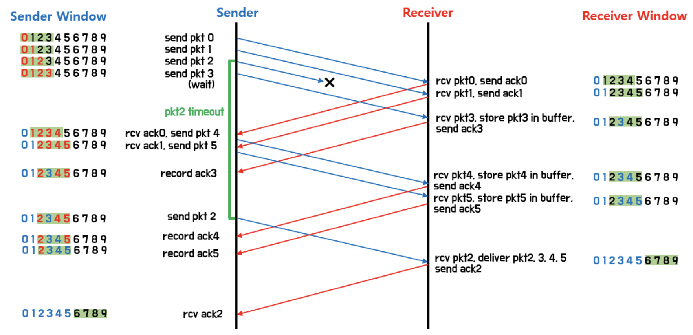
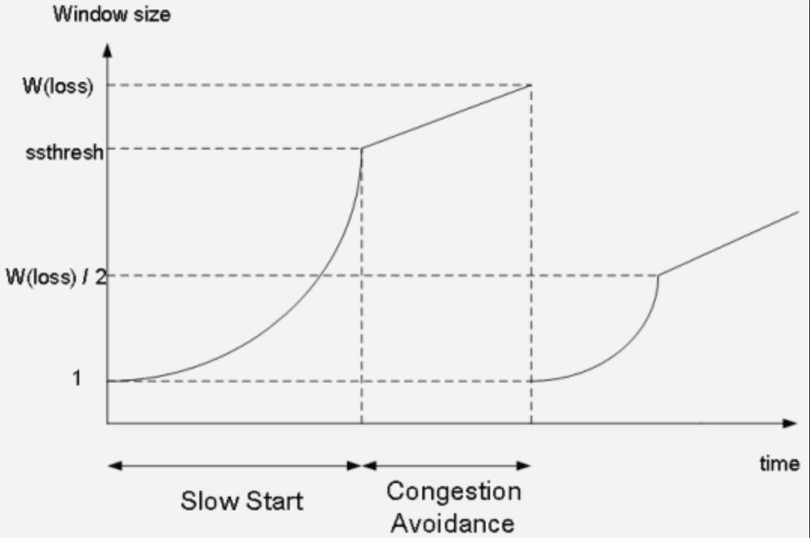

# TCP/IP 혼잡제어, 흐름제어

### 전송 전체 과정

---

- Application layer : sender application layer가 socket에 data를 씀.
- Transport layer : data를 segment에 감싼다. 그리고 network layer에 넘겨줌.
- 그 후 receiving node로 전송이 됨. 이때, sender의 send buffer에 data를 저장하고, receiver는 receive buffer에 data를 저장함.
- application에서 준비가 되면 이 buffer에 있는 것을 읽기 시작함.
- 따라서 flow control의 핵심은 이 receiver buffer가 넘치지 않게 하는 것임.
- 따라서 receiver는 RWND(Receive WiNDow) : receive buffer의 남은 공간을 홍보함

# 흐름제어 (Flow Control)

---

<aside>
💡 송 수신 측 사이의 패킷 수를 제어하는 기능

</aside>

- 수신측이 송신측보다 데이터 처리 속도가 빠르면 문제가 없지만, **송신측의 속도가 빠를 경우** 문제가 생김
- 수신측에서 제한된 저장 용량을 초과한 이후 도착하는 데이터는 손실될 수 있으며, 만약 손실된다면 불필요한 응답과 데이터 전송이 송/수신 측 간에 빈번이 발생
- 이러한 위험을 줄이기 위해 송신 측의 데이터 전송량을 수신측에 따라 조절해야함

## Stop and Wait

---

<aside>
💡 **매번 전송한 패킷에 대해 확인 응답(ACK)를 받으면 다음 패킷을 전송하는 방법**.

</aside>

- 그러나 패킷을 하나씩 보내기 때문에 비효율적인 방법.
    
    
    

### 문제점

- 만약 서버에서 보낸 ACK이 유실되면 클라이언트는 무한히 대기해야함
- 또 클라이언트가 보낸 패킷이 유실되면 서버는 ACK을 보내지 않기 때문에 서로 무한히 대기해야함

## ARQ(Automatic Repeat Request)

---

- 타임아웃, 데이터의 시퀀스 번호, ACK의 시퀀스 번호를 이용
- 타임아웃은 세그먼트를 보낸 뒤 일정시간동안 ACK을 받지 못하면 중간에 패킷이 유실되었다고 판단하고 같은 세그먼트를 다시 재전송
- 시퀀스 번호는 세그먼트에 번호를 붙이고 서버는 해당 세그먼트를 받아 오류가 없으면 ACK에 전달받은 데이터의 시퀀스 번호 + 1 을 붙여 클라이언트에게 보냄
- 만약 오류가 발생한다면 NACK를 보냄
- 클라이언트는 타임아웃 이내에 ACK이 오면 ACK에 붙은 시퀀스 번호의 세그먼트를 전송하고, NACK이 오거나 세그먼트가 타임아웃까지 오지 않으면 같은 세그먼트를 재전송

### 문제점

- Stop and Wait는 송신자가 반드시 이전 패킷에 대한 ACK을 기다려야하기 때문에 성능이 좋지 않다.

## Sliding Window

---

<aside>
💡 수신 측에서 설정한 윈도우 크기만큼 송신 측에서 확인 응답(ACK) 없이 패킷을 전송할 수 있게 하여 데이터 흐름을 동적으로 조절하는 제어 기법

</aside>

### 목적

- 전송은 되었지만, ack를 받지 못한 byte 숫자를 파악하기 위해 사용하는 protocol

```
LastByteSent - LastByteAcked <= ReceivecWindowAdvertised

(마지막에 보내진 바이트 - 마지막에 확인된 바이트 <= 남아있는 공간) ==

(현재 공중에 떠있는 패킷 수 <= sliding window)
```

### 🪟 **Window 크기**

- 최초의 윈도우 크기는 호스트들의 '3 way handshaking'을 통해 수신 측 윈도우 크기로 설정하고 이후 수신 측의 버퍼에 남아있는 공간에 따라 변함
- 윈도우 크기는 수신 측에서 송신 측으로 확인 응답(ACK)을 보낼 때 TCP 헤더(window size)에 담아서 보냄
- 즉, 윈도우는 메모리 버퍼의 일정 영역.

### **🎯 동작 방식**

<aside>
💡 윈도우에 포함된 패킷을 계속 전송하고, 수신 측으로부터 확인 응답(ACK)이 오면 윈도우를 옆으로 옮겨 다음 패킷들을 전송

</aside>

예시)


- 최초로 수신자는 윈도우 사이즈를 7로 정한다.
- 송신자는 수신자의 확인 응답(ACK)을 받기 전까지 데이터를 보낸다.
- 수신자는 확인 응답(ACK)을 송신자에게 보내면, 슬라이딩 윈도우 사이즈을 충족할 수 있게끔 윈도우를 옆으로 옮긴다
- 이후 데이터를 다 받을 때까지 위 과정을 반복한다.

**재전송**

- 송신 측은 일정 시간 동안 수신 측으로부터 확인 응답(ACK)을 받지 못하면, 패킷을 재전송한다.
- 만약, 송신 측에서 재전송을 했는데 패킷이 소실된 경우가 아니라 수신 측의 버퍼에 남는 공간 없는 경우
    - 해결: 송신 측은 해결 응답(ACK)을 보내면서 남은 버퍼의 크기 (윈도우 크기)도 함께 보내 준다.

## GBN(Go-Back-N)

---

<aside>
💡 슬라이딩 윈도우 프로토콜 중 한 종류로, receiver 측에서 순서대로 받지 못한 패킷이 있다면 해당 패킷부터 다시 재전송 하는 방식

</aside>

- 송신측은 윈도우 안에 포함된 패킷들을 모두 전송하고, 만약 이미 받은 번호에 대한 ACK을 다시 받으면 무시
- 수신측은 송신측이 보내는 패킷들을 순서대로 받고, 만약 순서가 맞지 않게 앞 번호 패킷보다 뒷 번호 패킷을 먼저 받으면 해당 패킷은 버리고 마지막으로 받는데 성공한 패킷의 번호를 ACK으로 응답
- 수신측은 자신이 전송한 패킷에 대한 ACK을 일정시간동안 받지 못하면 타임아웃을 발생시키고 마지막으로 성공한 패킷의 다음 패킷부터 모두 다시 보냄

- receiver 측은 정상적으로 받지 못한 패킷이 있을경우, 해당 패킷이 올때까지 다른 패킷들을 받아도 받지 못한 패킷의 직전 패킷에 대한 ACK을 보낸다. 이러한 성질 때문에 **cumulative ACK**이라고도 함

— 예를 들어 패킷 1,2,3,4,5를 전송했는데 receiver 측에서 1,2,4,5를 받았다면, receiver 측은 ACK 1,2,2,2를 보낸다.

— sender 입장에서 ACK 1,2,3이 안오고 ACK 4만 오더라도 receiver가 패킷 1,2,3,4를 정상적으로 받았다는 것을 알 수 있다. (ACK이 오다가 손실된 경우)

- sender는 전송한 패킷 중, ack 되지 않은 가장 최신의 패킷에 대해 타이머를 계산

- 만약 해당 타이머가 만료될 때까지 ack이 안오면, window 내의 unack된 모든 패킷을 재전송

- 만약 해당 타이머가 만료되기 전에 ack이 오면, 다음 ack 되지 않은 가장 최신의 패킷에 대해 타이머를 계산

- 구조가 간단하고 구현이 단순하며, 따로 패킷을 보관할 버퍼가 필요 없음
- Sender의 Window Size는 사용되는 sequence number보다 무조건 커야함

- 만약 Window size가 같거나 작으면, receiver가 오해할 수 있는 상황이 생긴다. (ack이 모두 소실된 경우)


### 문제점

- 송신한 패킷이 유실되거나 ACK이 유실되어서 ACK을 받지 못하면 모든 패킷을 다시 재전송하는 문제 발생

## SR(Selective Repeat)

---

<aside>
💡 receiver 측에서 받은 각각의 패킷들에 대해 ACK을 보내는 방식

</aside>

- receiver 측은 ACK이 순서대로 오든 말든, 그냥 받은 패킷에 대한 ACK을 보냄

- 예를 들어 패킷 1,2,3,4,5를 전송했는데 receiver 측에서 1,2,4,5가 왔다면, receiver 측은 ACK 1,2,4,5를 보낸다.

- sender는 ACK을 받지 못한 모든 패킷에 대해 타이머를 계산한다.

- 만약 각각의 타이머가 만료될 때까지 ack이 안오면, 각각 패킷을 재전송한다.

- 따로 받은 패킷을 보관할 버퍼가 필요하다.

- 올바르지 않은 패킷이 와도 일단 저장해놓고, 나중에 부족한 부분이 채워지면 함께 올리는 구조이기 때문.

- 사용되는 sequence number는 Sender의 Window Size와 Receiver의 Widow Size 크기의 합보다 무조건 크거나 같아야함

- 만약 sequence number의 크기가 더 작다면, receiver가 오해할 수 있는 상황이 생김



- 그림 설명
    
    위의 그림은 `파이프라이닝`이 적용된 TCP 전송 프로토콜에서의 데이터가 어떻게 전송되는지를 보여줍니다. 송신자는 확인응답을 기다리지 않고 여러 패킷을 전송하는 것을 보면 파이프라이닝 방식인지, 전송 후 대기 방식인지 알 수 있습니다. 또한 `pkt2`가 재전송 될 때, 이후의 모든 패킷을 재전송하지 않는 것을 보아 `Selective Repeat` 방식임을 알 수 있습니다.
    
    그림을 자세히 보면, `pkt0`과 `pkt1`은 정상적으로 전송되어 수신자 측에서 `ACK0`, `ACK1`으로 응답을 한 것을 알 수 있습니다. 동시에 이 패킷들은 상위계층으로 전달됩니다. 하지만 `pkt2`는 패킷 로스가 발생했음을 알 수 있습니다. 따라서 수신자가 순서에 맞는 패킷 받지 못하여 `pkt2`에 해당하는 윈도우 베이스는 다음 패킷으로 옮겨지지 못합니다. 그 후, 수신자가 다음에 받은 `pkt3`은 순서에 맞지 않기 때문에 우선 이를 버퍼에 저장하고 `ACK3`으로 응답합니다.
    
    이후, 송신자는 수신자의 ACK을 받게 됩니다. 따라서 송신자의 윈도우 베이스는 다음 패킷으로 이동하게 됩니다. 그리고 다음 `pkt4`, `pkt5`를 전송합니다. 하지만 `ACK3`을 받았을 때에는 아직 `ACK2`가 도착하지 못했기 때문에 버퍼에 기록합니다. 마찬가지로 윈도우 베이스는 다음 패킷으로 옮겨지지 못합니다.
    
    이제 수신자에서 `pkt4`와 `pkt5`를 받게 되어 ACK을 보내지만, 여전히 `pkt2`를 받지 못했기 때문에 버퍼에 기록하고 윈도우 베이스는 옮겨지지 못합니다.
    
    마침내 송신자 측에서 `pkt2` 타임아웃이 발생하고 이를 재전송합니다. 동시에 `ACK4`와 `ACK5`는 버퍼에 기록합니다.
    
    수신자는 `pkt2`를 무사히 받으면, `pkt2`에 대한 ACK을 전송하고 `pkt2`와 버퍼에 저장된 값들이 모두 상위계층으로 전달됩니다. 그리고 수신자 윈도우에 있는 패킷 수만큼의 크기로 윈도우 베이스는 다음 패킷으로 옮겨집니다.
    
- ACK2가 온 다음?
    
    송신자는 마침내 `ACK2`를 수신하게 됩니다. 윈도우에 있는 모든 패킷에 대한 ACK을 무사히 받았기 때문에 송신자는 윈도우 베이스를 패킷의 수만큼의 크기로 다음 패킷으로 옮기게 됩니다. 여기서 순서 번호는 순환방식이기 때문에 순서 번호 허용치의 최댓값이 될 경우, 다시 순서 번호의 최솟값부터 윈도우가 이어지게 됩니다.
    
    이후, 송신자와 수신자의 윈도우가 처음 상태처럼 갱신되었으므로, 송신자와 수신자는 다시 데이터 통신이 가능합니다. 송신자는 맨 처음 데이터를 전송할 때와 마찬가지로 전송할 데이터가 있을 경우, 변경된 윈도우의 패킷을 순차적으로 수신자에게 전송할 수 있습니다. 이러한 과정이 반복되어 파이프라이닝 Selective Repeat 방식의 TCP의 신뢰성 있는 통신이 이루어지게 됩니다.
    
    
    
    위에서 설명했듯이, pkt2에 대한 ACK이 수신되어 그 동안 버퍼에 저장 되어있던 패킷에 대한 ACK들을 응답합니다. 이와 동시에 윈도우 베이스는 그 만큼 옮겨지게 됩니다. 송신자의 윈도우와 수신자의 윈도우 베이스가 새로운 패킷을 가지며 송신자와 수신자의 베이스는 서로 같은 값을 가지게 됩니다.
    

- selective repeat 딜레마와 극복방법

[네트워크 - Selective Repeat의 동작과 마주하는 딜레마와 극복](https://hwanine.github.io/network/SelectiveRepeat/)

⇒ 결론

Selective Repeat 딜레마를 해결하기 위해서는 순서번호 허용치가 윈도우 사이즈보다 크면 된다는 것을 알 수 있었습니다. 하지만 단순히 사이즈만 크면 해결되는 것은 아닙니다. 윈도우 사이즈의 크기에 따라 어느 정도의 비율보다 커야 합니다. 그 비율로 정의한 순서번호 허용치 값의 범위는 다음과 같습니다.

- 순서번호 허용치 값 >= 2 * 윈도우 사이즈

# 혼잡제어(Congestion Control)

---

<aside>
💡 네트워크 내의 패킷 수를 조절하여 네트워크의 오버플로우를 방지하는 기능

</aside>

- 데이터의 양이 라우터가 처리할 수 있는 양을 초과하면 초과된 데이터는 라우터가 처리하지 못함
- 이때 송신 측에서는 라우터가 처리하지 못한 데이터를 손실 데이터로 간주하고 계속 재전송 → 네트워크 혼잡
- 이런 상황은 송신 측의 전송 속도를 적절히 조절하여 예방할 수 있는데, 이것을 혼잡 제어라고 한다.

— 혼잡: 네트워크 내 패킷의 수가 과도하게 증가하는 현상

— 흐름제어가 송신측과 수신측 사이의 전송속도를 다루는데 반해, 혼잡제어는 호스트와 라우터를 포함한 보다 넓은 관점에서 전송 문제를 다루게 된다.

## AIMD(Additive Increase/Multicative Decrease)

---


- 직역: 합 증가/곱 감소 방식
- 처음에 패킷을 하나씩 보내고 문제 없이 도착하면 윈도우의 크기를 1씩 증가시켜가며 전송
    
    만약, 전송에 실패하거나 일정 시간을 넘으면 윈도우 크기를 반으로 줄임(패킷의 보내는 속도를 반으로 줄임)
    
- 공평한 방식으로, 여러 호스트가 한 네트워크를 공유하고 있으면 나중에 진입하는 쪽이 처음에는 불리하지만, 시간이 흐르면 평형상태로 수렴하게 되는 특징 존재

**👎 단점**

- 초기에 네트워크의 높은 대역폭을 사용하지 못함
- 윈도우 크기를 너무 조금씩 늘리기 때문에 네트워크의 모든 대역을 활용하여 제대로 된 속도로 통신하기까지 시간이 오래 걸린다
- 즉, 네트워크가 혼잡해지는 상황을 미리 감지하지 못하고 네트워크가 혼잡해지고 난 후 대역폭을 줄이는 방식

## Slow Start(느린 시작)

---

<aside>
💡 AIMD와 마찬가지로 패킷을 하나씩 보내면서 시작하고, 윈도우의 크기를 1, 2, 4, 8, ...과 같이 지수적으로 증가시키다가 혼잡이 감지되면 윈도우 크기를 1로 줄이는 방식

</aside>

- 전송 속도는 AIMD와 달리 지수 함수 꼴로 증가
- 보낸 데이터의 ACK가 도착할 때마다 윈도우 크기를 증가시키기 때문에 처음에는 윈도우 크기가 조금 느리게 증가할지라도, 시간이 가면 갈수록 윈도우 크기가 점점 빠르게 증가한다는 장점 존재
- 처음에는 네트워크의 수용량을 예상할 수 있는 정보가 없지만, 한번 혼잡 현상이 발생하고 나면 네트워크의 수용량을 어느 정도 예상할 수 있음

## Fast Retransmit(빠른 재전송)

---

<aside>
💡 TCP의 혼잡 조절에 추가된 정책으로 패킷을 받는 쪽에서 먼저 도착해야할 패킷이 도착하지 않고 다음 패킷이 도착한 경우에도 ACK 패킷을 보냄

</aside>

- 수신자는 세그먼트로 분할된 내용들이 순서대로 도착하지 않는 경우 발생 가능
- 이런 상황이 발생했을 때 수신 측에서는 순서대로 잘 도착한 마지막 패킷의 다음 순번을 ACK 패킷에 실어서 보내고, 이런 중복 ACK를 3개 받으면 재전송이 이루어짐
- 송신 측은 자신이 설정한 타임 아웃 시간이 지나지 않았어도 바로 해당 패킷을 재전송할 수 있기 때문에 보다 빠른 재전송률을 유지할 수 있음
- 약간 혼잡한 상황이 일어난 것이므로 혼잡을 감지하고 window size를 줄이게됨

## Fast Recovery(빠른 회복)

---

<aside>
💡 빠른 회복은 혼잡한 상태가 되면 윈도우 크기를 1로 줄이지 않고 반으로 줄이고 선형 증가시키는 방법

</aside>

- 혼잡 상황을 한 번 겪고나서부터는 AIMD 방식으로 동작함

# 혼잡 제어 정책

---

- TCP에는 Tahoe, Reno, New Reno, Cubic, Ealstic-TCP까지 다양한 혼잡 제어 정책이 존재한다.
- 이러한 혼잡 제어 정책들은 공통적으로 **혼잡이 발생하면 윈도우 크기를 줄이거나, 혹은 증가시키지 않으며 혼잡을 회피한다**라는 전제를 깔고 있다.

- 대표적: Tahoe, Reno
    - 둘 다 처음에는 Slow Start방식을 사용하다가 네트워크가 혼잡하다고 느껴졌을 때 AIMD 방식으로 전환하는 방법 사용
        
        
        
        - x축: 시간, y축: 혼잡 윈도우인 Tahoe, Reno를 비교하는 그래프

## 용어 정리

---

### Timeout

- 여러 가지 요인으로 인해 송신 측이 보낸 데이터 자체가 유실되었거나, 수신 측이 응답으로 보낸 ACK가 유실되는 경우

### 3 ACK Duplicate

- **빠른 재전송**
    - 패킷을 받는 수신자 입장에서는 세그먼트로 분할된 내용들이 순서대로 도착하지 않는 경우가 생길 수 있다. 이런 상황이 발생했을 때 수신 측에서는 순서대로 잘 도착한 마지막 패킷의 다음 순번을 ACK 패킷에 실어서 보낸다. 그리고 이런 중복 ACK 3개를 받으면 문제가 있다고 판단하여 해당 패킷을 송신 측이 재전송한다.



### Slow Start 임계점(ssthresh)

- Tahoe와 Reno를 비교하는 그래프를 보면 `Threshold(임계점)`이라는 단어가 등장 → 이 임계점은 `Slow Start Threshold(ssthresh)`를 뜻하는 것으로, 여기까지만 Slow Start를 사용하겠다는 의미를 가짐
    
    
    
- Slow Start를 사용하며 윈도우 크기를 지수적으로 증가시키다보면 어느 순간부터는 윈도우 크기가 기하급수적으로 늘어나서 제어하기가 힘듦
- 또한, 네트워크의 혼잡이 예상되는 상황에서 빠르게 값을 증가시키기 보다는 조금씩 증가시키는 편이 훨씬 안전함
- 쉽게 생각해서 현재 윈도우 크기가 10이고, 현재 네트워크에 남은 공간이 15라고 할 때, Slow Start 방식을 사용하면 윈도우 크기가 20이 되지만 AIMD를 사용하면 앞으로 5번은 윈도우 크기를 천천히 늘릴 수 있다.
- 따라서, 특정한 임계점을 정해 놓고, 그 임계점이 넘어가면 AIMD 방식을 사용하여 선형적으로 윈도우를 증가시킨다. 이때, 이 임계점을 Slow Start Threshold (ssthresh)라고 부른다.

## Tahoe (타호라고 읽으면 된대요😆)

---

<aside>
💡 처음에는 Slow Start를 사용하여 자신의 윈도우 크기를 지수적으로 빠르게 증가시키다가 ssthresh를 만난 이후부터는 AIMD을 사용하여 선형적으로 윈도우 크기를 증가시키는 방법. ACK Duplicated나 Timeout이 발생하면 네트워크에 혼잡이 발생했다고 판단하고, ssthresh와 자신의 윈도우 크기를 수정함

</aside>


- 청록색 선은 송신 측의 혼잡 윈도우 크기, 굵은 검정선은 ssthresh 값
- 송신 측의 혼잡 윈도우 크기는 8로 초기화, ssthresh는 4로 설정
- 송신 측은 임계점을 만나기 전까지 Slow Start 방식을 사용하여 자신의 윈도우 크기를 증가시키다가 ssthresh를 넘어선 이후부터는 선형적으로 증가시킴
- 그래프를 보면 처음 혼잡 상황이 발생한 상태의 혼잡 윈도우 크기는 6이며, 그에 따라 ssthresh를 3으로 변경하고, 자신의 혼잡 윈도우 크기를 1로 줄임. 이후 다시 Slow Start로 시작하여 임계점에 도달하면 AIMD를 시작한다.
- 이 정책은 한 번 혼잡 상황이 발생한 지점을 기억하고 그 지점이 가까워지지 않도록 합리적으로 조절하는 방법

👎 **단점**

- 초반의 Slow Start 구간에 윈도우 크기를 늘릴 때 오래 걸림
- 혼잡 상황이 발생했을 때 다시 윈도우 크기를 1에서부터 시작해야함

## Reno

---

<aside>
💡 TCP Tahoe 이후에 나온 정책으로, Tahoe와 마찬가지로 Slow Start로 시작하여 임계점을 넘어서면 AIMD을 사용. Tahoe와는 다르게 **3 ACK Duplicated와 Timeout 혼잡 상황을 구분함**

</aside>


- 3개의 중복 ACK가 발생했을 때, 윈도우 크기를 1로 줄이는 것이 아니라 AIMD처럼 반으로 줄이고 sshthresh를 줄어든 윈도우 값으로 정하게 된다. ⇒ **빠른 회복**
- 그러나 Timeout에 의해서 데이터가 손실되면 Tahoe와 마찬가지로 윈도우 크기를 바로 1로 줄여버리고 Slow Start를 진행. 이때 ssthresh를 변경하지는 않음
- 즉, Reno는 ACK 중복은 Timeout에 비해 그리 큰 혼잡이 아니라고 가정하고 혼잡 윈도우 크기를 1로 줄이지도 않는다는 점에서 혼잡 상황의 우선 순위를 둔 정책이라 볼 수 있음

## ****혼잡제어와 흐름제어의 차이****

---

- 혼잡제어(Congestion Control)는 네트워크에 패킷이 과도하게 들어오는 것을 막음
    
    송신자가 데이터를 보내는 속도와 네트워크가 데이터를 처리하는 속도의 차이가 있어 문제가 발생한다.
    
- 흐름제어(Flow Control)는 송신 호스트의 속도가 수신 호스트의 처리 속도보다 빨라 수신 호스트의 라우터 큐를 초과하게 되는 상황을 제어하는 것을 말함
- 더 간단하게 설명하면 혼잡제어는 네트워크가 혼잡해지지 않도록 하는 것이고, 흐름제어는 두 호스트간의 네트워크 처리 속도를 맞춰주는 것을 의미함

### Reference

[[네트워크] TCP/IP 흐름 제어 & 혼잡 제어](https://steady-coding.tistory.com/507)

[TCP/IP (흐름제어/혼잡제어) | 👨🏻‍💻 Tech Interview](https://gyoogle.dev/blog/computer-science/network/%ED%9D%90%EB%A6%84%EC%A0%9C%EC%96%B4%20&%20%ED%98%BC%EC%9E%A1%EC%A0%9C%EC%96%B4.html)

[Getting-Ready-For-Interview/02_Transport.md at main · jeonyeohun/Getting-Ready-For-Interview](https://github.com/jeonyeohun/Getting-Ready-For-Interview/blob/main/Network/02_Transport.md)

[패킷 pipelining (go-Back-N, selective repeat)](https://ddongwon.tistory.com/81)

[사이 좋게 네트워크를 나눠 쓰는 방법, TCP의 혼잡 제어](https://evan-moon.github.io/2019/11/26/tcp-congestion-control/)

ㄴ추천하는 글