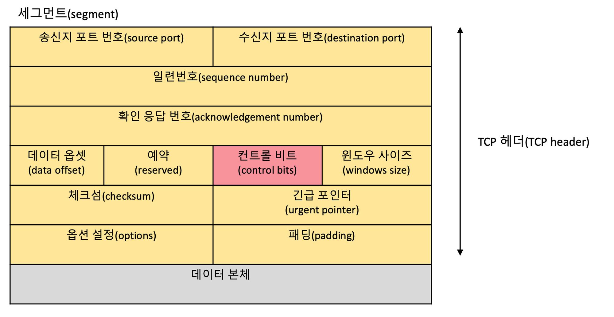
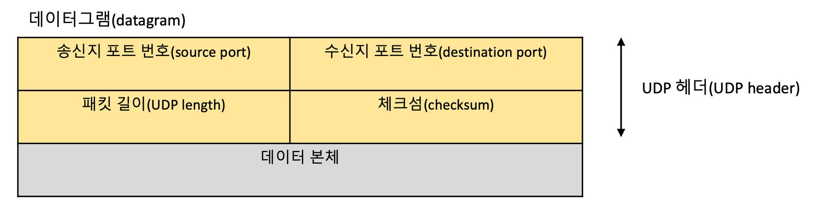

# TCP vs UDP

모두 **전송 계층**에서 사용하는 프로토콜!!

# **TCP(Transmission Control Protocol)**

## TCP

<aside>
💡 인터넷 상에서 데이터를 메세지의 형태로 보내기 위해 IP와 함께 사용하는 프로토콜

</aside>

- TCP와 IP를 함께 사용하는데, IP가 데이터의 배달을 처리한다면 TCP는 패킷을 추적 및 관리함
- 패킷
    - 인터넷 내에서 데이터를 보내기 위한 **경로배정(라우팅)**을 효율적으로 하기 위해서**데이터**를 **여러 개의 조각들**로 나누어 전송을 하는데 이때, 이 조각을 **패킷**이라고 함
- 패킷 추적 및 관리 방법
    - 데이터를 패킷 단위로 나누어 같은 목적지(IP 계층)으로 전송

## TCP 특징

- TCP는 **신뢰성있는 데이터 전송**을 지원하는 **연결지향형 프로토콜**
- 데이터 전송에 신뢰성을 더하기 위해 데이터를 **세그먼트(segment)**라는 단위로 분할하고, 전송 속도를 조정하며, 데이터가 제대로 전달되지 않았을 경우 재전송을 함
- **흐름 제어와 혼잡 제어를 지원**하며 **데이터의 순서를 보장**함
- TCP는 가상 회선 방식을 제공 (Handshaking)
    - 송신 측과 수신 측을 연결하여 패킷을 전송하기 위한 **논리적 경로**를 배정
    - 참고(가상회선 vs 데이터그램 교환 방식)
        
        [[네트워크] 가상회선 패킷 교환 vs 데이터그램 패킷 교환](https://woovictory.github.io/2018/12/28/Network-Packet-Switching-Method/)
        
- **3-way handshaking** 과정을 통해 **연결** 후 통신 시작, **4-way handshaking** 과정을 통해 **연결해제**
- TCP의 모든 연결은 전이중(full-duplex), 점대점(point to point) 방식 → multitasking, broadcasting 지원 X
- 한 메시지가 여러 개의 패킷으로 나누어진 경우 각 패킷들은 서로 다른 경로를 통해 전달될 수 있으며, 그것들은 최종 목적지에서 재조립됨
- TCP에서 사용하는 포트번호: 0 ~ 65535(=2^16)
    
    ```java
    0번 ~ 1023번: 잘 알려진 포트 (well-known port)
    1024번 ~ 49151번: 등록된 포트 (registered port)
    49152번 ~ 65535번: 동적 포트 (dynamic port)
    
    - 0: 공식적으로 TCP/IP 네트워킹에서 예약된 포트
    		 하지만, 네트워크 프로그래밍, 특히 유닉스 소켓 프로그래밍에서 특별한 의미 가짐 -> 시스템 할당(동적) 포트 지정
    ```
    
- **연속성보다 신뢰성있는 전송이 중요할 때 사용하는 프로토콜**
    - 웹이나 이메일, FTP와 같이 정확한 데이터 전달이 필요한 통신에 사용한다.
- UDP에 비해 속도가 느림

## **TCP 헤더의 구조**

TCP의 세그먼트는 데이터 본체에 TCP 헤더가 붙은 형태로 구성된다.



- 일련번호(sequence number) : 송신한 바이트 수
- 확인 응답 번호(acknowledgement number) : 수신한 바이트 수
- 데이터 옵셋(data offset) : TCP 헤더의 길이
- 윈도우 사이즈(windows size) : 한 번에 수신할 수 있는 데이터 크기
- 체크섬(checksum) : 데이터가 훼손되었는지 확인하기 위한 정보

### **흐름 제어와 혼잡 제어**

[TCP/IP 혼잡제어, 흐름제어](https://www.notion.so/TCP-IP-53c3581d86ba4061b2da79ac865d99a0) 

- 흐름 제어(flow control)
    - 흐름 제어는 송신 측(호스트)과 수신 측(호스트)의 데이터 처리 속도 차이를 조절하기 위한 기법
- 혼잡 제어(congestion control)
    - 혼잡 제어는 네트워크 내의 패킷 수가 넘치게 증가하지 않도록 방지하기 위한 기법

# **UDP(User Datagram Protocol)**

## **UDP**

<aside>
💡 데이터를 데이터그램 단위로 처리하는 프로토콜

</aside>

## **UDP의 특징**

- **비연결형 프로토콜**
- **신뢰성이 낮음**
- 연결을 위해 할당되는 논리적인 경로가 **없음**
    
    → 각각의 패킷은 다른 경로로 전송, 각 패킷은 독립적인 관계를 지니고, 독립적으로 처리하게 됨
    
- 통신 과정에서 **데이터의 손실이 발생할 수 있음**
    - VoIP와 같은 음성 서비스나 동영상 스트리밍 서비스는 일부 데이터가 누락되거나 왜곡되더라도 큰 문제가 없기 때문에 UDP를 주로 사용
- UDP는 TCP와는 달리 메시지를 패킷(데이터그램)으로 나누지만 최종 목적지에서 재조립하지 않음
- UDP헤더의 CheckSum 필드를 통해 최소한의 오류만 검출
- **신뢰성보단 연속성이 중요한 서비스(성능이 중요한 서비스)에 사용하는 프로토콜**
- 흐름제어, 혼잡제어 없음
    - 흐름제어가 없어서 패킷이 제대로 전송되었는지, 오류가 없는지 확인 불가
- RTP(Real-Time Protocol), Multicast, 멀티미디어, VoIP, DNS에서 사용
    - RTP : 재전송할 경우 데이터가 섞이게 되므로 UDP 사용
    - DNS : TCP처럼 Session을 맺고 통신을 한다면 속도도 느리고, 서버 리소스도 엄청나게 소모되므로 UDP 사용
- TCP보다 속도가 빠름

## **UDP 헤더 구조**

UDP에서는 패킷에 해당하는 것을 데이터그램 이라고 부른다.



- 패킷 길이(UDP length) : 헤더 길이와 데이터 길이의 합계
- 체크섬(checksum) : 데이터가 훼손되었는지 확인하기 위한 정보

### **브로드캐스트 & 멀티캐스트**

TCP에는 없는 기능으로 UDP에는 하나의 패킷을 여러 수신지에 전달하는 **브로드캐스트(broadcast)**와 **멀티캐스트(multicast)** 존재

- 브로드캐스트(broadcast)
    - local LAN 상에 붙어있는 모든 네트워크 장비들에게 보내는 통신
    - 통신의 대상이 특정한 한 네트워크가 아니라, 네트워크 안의 모든 장비들에게 통신을 하는 방식
- 멀티캐스트(multicast)
    - 보내고자 하는 정보를 그룹 내의 일정 네트워크 장비들에게만 한번에 보낼 수 있는 통신

# **TCP vs UDP**

| --- | --- |
| 연결지향형 프로토콜 | 비연결지향성 프로토콜 |
| 바이트 스트림을 통한 연결 | 메세지 스트림을 통한 연결 |
| 혼잡제어, 흐름제어 지원 O | 혼잡제어, 흐름제어 지원 X |
| 순서 보장, 상대적으로 느림 | 순서 보장되지 않음, 상대적으로 빠름 |
| 신뢰성 있는 데이터 전송, 안정적 | 데이터 전송을 보장하지 않음 |
| 패킷: 세그먼트 | 패킷: 데이터그램 |
| HTTP, 전자우편, 파일 전송에서 사용 | DNS, Broadcasting에 사용 |

### Reference

[Interview_Question_for_Beginner/Network at master · JaeYeopHan/Interview_Question_for_Beginner](https://github.com/JaeYeopHan/Interview_Question_for_Beginner/tree/master/Network#tcp%EC%99%80-udp%EC%9D%98-%EB%B9%84%EA%B5%90)

[Tech-Stack/TCP_and_UDP.md at master · HyeminNoh/Tech-Stack](https://github.com/HyeminNoh/Tech-Stack/blob/master/docs/Network/TCP_and_UDP.md)

[TCP와 UDP 그리고 TCP/IP](https://goodgid.github.io/TCP-UDP/)

[[TCP/UDP] TCP와 UDP의 특징과 차이](https://mangkyu.tistory.com/15)