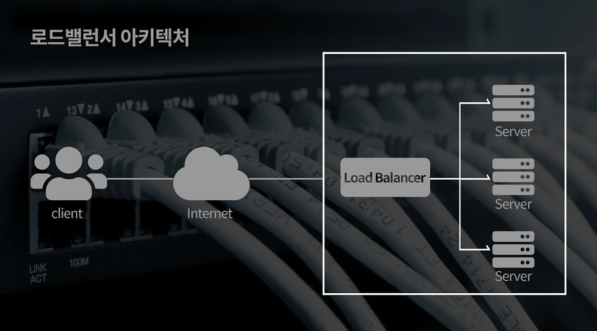
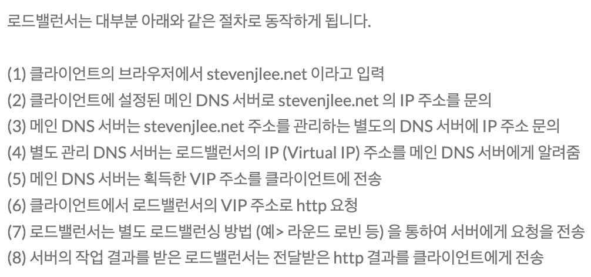
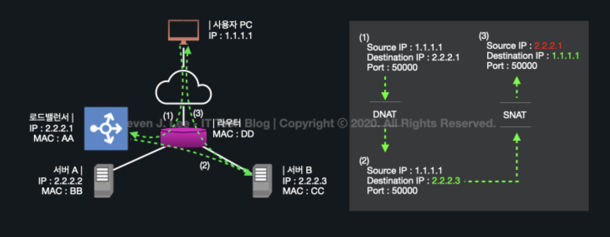
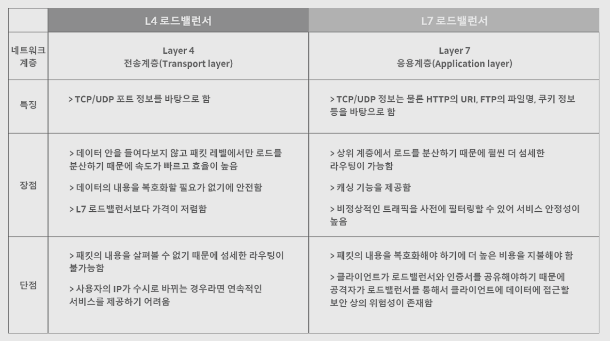
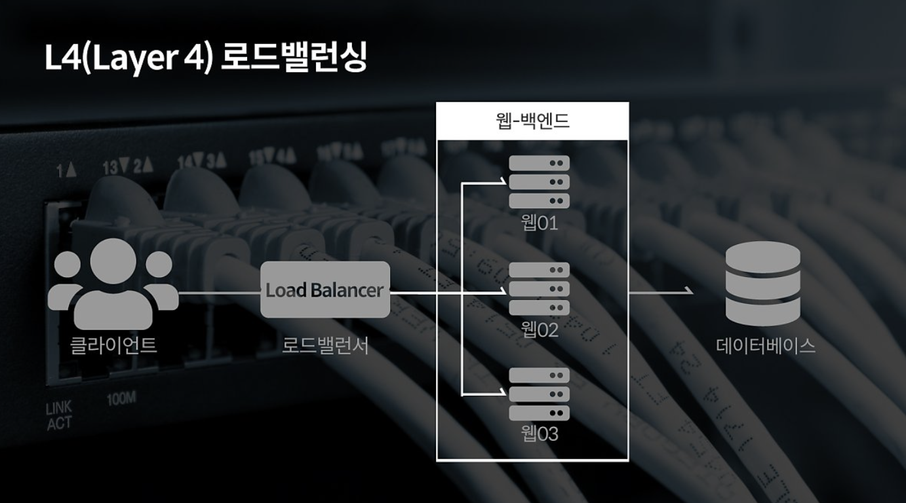
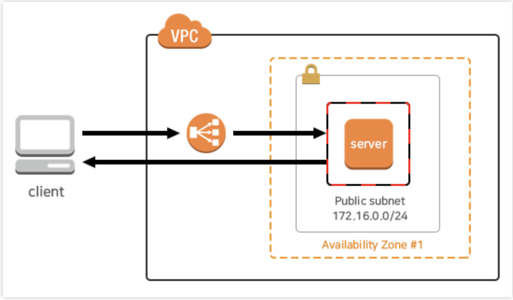
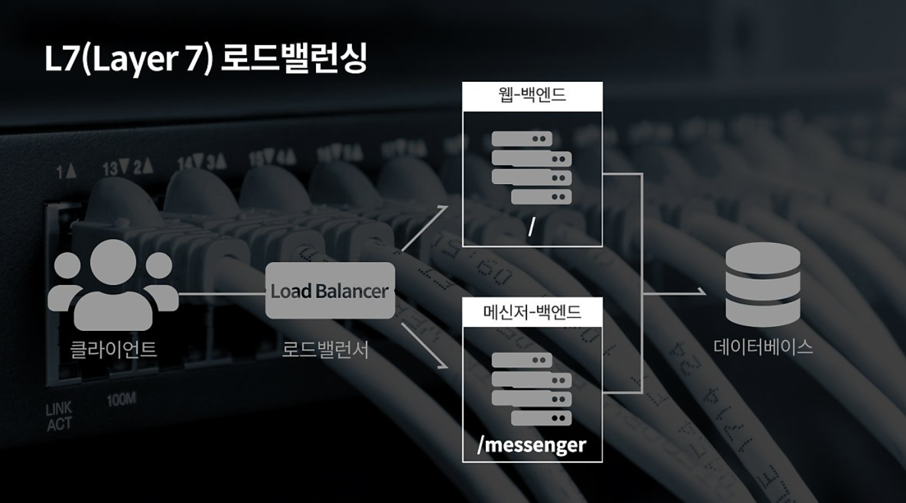
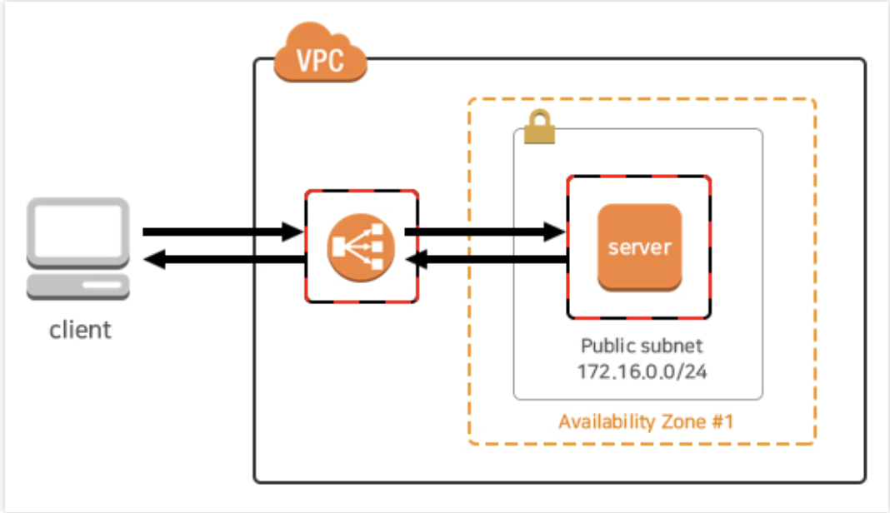

# 로드 밸런싱(Load Balancing)

# 로드 밸런싱

---

<aside>
💡 서버가 처리해야 할 업무 혹은 요청(Load)을 여러 대의 서버로 나누어(Balancing) 처리하는 것

</aside>

- 한 대의 서버로 부하가 집중되지 않도록 트래픽을 관리해 각각의 서버가 최적의 퍼포먼스를 보일 수 있도록 하는 것이 목적
- 서비스의 규모가 커지고, 이용자 수가 늘어났을 때 원활한 서비스 동작을 위한 대처방법
    - Scale-up : 기존의 서버 성능 확장
        - ex) CPU i3 → i7
    - **Scale-out**: 기존의 서버와 동일하거나 낮은 성능의 서버를 증설 ⇒ **load balancing 필요**
        - ex) CPU i3 여러대 운영

### 로드 밸런서(Load Balancer)

---

- 애플리케이션 트래픽을 Amazon EC2 인스턴스, 컨테이너, IP 주소, Lambda 함수, 가상 어플라이언스와 같은 여러 대상에 자동으로 분산시켜 안정적인 AWS서버 환경을 운용하는데에 도움을 주는 서비스
    
    ⇒ **ELB(Elastic Load Balancing)**: 시스템에 가해지는 부하를 여러대의 시스템으로 분산해서 규모잇는 시스템을 만들 수 있도록 해주는 단일 진입점
    
- 특징
    - 트래픽 분산
    - 자동 확장
    - 인스턴스의 상태를 자동 감지해서 오류가 있는 시스템은 배제
    - 사용자 세션을 특정 인스턴스에 고정
    - SSL 암호화 지원
    - SSL의 경유지로 ELB를 사용하는 경우에 SSL 처리에 따른 부하를 ELB가 수용하게 된다.
    - IPv4, IPv6 지원
    - CloudWatch를 통해서 모니터링
    - 사용한 시간과 통과한 트래픽에 따라서 종량제로 과금
- 종류
    - **Classic Load Balancer (CLB)**
        - CLB는 가장 오래된 로드밸런서로 ELB의 가장 기본적인 형태
        - 현재는 잘 쓰이지 않는 추세
        - L4 계층부터 L7계층까지 로드밸런싱이 가능
        - TCP, SSL, HTTP, HTTPS 등 다양한 프로토콜을 수용할 수 있고, Sticky Session 의 기능도 제공
        - 상태 확인은 TCP 혹은 HTTP 기반으로 이루어지며, 로드 밸런서, 즉 클래식 로드 밸런서로부터 고정 host name을 부여 받음
        - 하나의 URL만 가질 수 있음
    - **Network Load Balancer (NLB)**
        - L4계층 (Network Layer)에서 작동
        - TCP/UDP 트래픽을 로드밸런싱하여 내부 인스턴스로 전달
        - TCP/UDP 서버를 구축할 때 NLB는 굉장히 낮은 지연시간으로 최적의 성능을 보여줌
        - 로드 밸런서에 대한 고정 IP 주소를 지원
    - **Application Load Balancer (ALB)**
        - L7계층 (Application Layer)에서 작동
        - HTTP/HTTPS 트래픽을 처리하는 로드밸런싱에 최적화 되어있음
        - ALB는 Path-based routing을 지원하여 ALB에 연결된 인스턴스들은 여러개의 URL과 path를 가질 수 있음
        - WebSocket 이나 HTTP/1.1 이상의 프로토콜 지원, 향상된 라우팅 정책 등의 기능으로 인해서 기존의 CLB 보다 많은 장점을 포함함
    - **Gateway Load Balancer (GWLB)**
        - 가장 최근의 로드 밸런서
        - 외부에서 유입되는 트래픽과 외부로 나가는 트래픽을 가상 어플라이언스로 라우팅 할 수 있도록 하는 서비스
        - 가상 어플라이언스의 간편한 배포, 확장성 및 고가용성 제공
        - 3rd-party를 이용해 방화벽을 구축하는 경우에 발생하는 운영 복잡도 증가 및 제약 사항에 대한 문제점들을 해결할 수 있음

# 로드밸런서 기본 동작 방식

---

# 로드 밸런싱 기본 기능

---

## Health Check(상태 확인)

---

<aside>
💡 서버들에 대한 주기적인 Health Check를 통해 서버들의 장애 여부를 판단 → 정상 동작 중인 서버로만 트래픽을 보냄

</aside>

- L3 체크: ICMP를 이용하여 **IP 주소가 통신 가능한 상태인지** 확인
    - **ICMP**: Internet Control Message Protocol.
        - 패킷 전송에 실패했을 때 에러가 났음을 알림과 동시에, 해결 가능한 힌트를 제공하는 메시징 프로토콜.
        - TCP/IP의 IP 계층에서 동작
- L4 체크: TCP 특성(3 Way Handshaking) 바탕으로 **각 포트 상태 체크**
- L7 체크: 어플리케이션 계층에서 체크. **실제 웹페이지에 통신으로 시도하여 이상 유무 파악**

## Tunneling(터널링)

---

<aside>
💡 데이터 스트림을 인터넷 상에서 가상의 파이프를 통해 전달시키는 기술.

</aside>

- 패킷 내에 터널링할 대상을 캡슐화시켜 목적지까지 전송
- **연결된 상호 간**에만 캡슐화된 패킷을 구별해 캡슐화를 해제하게 함

## NAT(Network Address Translation)

---

<aside>
💡 내부 네트워크에서 사용하는 사설 IP 주소와 로드밸런서 외부의 공인 IP 주소 간의 변환 역할

</aside>

- 로드밸런싱 관점에서는 여러 개의 호스트가 하나의 공인 IP 주소(VLAN or VIP)를 통해 접속하는 것이 주목적.
- **SNAT (Source Network Address Translation):** 내부에서 외부로 트래픽이 나가는 경우.
    - 내부 사설 IP 주소 → 외부 공인 IP 주소
    - ex) 집에서 사용하는 공유기
- **DNAT (Destination Network Address Translation)**: 외부에서 내부로 트래픽이 들어오는 경우.
    - 외부 공인 IP 주소 → 내부 사설 IP 주소
    

## DSR(Direct Server Routing)

---

<aside>
💡 서버에서 클라이언트로 트래픽이 되돌아가는 경우, 목적지를 클라이언트로 설정한 다음, 네트워크 장비나 **로드밸런서를 거치지 않고 바로 클라이언트를 찾아가는 방식**

</aside>

- 이 기능을 통해 로드밸런서 부하를 줄일 수 있음

# 로드 밸런싱 기법

---

## 라운드로빈 방식(Round Robin Method)

---

<aside>
💡 서버에 들어온 요청을 순서대로 돌아가며 배정하는 방식

</aside>

- 클라이언트의 요청을 순서대로 분배하기 때문에 여러 대의 서버가 동일한 스펙을 갖고 있고, 서버와의 연결(세션)이 오래 지속되지 않는 경우에 활용하기 적합

## 가중 라운드로빈 방식(Weighted Round Robin Method)

---

<aside>
💡 각각의 서버마다 가중치를 매기고 가중치가 높은 서버에 클라이언트 요청을 우선적으로 배분하는 방식

</aside>

- 주로 서버의 트래픽 처리 능력이 상이한 경우 사용되는 부하 분산 방식

## IP 해시 방식(IP Hash Method)

---

<aside>
💡 클라이언트의 IP 주소를 특정 서버로 매핑하여 요청을 처리하는 방식

</aside>

- 사용자의 IP를 해싱해 로드를 분배하기 때문에 사용자가 항상 동일한 서버로 연결되는 것을 보장

## 최소 연결 방식(Least Connection Method)

---

<aside>
💡 요청이 들어온 시점에 가장 적은 연결상태를 보이는 서버에 우선적으로 트래픽을 배분하는 방식

</aside>

- 자주 세션이 길어지거나, 서버에 분배된 트래픽들이 일정하지 않은 경우에 적합한 방식

## 최소 응답 시간 방식(Least Response Time Method)

---

<aside>
💡 서버의 현재 연결 상태와 응답 시간(Response Time)을 모두 고려하여 트래픽을 배분하는 방식

</aside>

- 응답 시간: 서버에 요청을 보내고 최초 응답을 받을 때까지 소요되는 시간
- 가장 적은 연결 상태와 가장 짧은 응답 시간을 보이는 서버에 우선적으로 로드를 배분하는 방식

# 로드 밸런싱 종류

---

### L2(Data Link Layer)

---

- Mac Address Load Balancing
- 예시 : Mac
    - 80–00–20–30–1C-47
- 브릿지, 허브 등
- 장점 : 구조가 간단, 신뢰성이 높다, 가격저렴, 성능이 좋다.
- 단점 : Broadcast 패킷에 의해 성능저하 발생, 라우팅 등 상위레이어 프로토콜 기반 스위칭 불가

### L3(Network Layer)

---

- IP Address Load Balancing
- 예시 : IP
    - 213.12.32.123
- L2 + Routing
- Router, ICMP 프로토콜, IP
- 장점: Broadcast 트래픽으로 전체 성능 저하 방지, 트레픽체크
- 단점: 특정 프로토콜을 이용해야 스위칭 가능

### L4(Transport Layer)

---

- Transport Layer(IP+Port) Load Balancing
- 예시: IP+Port
    - 213.12.32.123:80, 213.12.32.123:1024
- 장점 : Port기반 스위칭 지원, VIP를 이용하여 여러대를 한대로 묶어 부하분산
- 주로 Round Robin 방식 사용

(사실상 여기서부터가 LB..?)

### L7(Application Layer)

---

- Application Layer(사용자 Request) Load Balancing
- 예시 : IP+Port+패킷 내용
    - 213.12.32.123:80, 213.12.32.123:1024 + GET/ img/aaa.jpg
- HTTP, FTP, SMTP Protocol
- 비쌈

# L4 로드 밸런싱 vs L7 로드 밸런싱

---

- 로드 밸런싱에서 가장 많이 활용됨
- 모든 요청을 L4 or L7 로드 밸런서가 받아 서버들에게 적절히 나누어줌

## L4 로드 밸런싱

---

- 전송 계층(Layer 4) 프로토콜의 헤더를 부하 분산에 이용
- 네트워크 계층(IP, IPX)이나 전송 계층(TCP, UDP)의 정보(IP주소, 포트번호, MAC주소, 전송 프로토콜)를 바탕으로 로드를 분산
- IP 주소나 포트번호, MAC 주소, 전송 프로토콜에 따라 트래픽을 나누는 것이 가능함

👍 **장점**

---

- 패킷의 내용을 확인하지 않고 로드를 분산하므로 속도가 빠르고 효율이 높음.
- 데이터의 내용을 복호화할 필요가 없기에 안전함
- L7 로드밸런서보다 가격이 저렴함

**👎 단점**

---

- 패킷의 내용을 살펴볼 수 없으므로, 섬세한 라우팅 불가.
- 사용자의 IP가 수시로 바뀌는 경우라면, 연속적인 서비스를 제공하기 어려움.

### NLB(Network LoadBalancer)

---

- Client IP와 서버사이에 서버로 들어오는 트래픽은 Load Balancer를 통하고, 나가는 트래픽은 Client IP와 직접 통신
- NLB는 Security Group 적용이 되지 않아서 서버에 적용된 Security Group 에서 보안이 가능
- Client → Server에서 Access 제한 가능
- NLB는 할당한 Elastic IP 를 Static IP로 사용이 가능하여 DNS Name과 IP주소 모두 사용 가능
- Name Server 또는 Route 53에서 A Record 사용 가능

## L7 로드 밸런싱

---

- 애플케이션 계층(Layer 7, HTTP, FTP, SMTP)에서 로드를 분산
- HTTP 헤더, 쿠키 등과 같은 사용자의 요청을 기준으로 특정 서버에 트래픽을 분산하는 것이 가능
    - 패킷의 내용을 확인하고 그 내용에 따라 로드를 특정 서버에 분배하는 것이 가능
    - URL에 따라 부하를 분산시키거나, HTTP 헤더의 쿠키 값에 따라 부하를 분산하는 등 클라이언트의 요청을 보다 세분화해 서버에 전달 가능
    - **방식**
        - **URL 스위칭(URL Switching)** 방식 : 특정 하위 URL들은 특정 서버로 처리하는 방식.
            
            ex) '.../steven/image' => 이미지 처리 서버
            
             '.../steven/video' => 동영상 처리 서버
            
        - **컨텍스트 스위칭(Context Switching)** 방식 : 클라이언트가 요청한 특정 리소스에 대해 특정 서버로 연결 가능.
            
            ex) 이미지 파일에 대해서는 **확장자를 참조**하여, 별도로 구성된 이미지 파일이 있는 서버 or 스토리지로 직접 연결.
            
        - **쿠키 지속성(Persistence with Cookies)** : 쿠키 정보를 바탕으로 클라이언트가 연결했었던 동일한 서버에 계속 할당해 주는 방식. 특히, 사설 네트워크에 있던 클라이언트의 IP 주소가 공인 IP 주소로 치환되어 전송하는 방식을 지원.
            
            ex) X-Forwarded-For 헤더에 클라이언트 IP 주소를 별도로 기입
            
- 특정한 패턴을 지닌 바이러스를 감지해 네트워크를 보호할 수 있으며, DoS/DDoS와 같은 비정상적인 트래픽을 필터링할 수 있어 네트워크 보안 분야에서도 활용

👍 **장점**

---

- 상위 계층에서 로드를 분산하기 때문에 훨씬 더 섬세한 라우팅 가능.
- 캐싱(Cashing) 기능을 제공.
- 비정상적인 트래픽을 사전에 필터링할 수 있어 서비스 안정성 높음.

**👎 단점**

---

- L4 로드밸런서에 비해 비쌈.
- 패킷의 내용을 복호화하여야 하므로 더 높은 비용을 지불해야 함.
- 클라이언트가 로드밸런서와 인증서를 공유해야 하기 때문에, 공격자가 로드밸런서를 통해 클라이언트의 데이터에 접근할 수 있는 보안상의 위험성 존재.

### ALB(Application LoadBalancer)

---

- Reverse Proxy 대로 Client IP와 서버사이에 들어오고 나가는 트래픽이 모두 Load Balancer 와 통신합니다.
- CLB/ALB는 Security Group 을 통한 보안이 가능합니다.
- Client → Load Balancer의 Access 제한 가능
- ALB/CLB는 IP 주소가 변동되기 때문에 Client 에서 Access 할 ELB의 DNS Name을 이용해야 합니다.
- Name Server 또는 Route 53에서 CNAME 을 사용해야 Domain Name 연동이 가능합니다.

### 사용 예시

[[Nginx] 로드밸런싱 개념 및 구축 - 1](https://velog.io/@kimjiwonpg98/Nginx-%EB%A1%9C%EB%93%9C%EB%B0%B8%EB%9F%B0%EC%8B%B1-%EA%B0%9C%EB%85%90-%EB%B0%8F-%EA%B5%AC%EC%B6%95)

[[MSA] Spring Cloud Ribbon - 개념과 실습편](https://sabarada.tistory.com/54)

## Reference

---

[로드밸런서(Load Balancer)의 개념과 특징](https://m.post.naver.com/viewer/postView.naver?volumeNo=27046347&memberNo=2521903)

[로드 밸런싱에 대해 알아보자!](https://tecoble.techcourse.co.kr/post/2021-11-07-load-balancing/)

[로드 밸런싱(Load balancing) 종류와 알고리즘 | DevelopersIO](https://dev.classmethod.jp/articles/load-balancing-types-and-algorithm/)

[[네트워크] 로드밸런싱의 개념 및 기법 설명](https://co-no.tistory.com/22)

[Elastic Load Balancing (ELB) - 생활코딩](https://opentutorials.org/course/608/3008)

[[ELB] ALB / NLB / CLB / GWLB](https://potato-yong.tistory.com/131)

[L2, L4, L7 등 로드밸런싱에 대한 기본적 이해](https://m.blog.naver.com/PostView.naver?isHttpsRedirect=true&blogId=innolifes&logNo=222078920240)